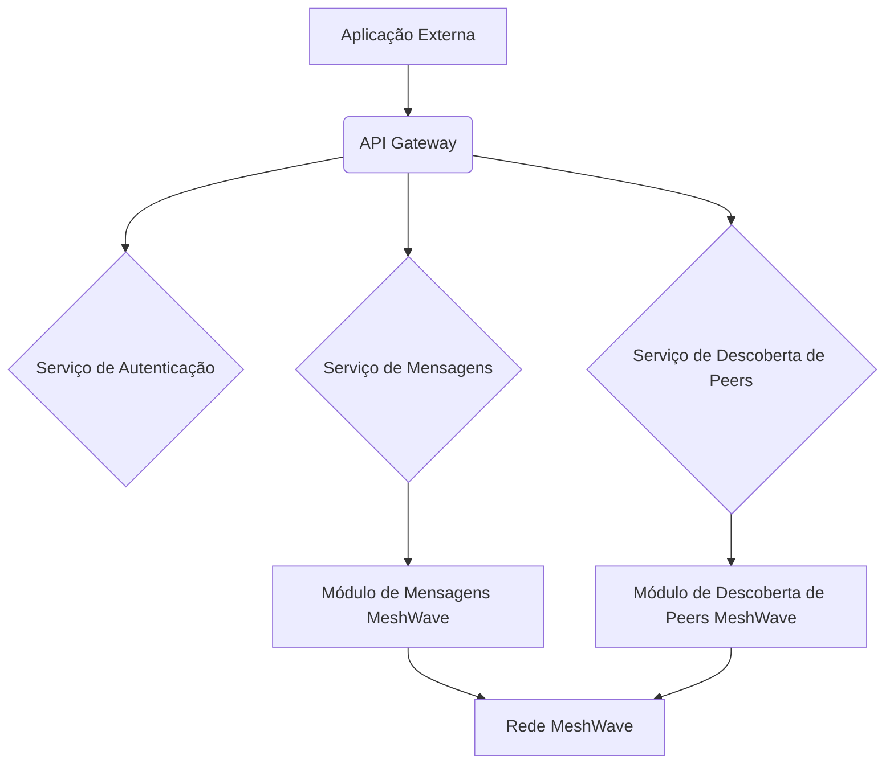
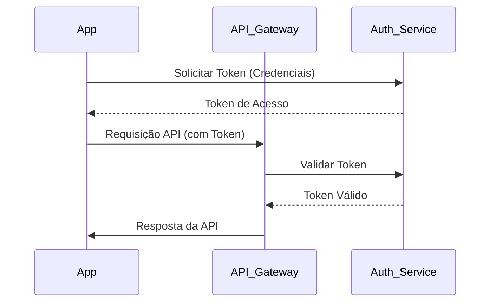

# Imagens e Ilustrações das APIs para Desenvolvedores

Este diretório contém imagens, diagramas e ilustrações que auxiliam na compreensão das APIs do Projeto MeshWave.

## Conteúdo Esperado:

*   **Diagramas de Arquitetura:** Ilustrações da arquitetura das APIs.
*   **Fluxos de Autenticação:** Diagramas que explicam o processo de autenticação.
*   **Exemplos de Requisições/Respostas:** Imagens de payloads JSON/XML formatados.

## Imagens e Ilustrações das APIs para Desenvolvedores

Este diretório contém imagens, diagramas e ilustrações que auxiliam na compreensão das APIs do Projeto MeshWave, visualizando seus conceitos, fluxos e interações.

### 1. Diagrama de Arquitetura das APIs

Este diagrama ilustra a arquitetura de alto nível das APIs do MeshWave, mostrando como elas se integram com os módulos de comunicação e roteamento da rede mesh.

### 2. Fluxo de Autenticação da API

Este fluxograma detalha o processo de autenticação de uma aplicação externa para acessar as APIs do MeshWave, desde a solicitação do token até o uso em requisições subsequentes.

---

**Autor:** Diogenes Duarte Sobral
**Contato:** celular +55 21 972341965, omaci2008@gmail.com

