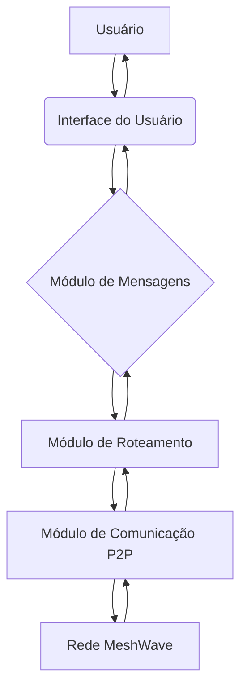

# Imagens e Ilustrações do App MeshWave

Este diretório contém imagens representativas, ilustrações, mockups de UI/UX e outros recursos visuais relacionados ao aplicativo MeshWave.

## Conteúdo Esperado:

*   **Mockups e Wireframes:** Representações visuais da interface do usuário.
*   **Diagramas de Arquitetura:** Ilustrações da estrutura do sistema.
*   **Fluxogramas:** Representações visuais dos processos do aplicativo.
*   **Ícones e Ativos Gráficos:** Elementos visuais utilizados na aplicação.

## Ilustrações e Mockups do App MeshWave

Esta seção apresenta ilustrações conceituais e mockups de interface de usuário para o aplicativo MeshWave, visando fornecer uma representação visual do seu design e funcionalidade.

### 1. Diagrama de Arquitetura Simplificado

Este diagrama ilustra os principais componentes do aplicativo e como eles interagem com a rede MeshWave.

### 2. Mockup da Tela Principal de Conversas

Este mockup representa a tela principal do aplicativo, onde as conversas com diferentes peers seriam exibidas.

(A imagem real seria inserida aqui. Exemplo de descrição para uma imagem: ``)

### 3. Mockup da Tela de Envio de Mensagens

Este mockup detalha a interface para composição e envio de mensagens, incluindo o campo de texto e o botão de envio.

(A imagem real seria inserida aqui. Exemplo de descrição para uma imagem: ``)

---

**Autor:** Diogenes Duarte Sobral
**Contato:** celular +55 21 972341965, omaci2008@gmail.com

