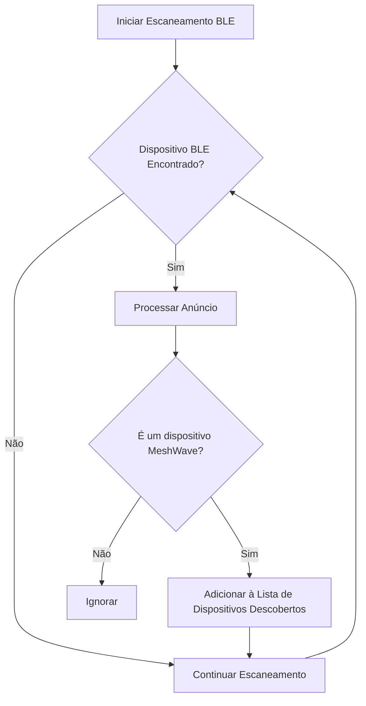

# Imagens e Ilustrações da Comunicação Nativa

Este diretório contém imagens representativas, ilustrações e diagramas visuais relacionados à comunicação nativa do Projeto MeshWave.

## Conteúdo Esperado:

*   **Diagramas de Rede:** Ilustrações de topologias de rede P2P.
*   **Fluxogramas de Conexão:** Representações visuais do processo de conexão entre dispositivos.
*   **Ícones:** Elementos visuais para representar diferentes tipos de comunicação.


## Ilustrações e Diagramas da Comunicação Nativa

Esta seção apresenta ilustrações conceituais e diagramas técnicos que auxiliam na compreensão dos mecanismos de comunicação nativa (Wi-Fi Direct e BLE) no Projeto MeshWave.

### 1. Diagrama de Conexão Wi-Fi Direct (Exemplo)

Este diagrama ilustra o fluxo de estabelecimento de uma conexão Wi-Fi Direct entre dois dispositivos, mostrando os papéis de Group Owner (GO) e Cliente.

```mermaid
sequenceDiagram
    participant DeviceA
    participant DeviceB

    DeviceA->>DeviceB: discoverPeers()
    DeviceB-->>DeviceA: onPeersAvailable(DeviceB)
    DeviceA->>DeviceB: connect(DeviceB)
    DeviceB-->>DeviceA: Connection Request
    DeviceA->>DeviceB: Connection Acceptance
    DeviceA<->>DeviceB: Group Formation (GO/Client negotiation)
    DeviceA<->>DeviceB: P2P Connected (TCP Sockets)
```

### 2. Fluxograma de Descoberta de Dispositivos BLE

Este fluxograma detalha o processo de um dispositivo escaneando e descobrindo outros dispositivos BLE que estão anunciando sua presença.



---

**Autor:** Diogenes Duarte Sobral
**Contato:** celular +55 21 972341965, omaci2008@gmail.com


