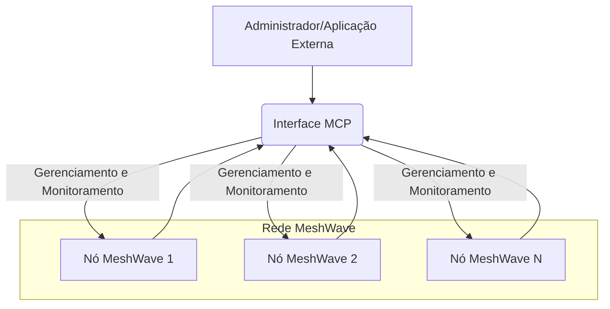
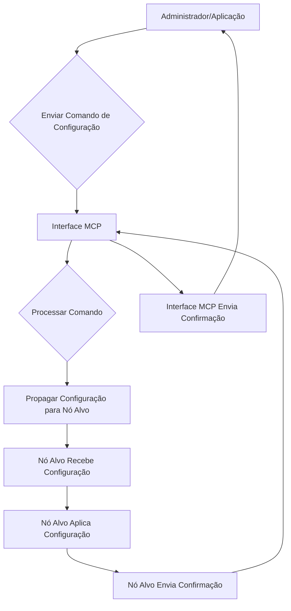

## Imagens e Ilustrações da Interface MCP

Este diretório contém imagens e diagramas que visualizam os conceitos e a funcionalidade da Interface do Módulo de Controle Principal (MCP) no Projeto MeshWave, ilustrando seu papel central no gerenciamento da rede.

### 1. Diagrama Conceitual da Interface MCP

Este diagrama ilustra a posição central da Interface MCP na rede MeshWave, conectando-se a diferentes tipos de nós e fornecendo um ponto de controle unificado para aplicações e administradores.

### 2. Fluxo de Configuração de Nó via MCP

Este fluxograma demonstra o processo de um administrador ou aplicação enviando um comando de configuração para a Interface MCP, que então o propaga para o nó alvo na rede.

---

**Autor:** Diogenes Duarte Sobral
**Contato:** celular +55 21 972341965, omaci2008@gmail.com

