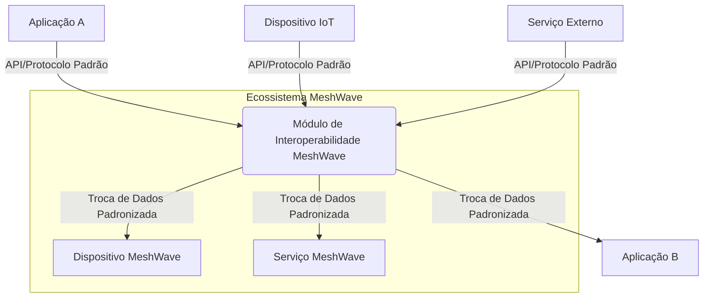

## Imagens e Ilustrações da Interoperabilidade

Este diretório contém imagens e diagramas que visualizam os conceitos e a implementação da interoperabilidade no Projeto MeshWave, ilustrando como diferentes sistemas e dispositivos podem se comunicar e trocar informações.

### 1. Diagrama de Interoperabilidade de Sistemas

Este diagrama ilustra como diferentes sistemas (aplicações, dispositivos, serviços) podem interagir dentro do ecossistema MeshWave através de padrões de comunicação e APIs abertas.



### 2. Fluxo de Comunicação Interoperável

Este fluxograma demonstra um fluxo de comunicação onde um dispositivo envia dados que são processados por um serviço e consumidos por uma aplicação, tudo de forma interoperável.

```mermaid
flowchart TD
    A[Dispositivo Sensor] --> B{Formato de Dados Padrão (JSON/Protobuf)}
    B --> C[Módulo de Comunicação (MQTT/CoAP)]
    C --> D[Rede MeshWave]
    D --> E[Módulo de Interoperabilidade]
    E --> F[Serviço de Análise de Dados]
    F --> G[API de Dados Processados]
    G --> H[Aplicação de Visualização]
```

---

**Autor:** Diogenes Duarte Sobral
**Contato:** celular +55 21 972341965, omaci2008@gmail.com


