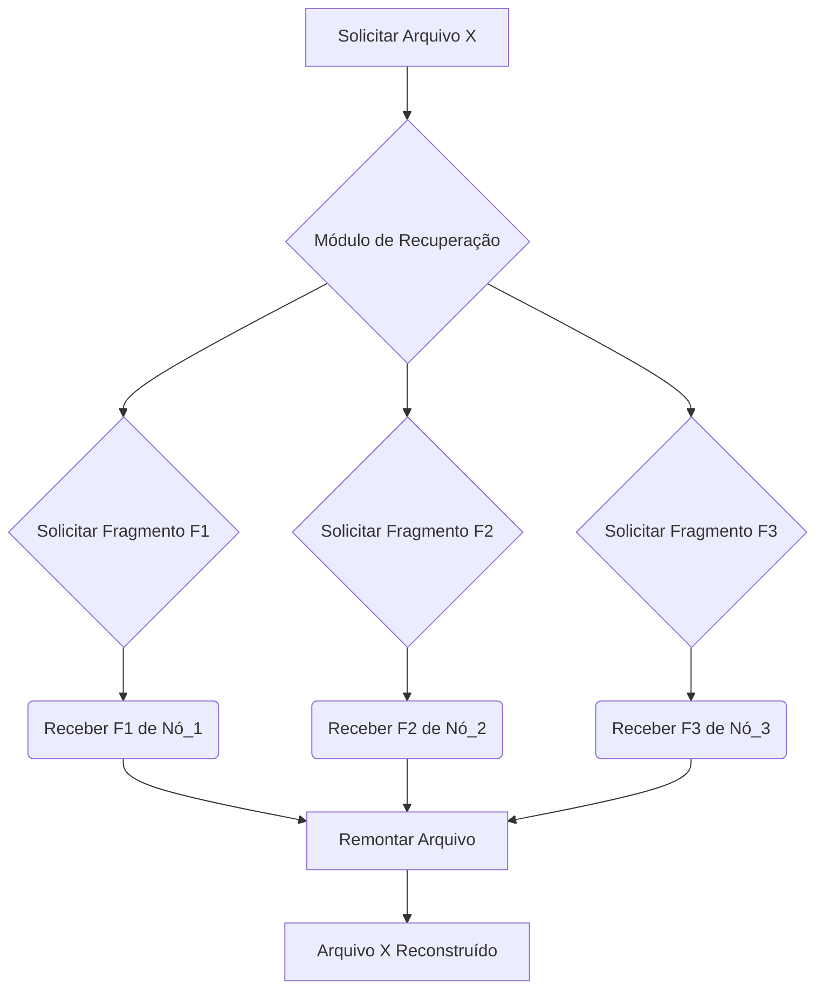

## Imagens e Ilustrações do Armazenamento Cooperativo

Este diretório contém imagens e diagramas que visualizam os conceitos e o fluxo do armazenamento cooperativo no Projeto MeshWave, ilustrando como os dados são fragmentados, replicados e distribuídos pela rede.

### 1. Fluxo de Armazenamento de Arquivos em Rede Mesh

Este diagrama ilustra o processo de um arquivo sendo dividido em fragmentos, replicado e distribuído para diferentes nós na rede mesh para armazenamento cooperativo.

```mermaid
sequenceDiagram
    participant Usuário/Dispositivo
    participant Módulo_Armazenamento
    participant Nó_1
    participant Nó_2
    participant Nó_3

    Usuário/Dispositivo->>Módulo_Armazenamento: 1. Enviar Arquivo para Armazenar
    Módulo_Armazenamento->>Módulo_Armazenamento: 2. Fragmentar Arquivo (F1, F2, F3)
    Módulo_Armazenamento->>Módulo_Armazenamento: 3. Replicar Fragmentos (F1a, F1b, F2a, F2b, etc.)

    Módulo_Armazenamento->>Nó_1: 4. Armazenar F1a, F2a
    Módulo_Armazenamento->>Nó_2: 5. Armazenar F1b, F3a
    Módulo_Armazenamento->>Nó_3: 6. Armazenar F2b, F3b

    Note over Nó_1,Nó_2,Nó_3: Dados distribuídos e redundantes
```

### 2. Diagrama de Reconstrução de Arquivos

Este diagrama conceitual mostra como os fragmentos de um arquivo são coletados de múltiplos nós e remontados para reconstruir o arquivo original, mesmo que alguns nós estejam offline.



---

**Autor:** Diogenes Duarte Sobral
**Contato:** celular +55 21 972341965, omaci2008@gmail.com


