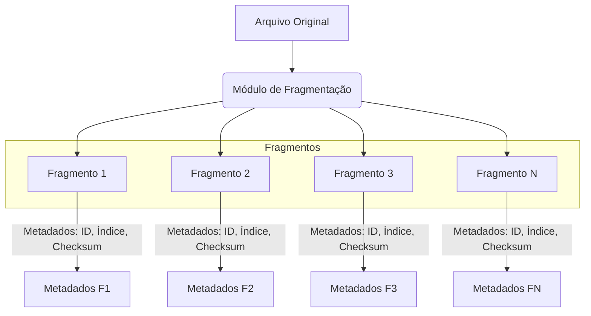
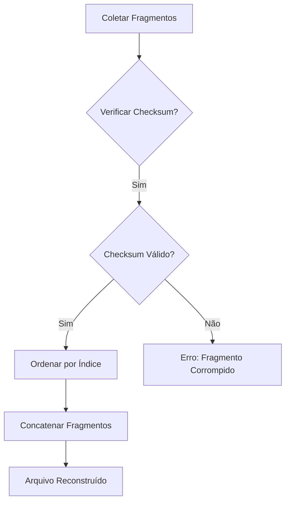

## Imagens e Ilustrações da Fragmentação Básica

Este diretório contém imagens e diagramas que visualizam os conceitos e o fluxo da fragmentação básica de dados no Projeto MeshWave, ilustrando como os arquivos são divididos em partes menores.

### 1. Diagrama de Fragmentação de Arquivo

Este diagrama ilustra o processo de um arquivo sendo dividido em múltiplos fragmentos de tamanho fixo, cada um com seu próprio identificador e metadados.

### 2. Fluxo de Remontagem de Arquivos

Este fluxograma demonstra como os fragmentos são coletados, verificados e concatenados na ordem correta para reconstruir o arquivo original.

---

**Autor:** Diogenes Duarte Sobral
**Contato:** celular +55 21 972341965, omaci2008@gmail.com

