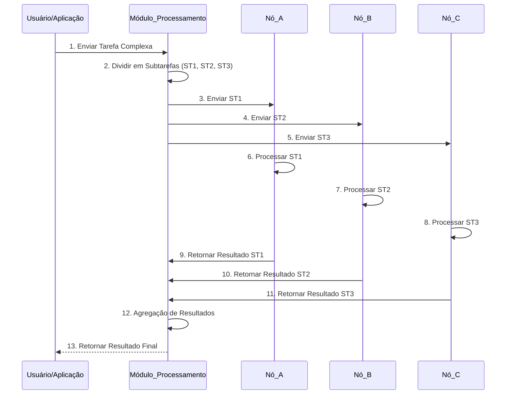

## Imagens e Ilustrações do Processamento Cooperativo

Este diretório contém imagens e diagramas que visualizam os conceitos e o fluxo do processamento cooperativo no Projeto MeshWave, ilustrando como as tarefas são divididas, distribuídas e seus resultados agregados.

### 1. Fluxo de Processamento Distribuído (Conceitual)

Este diagrama ilustra o processo de uma tarefa complexa sendo dividida em subtarefas, distribuída para múltiplos nós para processamento paralelo e, em seguida, os resultados sendo agregados para formar a solução final.



### 2. Diagrama de Seleção de Nó para Subtarefa

Este diagrama conceitual mostra os critérios que podem ser usados para selecionar o nó mais adequado para executar uma subtarefa em um ambiente de processamento cooperativo.

```mermaid
graph TD
    A[Subtarefa Pendente] --> B{Capacidade de CPU/Memória?}
    B -- Sim --> C{Carga Atual do Nó?}
    C -- Baixa --> D{Proximidade (Latência)?}
    D -- Alta --> E[Selecionar Nó]
    D -- Baixa --> E
    C -- Alta --> F[Rejeitar Nó / Tentar Outro]
    B -- Não --> F
```

---

**Autor:** Diogenes Duarte Sobral
**Contato:** celular +55 21 972341965, omaci2008@gmail.com


