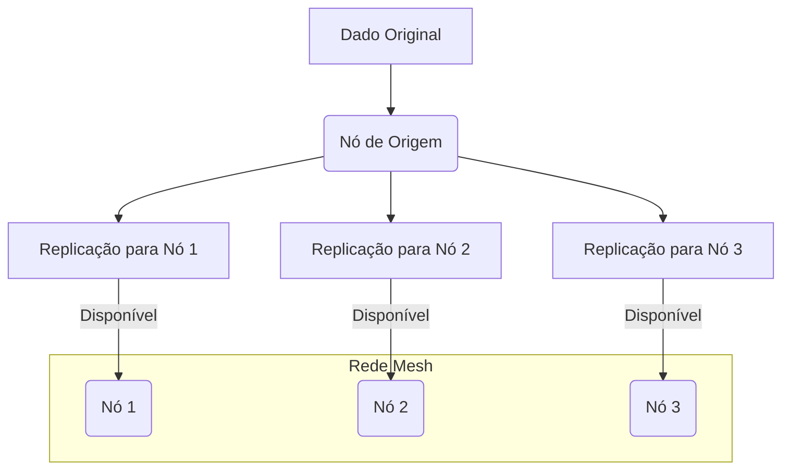
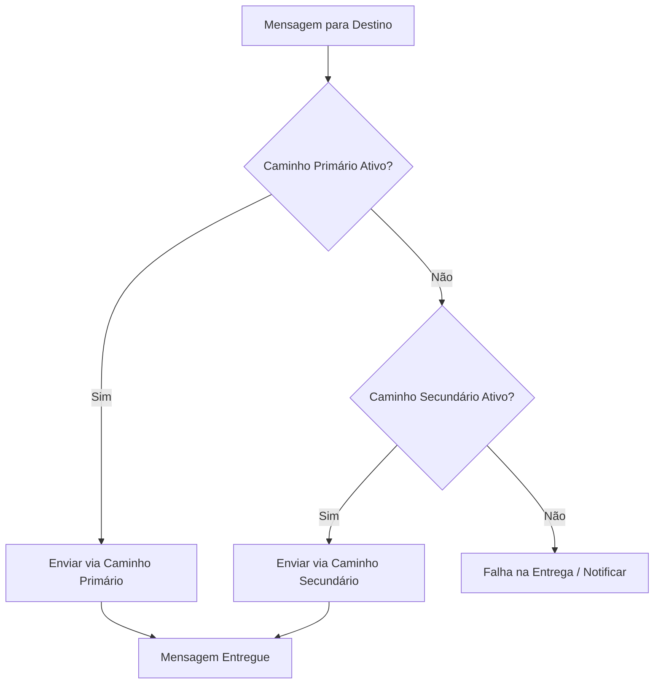

## Imagens e Ilustrações da Redundância

Este diretório contém imagens e diagramas que visualizam os conceitos e a implementação de mecanismos de redundância no Projeto MeshWave, ilustrando como a alta disponibilidade e a resiliência são alcançadas.

### 1. Diagrama de Replicação de Dados

Este diagrama ilustra como um item de dado é replicado para múltiplos nós na rede mesh, garantindo que, mesmo que um nó falhe, o dado ainda esteja disponível em outras réplicas.

### 2. Fluxo de Roteamento com Caminhos Alternativos

Este fluxograma demonstra como o sistema de roteamento do MeshWave pode usar caminhos alternativos para entregar mensagens, garantindo a comunicação mesmo em caso de falha de um caminho primário.

---

**Autor:** Diogenes Duarte Sobral
**Contato:** celular +55 21 972341965, omaci2008@gmail.com

