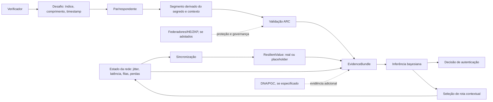

# ARC, autenticação contextual e inferência bayesiana do MeshWave

## Metadados

| Campo | Valor |
|---|---|
| ID curatorial | `DOM-05` |
| Status | `REVISÃO` — modelo conceitual e código transcrito; nenhuma implementação publicada, calibração ou validação reproduzível confirmada |
| Versão do documento | `0.1.0` |
| Última atualização | `2026-10-08` |
| Curador(es) | `Manus — curadoria BCE MeshWave` |
| Confiança geral | Média para a existência das propostas e do código transcrito; baixa para segurança, calibração, desempenho e produção |
| Documento relacionado no índice | `BCE/INDICE_CURATORIAL.md` — DOM-05 |

## 1. Resumo executivo

O lote F2.5 combina três linhas de material: (1) uma transcrição extensa de uma simulação em Kotlin que integra sincronização de relógios, ARC e um módulo bayesiano; (2) uma apresentação visual sobre “DNA do hardware”, identidade resiliente e ARC/PGC; e (3) uma análise propositiva de roteamento preditivo com contextual bandits, Thompson Sampling, commit-reveal, criptografia homomórfica, provas de conhecimento zero e calibração probabilística.

A evidência sustenta uma **proposta de arquitetura** e um **protótipo textual/transcrito**, não um sistema implementado e validado. O código descreve um protocolo ARC simples: deriva dois hashes SHA-256 de um identificador secreto e do timestamp do desafio, extrai um segmento da segunda hash e compara a resposta com o valor esperado. A sincronização produz um valor real ou um placeholder; o módulo bayesiano usa status de sincronização, latência e resultado da validação para calcular uma probabilidade posterior com priors e verossimilhanças fixos.

Não há repositório de código associado ao lote, dependências completas, build, teste automatizado, vetor de teste, resultado de execução, análise de ameaça, mecanismo de compromisso/revelação efetivamente implementado, prova criptográfica, calibração com dados ou teste em FABRIC/COSMOS. Commit-reveal, HE, ZKP, federação e consenso aparecem na fonte de roteamento como recomendações ou alternativas, não como implementação confirmada.

**Estado curatorial:** manter em `REVISÃO`. O próximo desenvolvimento deve transformar o protótipo transcrito em especificação verificável, sem interpretar o rótulo “código completo e funcional” como prova de execução.

## 2. Escopo e limites

Entram neste documento: ARC, desafio e resposta contextual, hashing e seleção de segmentos, sincronização e qualidade da evidência, `ResilientValue`, inferência bayesiana, prior/verossimilhança/posterior, limiar de decisão, roteamento preditivo quando usa autenticação contextual, commit-reveal, HE, ZKP, federadores, calibração, ataques e métricas de validação.

Não entram em profundidade: a identidade/DID e o identificador de equipamento (`DOM-04`), a topologia e os transportes da rede (`DOM-03`), implantação física, Android, persistência, LGPD e governança completa. O “DNA do hardware” é tratado aqui somente como hipótese de identidade/atestado; hardware físico e características de plataforma devem ser aprofundados em `DOM-10`/`DOM-11`.

A análise não considera título, imagem, checkbox de tarefa concluída ou afirmação de “protótipo funcional” como prova de execução. Nenhuma credencial, token, segredo literal ou dado pessoal é reproduzido.

## 3. Terminologia

| Termo | Definição adotada | Sinônimos/variações | Fonte |
|---|---|---|---|
| ARC | Nome dado à autenticação por segmento contextual derivado de um segredo e de um desafio; o protocolo transcrito usa hash e timestamp | Autenticação Recessiva Contextual | `KNOWLEDGE/info/20260422_165745_ARC - Autenticação Recessiva Contextual com inferência Bayesiana - Manus/` |
| PGC | Rótulo associado nas imagens e no texto do DNA do hardware a uma prova de gênese/contexto; algoritmo não fornecido | Prova de Gênese Contextual | `KNOWLEDGE/info/20260422_164535_DNA do Hardware_ Identidade Resiliente com ARC_PGC - Manus/` |
| `ResilientValue` | Invólucro que distingue valor medido/calculado de placeholder seguro | dado resiliente, default-fail | fonte ARC, `content.txt` e `code_blocks.txt` |
| Contexto | Dados usados para interpretar uma evidência ou escolher uma rota, como timestamp, latência, jitter, filas e perda | estado contextual | fontes ARC e roteamento preditivo |
| Prior | Probabilidade anterior atribuída antes da evidência de latência | crença anterior | fonte ARC |
| Verossimilhança | Fator que compara a probabilidade da evidência sob hipóteses de legitimidade e impostura | likelihood ratio | fonte ARC |
| Confiança posterior | Probabilidade calculada após combinar prior e evidência | score bayesiano | fonte ARC |
| Commit-reveal | Fluxo em que um compromisso é enviado antes da revelação de um valor ou prova | compromisso/revelação | fonte de roteamento preditivo |
| Contextual bandit | Modelo de seleção de ações/rotas condicionado ao estado observado, equilibrando exploração e exploração | bandit adaptativo, Thompson Sampling | fonte de roteamento preditivo |
| SOR | Métrica proposta para comparar custo de segurança e benefício do sistema | Security-Overhead Ratio | fonte de roteamento preditivo |

## 4. Estado da arte atual

### 4.1 Capacidades e comportamento descritos

A simulação transcrita descreve um fluxo em quatro estágios:

1. **Sincronização:** dispositivos trocam pacotes, estimam latência e classificam o resultado como `SUCCESS`, `UNSTABLE` ou `FAILED`.
2. **Desafio ARC:** o verificador cria um desafio com índice de segmento, comprimento e timestamp.
3. **Resposta e validação:** o respondente deriva um segmento contextual do identificador secreto; o verificador recalcula o esperado e compara as cadeias.
4. **Decisão bayesiana:** a validação, o status de sincronização e a latência de autenticação alimentam o cálculo de confiança; o orquestrador considera autenticação bem-sucedida quando a probabilidade excede `0.85`.

A refatoração com `ResilientValue` tenta impedir que uma latência substituta seja confundida com uma medição real. Quando a sincronização falha, o placeholder não entra no cálculo da verossimilhança, mas o status reduz o prior. Essa é uma regra de tratamento de incerteza proposta no código, não uma política validada.

A fonte de roteamento amplia o contexto para filas, perda histórica, séries temporais, latência e carga. Sugere recompensa normalizada, bandits distribuídos/federados e proteção contra envenenamento de contexto. Esses pontos são recomendações analíticas; não há algoritmo executável de escolha de rota no lote F2.5.

### 4.2 Componentes e responsabilidades

| Componente | Responsabilidade proposta | Estatuto nesta revisão |
|---|---|---|
| `TimeSyncProtocol` | Estimar qualidade da sincronização e produzir latência real ou placeholder | Código transcrito/protótipo; sem build ou teste confirmado |
| `ResilientValue` | Tornar explícita a diferença entre medição e valor substituto | Especificado em código transcrito; não integrado em artefato executável do repositório |
| `ArcProtocol` | Derivar e comparar segmento contextual | Código transcrito; esquema criptográfico e análise de ameaça incompletos |
| `ArcChallenge` | Transportar índice, comprimento e timestamp do desafio | Estrutura proposta no código; parâmetros não justificados |
| `BayesianModule` | Combinar validação, estado de sincronização e latência em um score | Código transcrito; priors e likelihoods não calibrados |
| Orquestrador `Device` | Simular a sequência sincronização → desafio → resposta → decisão | Protótipo narrado/transcrito; não executado no repositório |
| Contextual bandit | Escolher rotas com base em contexto e recompensa | Proposta de pesquisa; sem implementação no lote |
| Federador | Validar commits/reveals ou coordenar confiança | Hipótese de arquitetura; autoridade, consenso e falhas não definidos |
| HE/ZKP | Preservar segredo ou provar conhecimento sem revelar ARC | Alternativas sugeridas; nenhuma prova ou circuito anexado |
| DNA do hardware | Associar identidade resiliente a propriedades do equipamento | Hipótese/conceito visual; sem medição, atestado ou função de derivação |

### 4.3 Interfaces, entradas e saídas

A interface ARC transcrita recebe `secretId` e `ArcChallenge(segmentIndex, segmentLength, timestamp)` e produz `ArcResponse(segment)`. A validação recebe a resposta, o desafio e o identificador secreto conhecido do par, retornando `VALID` ou `INVALID`.

O módulo bayesiano recebe `EvidenceBundle(validationResult, authLatencyMs, syncResult)` e retorna `ConfidenceScore(probability)`. Não há contrato serializado, versão de mensagens, autenticação do canal, expiração explícita do desafio, controle de replay, registro de chave ou formato de interoperabilidade.

O material de integração Android menciona módulos `.aar`, `MeshPeerConnectionManager`, sockets, coroutines e serialização JSON, mas deixa funções de serialização/deserialização e trechos de frontend como placeholders. Essa menção é planejamento de integração, não evidência de aplicativo funcionando.

### 4.4 Requisitos, restrições e premissas

- Um segmento válido não deve ser a única evidência de legitimidade; posse do segredo, frescor, identidade do par e contexto precisam ser vinculados.
- Timestamp e índice devem estar protegidos contra manipulação, replay e escolhas enviesadas pelo respondente.
- O segredo não deve ser transmitido, exposto em logs ou mantido em texto simples.
- Placeholders devem ser propagados como estado de baixa qualidade, nunca tratados como medições.
- Priors e likelihoods precisam de dados, população de referência, janela temporal e calibração documentadas.
- O roteamento deve considerar a incerteza e o custo de segurança, sem permitir que um atacante injete métricas de rota ou contexto.
- A identidade do dispositivo e sua localização devem permanecer separadas, conforme `DOM-04`; ARC não substitui um DID nem um registro de chaves.

### 4.5 O que está implementado, prototipado ou apenas proposto

- **Implementado e verificável:** nenhum módulo executável no repositório, build, teste ou resultado de execução confirmado.
- **Prototipado:** código Kotlin transcrito com classes, fluxo de mensagens e simulação de jitter; o estatuto é protótipo alegado/transcrição, pois dependências e execução não estão disponíveis.
- **Especificado:** derivação de segmento por SHA-256, `ResilientValue`, cálculo bayesiano com priors fixos e limiar de confiança.
- **Hipótese:** DNA do hardware, PGC, federador descentralizado, HE, ZKP, bandits federados e calibração adaptativa.
- **Contraditório ou incompleto:** a fonte chama o código de “completo e funcional”, mas também omite arquivos, funções, dependências e implementação de frontend; o material não permite confirmar essa alegação.

## 5. Arquitetura e modelo conceitual



O diagrama é uma reconstrução curatorial. Ele não declara que federadores, HE, ZKP ou DNA existem. A separação mais importante é entre: **medir o contexto**, **provar conhecimento/posse**, **calcular confiança** e **selecionar rota**. Misturar essas funções pode transformar uma heurística de latência em falsa autenticação.

### 5.1 Modelo bayesiano transcrito

A fonte usa, em termos gerais:

```text
priorOdds = priorLegit / (1 - priorLegit)
posteriorOdds = likelihoodFactor * priorOdds
posterior = posteriorOdds / (1 + posteriorOdds)
```

Os valores transcritos incluem `priorLegit = 0,7` para sincronização bem-sucedida, `0,4` para instável e `0,2` para falha; para uma latência considerada boa, `P(evidência|legítimo)=0,8` e `P(evidência|impostor)=0,3`. Esses números são parâmetros de exemplo, não calibração comprovada.

Quando a validação ARC é inválida, o código retorna confiança zero antes da atualização bayesiana. Quando a latência é placeholder, o fator de verossimilhança permanece neutro e o prior reduzido representa a baixa qualidade da sincronização. Essa escolha evita usar `9999` como medição, mas ainda requer testes contra cenários adversariais e dados ausentes.

## 6. Fluxos e casos de uso

### 6.1 Autenticação simulada entre dois dispositivos

- **Pré-condições:** pares conhecem identificadores secretos; clocks e conexão simulada existem.
- **Sequência:** trocar pacotes; estimar sincronização; criar desafio; derivar resposta; validar; calcular confiança.
- **Dados:** timestamps, índices, segmentos, status de sincronização, latência e score.
- **Resultado esperado:** score e decisão de sucesso/falha.
- **Falhas:** jitter alto, resposta inválida, segredo desconhecido, conexão interrompida, estado ausente.
- **Evidência:** classes Kotlin transcritas em `content.txt`/`code_blocks.txt`; sem execução confirmada.

### 6.2 Autenticação com dado de sincronização ausente

- **Pré-condições:** medição de latência não confiável.
- **Sequência:** produzir `ResilientValue.Placeholder`; ignorar latência no likelihood; reduzir o prior por status instável/falho.
- **Resultado:** decisão conservadora sem quebrar o fluxo.
- **Risco:** o comportamento “conservador” depende dos priors fixos e pode ainda gerar confiança indevida se outras evidências forem fracas.
- **Evidência:** refatoração descrita na fonte ARC.

### 6.3 Roteamento contextual

- **Pré-condições:** histórico de rotas, métricas de latência/perda e contexto atual.
- **Sequência pretendida:** observar contexto; escolher rota via bandit; receber recompensa; atualizar modelo; aplicar autenticação e penalidade de overhead.
- **Resultado:** rota com compromisso entre desempenho, segurança e exploração.
- **Evidência:** análise textual de roteamento; não há implementação de bandit no lote.

### 6.4 Commit-reveal ou ZKP

- **Pré-condições:** protocolo de compromisso, nonce, janela temporal, chave e verificador definidos.
- **Sequência pretendida:** enviar commit; revelar valor ou prova; verificar contexto e frescor; aceitar/rejeitar.
- **Evidência:** recomendação na fonte de roteamento, não fluxo implementado na fonte ARC. O código ARC transcrito compara diretamente um segmento derivado e não contém commit-reveal ou ZKP.

## 7. Código, algoritmos e parâmetros

O código transcrito é Kotlin-like e contém repetições, referências a tipos externos (`Device`, `CalibrationPacket`, `FakeConnection`) e seções resumidas. O núcleo observado é:

1. SHA-256 do identificador secreto;
2. SHA-256 do hash-base concatenado ao timestamp;
3. `substring` em índice e comprimento do desafio;
4. comparação textual do segmento;
5. cálculo de score bayesiano a partir de priors e likelihoods.

Limitações técnicas observadas:

- não há especificação de codificação, endianness ou serialização do timestamp;
- índice e comprimento não são validados contra o tamanho da saída antes de `substring`;
- comparação de segmentos não é descrita como constant-time;
- o modelo de segredo, armazenamento, rotação e comprometimento não é definido;
- o timestamp é contexto, mas não há nonce único nem política de frescor formal;
- a fonte imprime valores de validação e nomes de dispositivos no fluxo, o que seria inadequado sem revisão de logging;
- a sincronização e o cálculo de latência são simulados e não provam relógio confiável;
- a integração Android deixa serialização, sockets e frontend incompletos;
- o código não é acompanhado de `build.gradle`, versão Kotlin, dependências, testes ou CI.

A fonte de roteamento propõe `reward = w1 * (1 / latência_normalizada) + w2 * (1 - taxa_de_perda)`, mas não define normalização, limites, escolha de pesos, tratamento de divisão por zero, atualização online ou comparação com baseline.

## 8. Evidências e fontes

| Evidência | Tipo | Caminho relativo | O que sustenta | Limitações |
|---|---|---|---|---|
| E05-01 | texto/código | `KNOWLEDGE/info/20260422_165745_ARC - Autenticação Recessiva Contextual com inferência Bayesiana - Manus/content.txt` | Fluxo completo alegado, `ResilientValue`, ARC, Bayes e integração planejada | Transcrição repetitiva; dependências e execução ausentes; alegações não verificadas |
| E05-02 | código | `KNOWLEDGE/info/20260422_165745_ARC - Autenticação Recessiva Contextual com inferência Bayesiana - Manus/code_blocks.txt` | Trechos Kotlin, classes de sincronização, ARC e Bayes | Blocos duplicados e incompletos; não são fonte compilável do projeto |
| E05-03 | imagem | `KNOWLEDGE/info/20260422_165745_ARC - Autenticação Recessiva Contextual com inferência Bayesiana - Manus/FULL.png` | Captura com código e resumo de integração modular | Interface de conversa; não demonstra build, teste ou execução |
| E05-04 | link | `KNOWLEDGE/info/20260422_165745_ARC - Autenticação Recessiva Contextual com inferência Bayesiana - Manus/links.txt` | Referência a Ktor e endereço local de simulador | Link local não é prova de serviço disponível; dependência externa não validada |
| E05-05 | texto/imagem | `KNOWLEDGE/info/20260422_164535_DNA do Hardware_ Identidade Resiliente com ARC_PGC - Manus/` | Associação nominal/visual entre DNA, ARC e PGC | Conteúdo é predominantemente apresentação de slide; não define atestado, medição ou protocolo |
| E05-06 | imagens | `.../164535_DNA do Hardware_ Identidade Resiliente com ARC_PGC - Manus/img_000.jpg` e `img_001.jpg` | Arte conceitual de SOFIA/privacidade e slide de apresentação | Não demonstram hardware, identidade criptográfica ou execução |
| E05-07 | texto/código | `KNOWLEDGE/info/20260422_171217_Roteamento Preditivo com Autenticação Contextual e Inferência Bayesiana - Manus/content.txt` | Recomendações sobre bandits, ARC federada, Bayes, ZKP e testbeds | Texto analítico/repetido; não contém resultados reproduzíveis |
| E05-08 | código/diagrama | `KNOWLEDGE/info/20260422_171217_Roteamento Preditivo com Autenticação Contextual e Inferência Bayesiana - Manus/code_blocks.txt` | Fórmula de recompensa e marcadores `nonce`, `commit`, Circom e zkSNARKs | Fragmentos sem implementação, parâmetros ou circuito |
| E05-09 | imagem | `KNOWLEDGE/info/20260422_171217_Roteamento Preditivo com Autenticação Contextual e Inferência Bayesiana - Manus/FULL.png` | Captura do resumo sobre ataques, overhead e artefatos | Captura de interface; não é testbed nem benchmark |
| E05-10 | documentos relacionados | `BCE/temas/identidade-dids-e-identificador-de-equipamento.md` e `BCE/temas/rede-mesh-comunicacao-e-roteamento.md` | Dependências entre autenticação, identidade, localização e rota | Ambos permanecem provisórios e sem implementação verificada |

## 9. Evolução arqueológica

| Período/versão | Formulação/estado | Mudança | Motivo/evidência | Resultado |
|---|---|---|---|---|
| Fase conceitual | ARC/PGC e DNA do hardware como identidade resiliente | Segurança é descrita por metáforas e imagens | Fonte DNA do hardware | Direção arquitetural sem protocolo |
| Fase de protótipo transcrito | ARC baseado em segmento de hash contextual e sincronização | Conceito ganha classes, mensagens e score | Fonte ARC, Kotlin transcrito | Protótipo alegado, não executado |
| Refatoração resiliente | Valores de medição passam a ser `Real` ou `Placeholder` | Falha deixa de ser `null` e entra explicitamente no fluxo | Fonte ARC | Regra de tratamento de dados incompletos; sem teste |
| Extensão analítica | ARC é combinado com commit-reveal, HE e ZKP | Segredo poderia ser protegido ou não revelado | Fonte de roteamento | Alternativas propostas; não implementadas |
| Extensão de decisão | Bayes é calibrado e aplicado a bandits contextuais | Score passa a influenciar seleção de rotas | Fonte de roteamento | Programa de validação e pesquisa, sem resultados confirmados |

## 10. Decisões tomadas

### DEC-DOM05-001 — Classificar o ARC transcrito como protótipo, não como protocolo aprovado

- **Problema:** a fonte chama o código de completo e funcional, mas não fornece projeto compilável, testes ou execução.
- **Escolha:** registrar o fluxo como protótipo transcrito e especificação parcial.
- **Justificativa:** a evidência demonstra lógica textual, não funcionamento em rede MeshWave.
- **Consequência:** qualquer uso futuro precisa de implementação versionada, revisão criptográfica e testes reproduzíveis.

### DEC-DOM05-002 — Não tratar score bayesiano como autenticação criptográfica

- **Problema:** uma probabilidade posterior pode ser interpretada como prova de identidade.
- **Escolha:** separar prova de posse/validade do cálculo probabilístico de confiança.
- **Justificativa:** o Bayes usa parâmetros heurísticos e não substitui chaves, assinaturas, atestados ou política de autorização.
- **Consequência:** o score só deve apoiar uma decisão contextual explicitamente calibrada.

### DEC-DOM05-003 — Tratar HE, ZKP, federação e DNA como alternativas não adotadas

- **Problema:** o texto de roteamento apresenta tecnologias avançadas como caminho de melhoria.
- **Escolha:** classificá-las como propostas/hipóteses até existir especificação, dependência, código e teste.
- **Justificativa:** nenhum circuito, contrato federado, esquema HE, atestado ou resultado foi anexado.
- **Consequência:** não prometer privacidade, descentralização, resistência quântica ou identidade física.

## 11. Alternativas, descartes e ideias não adotadas

- **`null` para latência:** substituído na narrativa por `ResilientValue`; a melhoria é conceitual e não foi validada no projeto.
- **Usar placeholder como medição:** rejeitado no modelo; o placeholder deve ser identificado e excluído do likelihood.
- **Commit-reveal:** mantido como alternativa de proteção; não está presente no núcleo ARC transcrito.
- **ZKP com Circom/zkSNARKs:** mantida como hipótese de não revelação; não há circuito ou prova.
- **HE/SEAL:** mantida como opção de privacidade; não há integração nem benchmark.
- **Federador centralizado:** identificado como ponto de falha; consenso distribuído é sugerido, não adotado.
- **DNA do hardware como identidade:** não adotado; faltam estabilidade, não clonabilidade, privacidade, recuperação e atestado.
- **Score fixo e limiar `0.85`:** preservado como parâmetro histórico do protótipo, não como política de produção.

## 12. Otimizações, correções e melhorias

A melhoria central é separar **validade criptográfica**, **qualidade do contexto**, **confiança probabilística** e **decisão de rota**. O uso explícito de `Real`/`Placeholder` reduz o risco de contaminar o cálculo com valores substitutos, mas deve ser acompanhado de propagação de incerteza e auditoria.

Para uma implementação futura, são necessárias: nonce e janela de frescor; proteção contra replay; comparação constant-time; armazenamento seguro e rotação de segredos; mensagens autenticadas; validação de índice/comprimento; calibração com dados rotulados; intervalos de credibilidade; testes adversariais de envenenamento; baseline sem ARC/Bayes; medição de CPU, memória e latência; e execução reproduzível em ambiente fixado.

Nenhuma dessas melhorias foi demonstrada como implementada no lote.

## 13. Conflitos e incertezas

| ID | Questão | Fontes em conflito | Impacto | Resolução/ação |
|---|---|---|---|---|
| C05-01 | ARC é segmento de hash direto ou commit-reveal/ZKP? | Fonte ARC versus fonte de roteamento | Não há um protocolo único | Congelar mensagem, nonce, frescor e método de prova antes de integrar |
| C05-02 | O DNA do hardware é metáfora, impressão digital ou atestado? | Fonte DNA e código ARC | Risco de prometer segurança física sem evidência | Definir ameaça, sensor/PUF, derivação, privacidade e teste |
| C05-03 | O score bayesiano está calibrado? | Priors fixos da fonte versus recomendação de calibração | Decisões e limiar podem ser inválidos fora da simulação | Fornecer dataset, método, métricas e intervalos |
| C05-04 | O código é executável? | “Código completo e funcional” versus placeholders, duplicatas e dependências ausentes | Não é possível afirmar protótipo operacional | Recuperar projeto, build e logs reproduzíveis |
| C05-05 | Quem controla o federador? | Federador sugerido versus proposta de consenso distribuído | Ponto de falha e governança não definidos | Especificar membros, quórum, rotação e falhas |
| C05-06 | Contexto de rota pode ser manipulado? | Bandit adaptativo versus alerta de envenenamento | Ataques podem forçar rotas ruins ou maliciosas | Criar testbed adversarial, limites e detecção de drift |
| C05-07 | O placeholder é sempre conservador? | Priors reduzidos e likelihood neutro | Um prior inadequado ainda pode produzir score alto | Fazer análise de sensibilidade e política de rejeição explícita |

## 14. Lacunas e questões em aberto

1. **Especificação ARC:** definir mensagens, nonce, timestamp, índice, comprimento, codificação, frescor e erros.
2. **Segredos e chaves:** definir geração, armazenamento, rotação, revogação, recuperação e separação entre identidade e segredo.
3. **Prova:** decidir entre segmento hash, MAC, assinatura, commit-reveal ou ZKP; justificar o modelo de ameaça.
4. **Bayes:** obter dados rotulados, estimar priors/likelihoods, calibrar e reportar incerteza.
5. **Roteamento:** implementar o bandit, reward, atualização e proteção contra envenenamento; comparar com baselines.
6. **DNA/PGC:** transformar o conceito em especificação testável ou reclassificá-lo como metáfora de produto.
7. **Reprodutibilidade:** publicar projeto, dependências, versão de compilador, testes, fixtures, logs e hashes.
8. **Privacidade:** avaliar exposição de timestamp, latência, perfil, localização e padrões de autenticação.
9. **Desempenho:** medir overhead de ARC/Bayes e disponibilidade em dispositivos MeshWave/Android.
10. **Testbeds:** confirmar se FABRIC/COSMOS foi usado; o lote contém apenas recomendação, não resultados.

## 15. Relações com outros documentos

- `DOM-03` — fornece o contexto de roteamento, CLA/CPA/Geohash e cache; deve consumir ARC sem confundir score com identidade.
- `DOM-04` — separa DID/identidade, localização e autenticação; ARC/PGC só deve complementar esse modelo após especificação.
- `DOM-10` — deve tratar Android, armazenamento seguro e disponibilidade de APIs.
- `DOM-11` — deve aprofundar hardware, PUF/atestado e infraestrutura física.
- `DOM-14` — deve consolidar privacidade, governança, ameaças e LGPD.
- `DOM-15` — deverá documentar APIs, serialização e integração dos módulos.

## 16. Histórico de versões do documento

| Versão | Data | Alteração | Fontes/commit |
|---|---|---|---|
| `0.1.0` | `2026-10-08` | Primeira síntese F2.5; separação entre ARC, contexto, Bayes, roteamento e alternativas criptográficas | Três caminhos do `ESCOPO_F2_5_ARC_BAYES.md`; commit a publicar |

## 17. Próximo passo de curadoria

Registrar o resultado da F2.5 no controle mestre e no índice, publicar este DOM-05 e criar checkpoint; depois iniciar a F2.6 lendo integralmente as fontes de SOFIA, agentes, missões e persistência indicadas no próximo escopo, sem elevar o protótipo ARC/Bayes a implementação validada.
