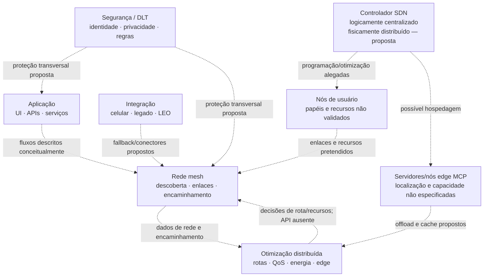

# Arquitetura geral e implantação do MeshWave

## Metadados

| Campo | Valor |
|---|---|
| ID curatorial | `DOM-02` |
| Status | `REVISÃO` — primeira síntese; arquitetura e cronograma não validados |
| Versão do documento | `0.1.0` |
| Última atualização | `2026-10-08` |
| Curador | `Manus — curadoria BCE MeshWave` |
| Confiança geral | Média para a existência da proposta arquitetural; baixa para vigência, implantação e funcionamento |
| Documento relacionado no índice | `BCE/INDICE_CURATORIAL.md` — DOM-02 |

## 1. Resumo executivo

Há uma descrição técnica na raiz (`01_arquitetura_geral_meshwave.md`, rotulada “Sistema MeshWave Versão 1.0” e datada no próprio arquivo de 2025-05-21) que propõe cinco camadas — aplicação, rede mesh, otimização/IA distribuída, integração e segurança/blockchain — mais um controlador SDN logicamente centralizado e fisicamente distribuído. Ela lista tecnologias, responsabilidades e possíveis pontos de execução, mas não fornece implementação, especificações de interface nem um desenho de implantação executável.

As imagens associadas a duas fontes de `KNOWLEDGE/` mostram principalmente **um roadmap por segmentos e fases**, não uma arquitetura implantada. Esse roadmap distribui itens entre quatro fases e uma escala temporal aproximada de 2025 a 2032. Uma captura textual ainda afirma que existiria um módulo Python de prova de conceito e descreve a transição de um protótipo para a Fase 2, mas nenhum código, commit, build ou resultado correspondente está anexado às fontes examinadas. Os conteúdos de “módulos faltantes” relatam a preparação de roteiros explicativos; os próprios roteiros não foram localizados nos artefatos da fonte.

Portanto, DOM-02 registra uma **arquitetura conceitual proposta e um roadmap**, não uma arquitetura de produção ou plano de implantação validado. As escolhas de transporte, criptografia, IA, DLT, LEO, 6G, computação quântica e armazenamento P2P abaixo devem permanecer classificadas como componentes propostos até serem associadas a artefatos rastreáveis e testes.

## 2. Escopo e limites

Esta primeira revisão processa o arquivo arquitetural listado como candidato no índice e os três conjuntos apontados no DOM-01 §13:

1. `01_arquitetura_geral_meshwave.md`;
2. `KNOWLEDGE/info/20260422_165052_Fonte para Arquitetura e Operação da Rede MeshWave - Manus/`;
3. `KNOWLEDGE/info/20260422_174348_Complementar Módulos Faltantes do Diagrama de Implantação - Manus/`;
4. `KNOWLEDGE/info/20260422_165701_Hierarquia de CLA Continental e Roteamento - Manus/`.

Foram lidos os textos e blocos de código associados; imagens `FULL.png` e anexos visuais foram inspecionados. Os três `links.txt` estão vazios. A fonte de roadmap tem transcrição extensa e repetitiva; foram comparados os trechos únicos para não tratar duplicações de interface como evidência independente.

**Fora do escopo desta versão:** validar protocolos em repositório ou rede; encontrar hardware ou serviços ativos; testar código; confirmar tecnologias externamente; aprovar arquitetura; fazer dimensionamento, threat model completo, orçamento ou plano de projeto com datas comprometidas. Não foi alterado nenhum arquivo em `KNOWLEDGE/`.

## 3. Terminologia e estatuto das afirmações

| Termo | Uso nesta documentação | Estatuto/limite |
|---|---|---|
| Camadas | Decomposição lógica apresentada no documento de arquitetura da raiz. | Especificação conceitual; sem deployment unit, interfaces ou runtime identificados. |
| Controlador SDN | Controlador descrito como logicamente centralizado, fisicamente distribuído; pode residir em nós capazes ou servidores “MCP”. | Papel proposto; consistência, eleição, disponibilidade e divisão do controle não especificadas. |
| MCP | Rótulo usado na fonte para “Multi-access Edge Computing” e para servidores/orquestração edge. | O significado e o contrato técnico pretendidos precisam de confirmação documental; não presumir componente já existente. |
| Rede mesh / P2P | Nós próximos descobrem-se, mantêm enlaces e encaminham pacotes; a descrição cita BLE, Wi‑Fi Direct e 5G/6G Sidelink/D2D. | Tecnologias candidatas na especificação; não há teste de interoperabilidade anexado. |
| DLT / Blockchain | Registro distribuído para identidades, hashes de transações/reputação e smart contracts. | Proposta; plataforma, consenso, dados, governança e custos ausentes. |
| LEO / 6G / quântico | Integrações e capacidades listadas principalmente em fases avançadas do roadmap. | Roadmap aspiracional; não são requisitos de curto prazo ou capacidades comprovadas. |
| CLA / CPA / Geohash | Vocabulário de uma representação visual de regiões/células e de um resumo de contexto sobre hierarquia de cache. | Modelo espacial sem legenda, sistema de coordenadas, regra de agregação ou algoritmo formal nesta fonte. |

Nesta versão, **relatado** significa que a afirmação aparece em documento/transcrição; **proposto** significa que descreve uma intenção de desenho; **roadmap** significa que foi alocado a uma fase planejada; **não verificado** significa que não há artefato operacional correspondente nas evidências processadas.

## 4. Estado da arte nas fontes revisadas

### 4.1 Arquitetura lógica proposta

O documento `01_arquitetura_geral_meshwave.md` descreve cinco camadas e um controlador transversal:

1. **Aplicação** — UI do aplicativo, APIs para desenvolvedores, middleware para serviços como VoIP e uma plataforma transitória de comunicação nativa.
2. **Rede Mesh** — descoberta de vizinhos, gestão de enlaces e encaminhamento básico de pacotes. São citados Bluetooth LE, Wi‑Fi Direct e 5G/6G Sidelink/D2D. O roteamento efetivo é atribuído à camada de otimização.
3. **Otimização e IA distribuída** — energia/bateria, otimização de rotas e QoS, TinyML embarcado, aprendizado federado, cache cooperativo preditivo, orquestração edge e gestão de processamento/armazenamento compartilhados.
4. **Integração** — fallback para redes celulares, sistemas legados, conectores LEO e interfaces SDN, com OpenFlow adaptado como exemplo.
5. **Segurança e Blockchain** — criptografia fim a fim (ECC/AES e preparação PQC), autenticação SSI/DIDs, proteção de metadados/localização e subcamada DLT para identidades, hashes, reputação e smart contracts.

O **controlador SDN** é apresentado à parte como logicamente centralizado, mas fisicamente distribuído. Ele coletaria informação, faria decisões de otimização global e programaria nós; poderia residir em nós com maior capacidade ou servidores edge referidos como MCP. Essa posição é uma descrição no documento, não prova de que haja uma rede de controladores ou serviço implantado.

As camadas são uma organização documental conceitual. Não há esquema de componentes, topologia física, separação entre control plane/data plane, contratos de API, protocolo de mensagens, plano de endereçamento, política de seleção de transporte, estratégia de consenso, artefato de provisionamento ou procedimento de recuperação que permita reconstruir uma implantação real.

### 4.2 Distribuição funcional sugerida

| Domínio | Elementos descritos | Evidência e limite |
|---|---|---|
| Aplicação e APIs | App MeshWave, comunicação nativa, APIs externas, integração VoIP; compartilhamento opcional de recursos do dispositivo. | Componentes enumerados em texto; sem interfaces, versão de API ou app verificável nestas fontes. |
| Enlace e encaminhamento | Descoberta BLE/Wi‑Fi Direct/5G‑6G D2D, gestão e término de conexões, encaminhamento inicial. | Requisitos/alternativas; nenhum log de descoberta ou teste entre nós. |
| Otimização e edge | Rotas, QoS, bateria, TinyML, aprendizado federado, cache preditivo, offload e alocação de armazenamento/processamento. | Lista conceitual; sem modelo, métrica, política de recursos ou nó edge identificado. |
| Integração externa | Redes celulares/legadas, LEO e controlador SDN. | Direção de integração; sem gateway/configuração ou prova de conectividade. |
| Segurança e identidade | ECC/AES, PQC futuro, SSI/DID, ofuscação/minimização, localização cifrada em DLT. | Intenção declarada; sem protocolo, threat model, gestão de chaves ou revisão criptográfica. |
| Registro/governança | DLT, reputação, smart contracts, consenso e tokenização. | Componentes propostos e em parte alocados a fases futuras; sem ledger, contrato ou teste. |

### 4.3 Modelo de implantação sugerido pelo texto

A especificação sugere nós de usuário participando da rede e compartilhando, sob prioridade da experiência do usuário, capacidade computacional ou armazenamento ocioso. Alguns nós capazes e/ou servidores edge/MCP poderiam hospedar o controlador ou tarefas descarregadas. Redes celulares, infraestrutura legada e LEO são caminhos de integração/fallback.

Isso **não permite afirmar** que esses papéis tenham sido implementados nem definir quais são obrigatórios. Permanecem ausentes: número/tipo mínimo de nós, níveis de confiança, topologia de controladores, gestão de churn, região de operação, hardware-alvo, sistema operacional, empacotamento, localização dos serviços, implantação cloud/edge, observabilidade, atualizações, rollback, custos e SLA.

### 4.4 Roadmap representado na imagem

A imagem intitulada “Evolução e Implantação dos Módulos do Projeto MeshWave” organiza segmentos por quatro fases. O eixo temporal mostra rótulos de 2025 a 2032; as faixas de duração são aproximadas e não devem ser interpretadas como cronograma comprometido.

| Segmento | Fase 1 — fundação/integração | Fase 2 — otimização inteligente/edge | Fase 3 — descentralização/serviços | Fase 4 — ecossistema/tecnologias emergentes |
|---|---|---|---|---|
| Aplicação | App MeshWave, comunicação nativa, APIs de desenvolvedor | Interoperabilidade, interface MCP, aplicativos otimizados | Marketplace, DApps básicos, serviços descentralizados | Ecossistema, interoperabilidade universal, aplicações quânticas |
| Rede mesh | Descoberta de vizinhos, gestão de conexões, roteamento básico | Roteamento preditivo, cache de localização, compartilhamento cooperativo | Roteamento avançado, otimização global, resiliência distribuída | Integração 6G, roteamento quântico, cobertura global |
| Otimização de IA | Sem itens visíveis na primeira fase do diagrama | Energia adaptativa, modelos preditivos, TinyML embarcado | Aprendizado federado, processamento distribuído, orquestração edge | IA generativa, computação quântica, otimização multiobjetivo |
| Integração | Middleware, bridges Wi‑Fi/celular, adaptadores de serviço | Integração MCP, adaptadores IoT, conectores avançados | Integração Q-CyPIA, conectores LEO, interface SDN | Estratégia terrestre/LEO, integração SATSI, interface terahertz |
| Segurança | Criptografia E2E, autenticação básica, privacidade fundamental | SSI/DIDs, ofuscação de metadados, privacidade de localização | Reputação, anonimização de consultas, privacidade diferencial | Criptografia/segurança quântica, identidade universal |
| Blockchain | Sem item explícito no diagrama da Fase 1 | Preparação Blockchain | Blockchain DLT, Smart Contracts, MeshCrypto | Governança participativa, serviços financeiros, economia autônoma |
| Hardware | Otimização do dispositivo | Adaptadores especiais e otimização de bateria | Hardware MeshWave e aceleradores de IA | Hardware otimizado, módulo quântico, conectividade mesh |
| Armazenamento/processamento | Sem item explícito no diagrama da Fase 1 | Armazenamento e processamento cooperativos, fragmentação básica, redundância | Armazenamento avançado, Erasure Coding, hardware e processamento distribuído | Armazenamento quântico, backup distribuído, P2P e processamento quântico |

Os itens descrevem **planejamento gráfico**, não entregas realizadas. “Roteamento quântico”, “computação quântica”, “interface terahertz”, “segurança quântica”, “identidade universal” e termos semelhantes são mantidos como visão futura, sem inferência sobre viabilidade ou maturidade.

A transcrição da fonte `174348` enumera arquivos de roteiro para módulos e relata sua conclusão, mas esses documentos não aparecem na lista de artefatos do conjunto nem foram encontrados no repositório pesquisado. O texto alterna alegações de cobertura das Fases 2–4 com títulos de roteiros encontrados sobretudo para Fases 3–4 e uma indicação de `8/8`; a contagem/abrangência não é reconciliável com os nomes listados. Logo, os roteiros são **artefatos mencionados, não anexos verificáveis**.

### 4.5 Implementado, prototipado ou apenas proposto

- **Implementado e verificável nesta revisão:** nenhum elemento arquitetural ou implantação end-to-end demonstrado pelas fontes F2.2.
- **Especificado conceitualmente:** cinco camadas, responsabilidades, controlador SDN, candidatos de conexão e tecnologias no documento Markdown da raiz.
- **Proposta/roadmap:** módulos da figura e fases 1–4; a presença visual de um item não significa que esteja desenvolvido ou pronto.
- **Protótipo alegado:** a captura `FULL.png` de L001-02 menciona um módulo Python como prova de conceito e uma futura evolução para produção; código, commit, teste e resultado não estão anexados. Não classificar como protótipo inspecionado.
- **Referência visual de topologia:** imagem CLA com grid e polígonos coloridos; comprova que uma representação foi registrada e aprovada como referência de conversa, não o algoritmo de roteamento ou a geografia executável.

## 5. Diagrama conceitual

Este diagrama é uma síntese BCE, não uma figura original nem configuração. As setas tracejadas indicam relações textualmente propostas; interfaces e funcionamento não foram verificados. A sequência e fronteiras reais entre camadas permanecem abertas.

## 6. Fluxo arquitetural e operação

O documento sugere, sem especificação executável, que a aplicação solicite comunicação; a rede descubra nós próximos, estabeleça enlaces e encaminhe pacotes; a camada de otimização use dados de rede para ajustar rota/QoS/energia e eventualmente descarregue tarefas; a camada de integração forneça conectores/fallback; e a camada de segurança proteja identidade, comunicação e dados.

Não há, contudo, uma sequência de mensagens, estado de conexão, algoritmo de rota, política de fallback, modelo de consistência do controlador, handshake de identidade, ciclo de chaves ou procedimento de recuperação. Essa cadeia deve ser tratada como **fluxo pretendido**, não como fluxo que existe em produção.

## 7. Código, algoritmos e parâmetros

As três fontes brutas indicadas pelo DOM-01 não fornecem código de arquitetura executável:

- `165052/.../code_blocks.txt` está vazio, e `links.txt` também; a captura menciona Python, mas o arquivo e os resultados não acompanham a fonte.
- `174348/.../code_blocks.txt` contém uma passagem de narração sobre armazenamento P2P, não código; `links.txt` vazio.
- `165701/.../code_blocks.txt` repete um excerto textual de `previous_task_context.md`; não é algoritmo; `links.txt` vazio.
- `01_arquitetura_geral_meshwave.md` é uma especificação em prosa; não inclui repositório de implementação, configurações, testes ou parâmetros suficientes para reprodução.

A imagem CLA usa células rotuladas por valores decimais e sobreposições poligonais, mas não fornece eixos, CRS, legenda, mapeamento de coordenadas, vizinhança, regra de seleção, precisão ou atualização. Não se converte o desenho em uma fórmula de Geohash/CLA.

## 8. Evolução, decisões e alternativas

| Data/versão registrada | Formulação | Interpretação e resultado conhecido |
|---|---|---|
| 2025-05-19, rótulo visual na captura | A imagem do roadmap aparece na interface com data 2025/5/19. | Metadado visível de tarefa/arquivo; não comprova publicação ou baseline formal. |
| 2025-05-21, rótulo no arquivo raiz | Documento intitulado “Sistema MeshWave Versão 1.0” propõe arquitetura de cinco camadas e SDN transversal. | Versão declarada no cabeçalho; sem tag/commit que confirme release de software. |
| Sem data técnica independente | Captura de L001-02 descreve Fase 1 como design/autenticação básica/preparação Blockchain e alega protótipo Python; Fase 2 traria P2P, criptografia de chave pública, consenso e SSI/DIDs. | Plano/alegação de progresso. A imagem não contém o protótipo, versão, teste ou confirmação de entrega. |
| Roadmap gráfico, horizonte 2025–2032 | Quatro fases, com durações indicadas de 12–18, 12–18, 18–24 e 24–36 meses. | Estimativas amplas; início/fim e sobreposições não estão definidos. |
| Fonte CLA, tarefa de referência visual | Usuário considera uma grade com polígonos a referência atual; texto associa a ideia a regiões, vértices e coordenadas compartilhadas. | Aprovação de uma representação conceitual, não decisão de protocolo nem validação geográfica. |

### Decisões técnicas

Nenhuma decisão técnica aprovada, com ID, autoridade, data de vigência e critérios de aceitação foi localizada nas fontes desta unidade. A escolha de cinco camadas e o posicionamento do SDN são **decisões/descrições da especificação**; não devem ser transformadas em decisão vigente do produto sem validação pelo responsável técnico e fonte identificável.

O usuário identificou o desenho CLA como referência visual para continuidade, mas a própria captura diz que ele não é esteticamente perfeito e não publica sua legenda. A decisão de preservar essa imagem como evidência não equivale a adotá-la como especificação final.

## 9. Problemas, conflitos e incertezas

| ID | Questão | Evidências | Impacto | Ação |
|---|---|---|---|---|
| C01 | O diagrama de fases é confundido com diagrama de implantação. | `img_000.jpg` em 165052/174348 | Pode levar a declarar componentes ou sequências implantadas apenas por aparecerem no roadmap. | Rotular a figura como roadmap; obter diagrama lógico/físico aprovado. |
| C02 | O texto da captura diz que há protótipo Python, mas nenhum arquivo/resultado acompanha as fontes. | `165052/FULL.png`, `code_blocks.txt` vazio | Não é possível verificar conteúdo, build, teste ou relação com versão 1.0. | Localizar repositório, commit, ambiente e logs; manter “alegado/não verificado”. |
| C03 | “Descentralização completa” convive com controlador SDN logicamente centralizado e integração com redes/servidores externos. | `01_arquitetura_geral_meshwave.md` §§1, 7 e características; roadmap | Poderá haver tensão de disponibilidade, governança, dependência ou ameaça. Não é contradição resolvida. | Definir o que é descentralizado, papel do controle e funcionamento sem controlador/conectividade externa. |
| C04 | Modelo de camadas (5 + SDN) e figura por segmentos/fases usam taxonomias diferentes. | Documento raiz e `img_000.jpg` | Relações e responsabilidades podem se sobrepor ou ficar sem dono. | Criar matriz rastreável de camadas × segmentos × módulos após validação. |
| C05 | Cronologia do roadmap não está reconciliada com a captura sobre Fase 1 até meados de 2026/Fase 2 em 2026–2027. | `165052/FULL.png` e figura `174348/img_000.jpg` | Risco de usar datas diferentes como compromisso. | Confirmar baseline, datas de início/fim, predecessoras, duração e estado real. |
| C06 | Transcrição relata roteiros concluídos/`8/8`, mas nomes, fases e arquivos disponíveis não reconciliam. | `174348/content.txt`, anexos enumerados | Pode haver incompletude do material ou texto de interface/entrega sem artefato. | Localizar os roteiros originais e registrar hashes/revisões; não inferir completude. |
| C07 | A imagem CLA não tem legenda nem referência espacial. | `165701/img_000.jpg`, captura `FULL.png` | Não se sabe se as células representam Geohash, cache, níveis de CLA/CPA ou outra indexação; impossível reproduzir rota. | Recuperar planilha e `previous_task_context.md` citados ou obter definição técnica e teste. |
| C08 | Fallback celular/LEO e princípio “sem infraestrutura de operadoras” não têm política de prioridade definida. | Documento raiz e DOM-01 L001-01 | Pode afetar custo, conectividade, privacidade e autonomia. | Definir modos de operação, condições de fallback e dependências externas em DOM-03/DOM-15. |
| C09 | Há um campo de contato pessoal no cabeçalho do documento arquitetural da raiz. | `01_arquitetura_geral_meshwave.md` | Dado não necessário para a síntese e potencialmente inadequado para redistribuição. | O valor não foi reproduzido nesta BCE; revisar necessidade de exposição no documento-fonte com o responsável. |
| C10 | Sigla MCP é usada para computação de borda, sem contrato ou glossário. | `01_arquitetura_geral_meshwave.md` | Ambiguidade de camada/servidor e risco de interpretação errada. | Confirmar significado e terminologia normativa com fonte técnica. |

## 10. Lacunas e questões abertas

1. Qual é a versão vigente/aprovada da arquitetura e onde estão o commit, a autoria institucional e o processo de decisão?
2. Existe uma figura oficial de arquitetura distinta do roadmap por fases? Ela mostra fronteiras, fluxos e componentes reais?
3. Quais camadas são módulos/deployments concretos; quais processos executam em dispositivo, edge, servidor, celular ou LEO?
4. Qual é o contrato de descoberta, enlace, encaminhamento, roteamento e fallback entre BLE, Wi‑Fi Direct e D2D?
5. Como o SDN é particionado, sincronizado, tolerante a partições e disponível sem conectividade ao edge?
6. Como tarefas e armazenamento compartilhados são consentidos, isolados, priorizados, limitados e auditados?
7. Quais são os protocolos e formatos de chaves/DIDs, como se faz rotação/revogação e quais dados de localização entram em DLT?
8. Qual baseline do roadmap é atual; quais itens foram concluídos, cancelados, adiados ou substituídos?
9. Onde estão o alegado protótipo Python, os roteiros, o contexto anterior e a fonte/planilha da imagem CLA?
10. Como se harmonizam descentralização, control plane SDN, provedores celulares e servidores edge sem comprometer a promessa de autonomia?
11. Que medidas, testes e critérios definem QoS, resiliência, bateria, anonimato, privacidade, disponibilidade e capacidade?

## 11. Relações com outros documentos

- `DOM-01` — visão geral; relaciona a arquitetura em camadas e conserva a síntese de ecossistema em estado provisório.
- `DOM-03` — definir enlaces, encaminhamento, CLA/CPA/Geohash, roteamento e fallback.
- `DOM-04` — SSI/DIDs, identidade de nós e privacidade de dados contextuais.
- `DOM-05` — ARC, Bayes, reputação e segurança contextual.
- `DOM-06` — SOFIA e seus papéis de agentes/orquestração; nenhuma implantação integrada inferida aqui.
- `DOM-11` — hardware/dispositivos e recursos edge.
- `DOM-12` — repositórios, versões e alegado protótipo Python.
- `DOM-14` — segurança, privacidade e governança.
- `DOM-15` — APIs e conectores celulares, LEO, SDN e edge.

## 12. Evidências e proveniência

| ID | Caminho relativo | Tipo | O que sustenta | Limitação / integridade |
|---|---|---|---|---|
| E01 | `01_arquitetura_geral_meshwave.md` | Especificação em Markdown | Cinco camadas, controlador SDN, responsabilidades e tecnologias propostas. | Cabeçalho declara “Versão 1.0”/2025-05-21; não há tag de software, código ou testes no documento. Campo de contato foi omitido desta síntese. |
| E02 | `KNOWLEDGE/info/20260422_165052_Fonte para Arquitetura e Operação da Rede MeshWave - Manus/content.txt` e `FULL.png` | Transcrição e captura | A captura relata Fase 1/Fase 2, design de autenticação/Blockchain, POC Python alegada e entrega SSI/DIDs futura. | `content.txt` é majoritariamente UI repetida; `code_blocks.txt` e `links.txt` vazios; nenhuma evidência do POC anexada. |
| E03 | `KNOWLEDGE/info/20260422_165052_Fonte para Arquitetura e Operação da Rede MeshWave - Manus/img_000.jpg` | Roadmap em imagem | Segmentos e fases da evolução/implantação; horizonte visual 2025–2032. | Imagem 1024×768 JPEG; planejamento, não estado executado. |
| E04 | `KNOWLEDGE/info/20260422_174348_Complementar Módulos Faltantes do Diagrama de Implantação - Manus/content.txt` | Transcrição de tarefa | Roteiros explicativos planejados para módulos e afirmações de conclusão. | 2.035 linhas com repetição; roteiros não aparecem como arquivos anexos nem foram localizados sob os nomes citados. |
| E05 | `KNOWLEDGE/info/20260422_174348_Complementar Módulos Faltantes do Diagrama de Implantação - Manus/img_000.jpg`, `img_001.jpg`, `FULL.png` | Roadmap/captura | Mesma matriz de segmentos/fases que a figura anterior. | `img_000.jpg` e `img_001.jpg` são WEBP 1024×768 com a mesma SHA-256 `6c81d6ebbb082cbc85078c7c064b8d9acd61bbeb268830e0421e038eddd80968`; extensão `.jpg` não corresponde ao formato interno. Não contar como episódios/imagens distintos. |
| E06 | `KNOWLEDGE/info/20260422_165701_Hierarquia de CLA Continental e Roteamento - Manus/content.txt`, `code_blocks.txt` e `FULL.png` | Transcrição/captura | Usuário e agente tratam uma figura como referência conceitual; menciona regiões, vértices e coordenadas compartilhadas. | Transcrição repetitiva; `previous_task_context.md` citado mas não anexado/localizado; blocos são texto, não código. |
| E07 | `KNOWLEDGE/info/20260422_165701_Hierarquia de CLA Continental e Roteamento - Manus/img_000.jpg` | Diagrama raster | Grade com células numeradas, regiões coloridas e polígonos/sobreposições. | 853×379; bytes identificados como PNG apesar da extensão `.jpg`; sem legenda/CRS/algoritmo, proveniência técnica ou dados-fonte. |
| E08 | `BCE/fontes/CLASSIFICACAO_LOTE_001.md`, `BCE/fontes/CLASSIFICACAO_LOTE_002.md`, `BCE/fontes/RELATORIO_LACUNAS_E_QUALIDADE_F1_7.md` | Sínteses curatoriais | Qualidade e classificação prévias das fontes e limites da amostra. | São sínteses, não substituem arquivos brutos nem validam os componentes. |

Os `links.txt` de E02, E04 e E06 têm zero bytes. Busca no repositório não localizou `previous_task_context.md` nem os arquivos de roteiro citados. Nenhum valor pessoal foi copiado. Os originais em `KNOWLEDGE/` foram mantidos intactos.

## 13. Próximo passo de curadoria

Executar **F2.3 — rede mesh, comunicação e roteamento**: confrontar este modelo com fontes dedicadas a BLE/Wi‑Fi Direct, descoberta de vizinhos, gestão de enlaces, encaminhamento, CLA/CPA/Geohash, cache e fallback; processar textos, código, links e imagens antes de definir qualquer protocolo. Resultado esperado: documento DOM-03 com estados implementados/propostos, algoritmos e parâmetros rastreáveis, conflitos C03/C07/C08 atualizados e referências cruzadas de volta a DOM-02. Manter DOM-02 em `REVISÃO` até haver especificação/implementação e implantação verificáveis.
