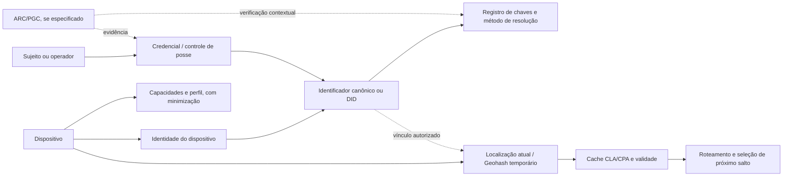

# Identidade, DIDs e identificador de equipamento do MeshWave

## Metadados

| Campo | Valor |
|---|---|
| ID curatorial | `DOM-04` |
| Status | `REVISÃO` — propostas conceituais; nenhum esquema, método DID ou implementação verificável confirmado |
| Versão do documento | `0.1.0` |
| Última atualização | `2026-10-08` |
| Curador | `Manus — curadoria BCE MeshWave` |
| Confiança geral | Média para a existência das propostas e imagens; baixa para unicidade, segurança, conformidade DID, ciclo de vida e operação |
| Documento relacionado no índice | `BCE/INDICE_CURATORIAL.md` — DOM-04 |

## 1. Resumo executivo

O lote F2.4 reúne ideias para identificar regiões, fabricantes, equipamentos, usuários e perfis em uma rede MeshWave. Há duas linhas principais. A primeira é um identificador composto, apresentado em imagens como um registro com campos geográficos, fabricante, perfil, timestamp e dígito verificador. A segunda é a proposta textual `GGGGGGFFFEEEE-V`, em que `GGGGGG` seria um GeoID/Geohash, `FFF` o fabricante, `EEEE` o equipamento e `V` um verificador.

Essas fontes **não estabelecem um DID normativo**. Não há método DID, documento DID, controlador, chave pública, método de verificação, resolução, revogação, rotação de chaves, prova de posse, governança de registradores ou implementação criptográfica verificável. O termo “DID” aparece como nome de uma proposta compacta de identificador; a conformidade com padrões de identidade descentralizada permanece não demonstrada.

Também aparece a ideia de “DNA do hardware”, ARC/PGC e identidade auto-soberana, mas as evidências disponíveis são textos de apresentação e imagens conceituais. Elas sustentam uma direção arquitetural ou de produto, não uma medição física de hardware, uma prova de gênese ou um protocolo de autenticação executável.

**Estado curatorial:** há material suficiente para registrar requisitos e conflitos, mas não para declarar um identificador adotado. O DOM-04 permanece em `REVISÃO`.

## 2. Escopo e limites

Entram neste documento: identidade de pessoa, usuário, dispositivo e nó; identificadores compostos; GeoID/Geohash usado como componente de identificação; fabricante e equipamento; perfil e timestamp; dígito verificador; identidade soberana; “DNA do hardware”; ARC/PGC apenas como dependências conceituais; privacidade, reidentificação e ciclo de vida; relação com cache e roteamento.

Não entram em profundidade a especificação de ARC/Bayes, a implementação de roteamento, a arquitetura física, a compatibilidade Android, a persistência, a LGPD completa ou a segurança criptográfica. Esses tópicos devem ser desenvolvidos em DOM-05, DOM-03, DOM-02, DOM-10/DOM-11, DOM-07 e DOM-14, respectivamente.

A análise não trata título, captura de interface, imagem gerada, rótulo de “tarefa concluída” ou relatório alegado como evidência de implementação. Nenhuma credencial, token ou dado pessoal é reproduzido.

## 3. Terminologia

| Termo | Definição adotada | Sinônimos/variações | Fonte |
|---|---|---|---|
| Identificador de equipamento | Cadeia destinada a distinguir um equipamento ou nó no contexto MeshWave. O formato ainda não foi aprovado. | identificador único, ID do equipamento | `KNOWLEDGE/info/20260422_174130_Definição do identificador único do equipamento na rede - Manus/` |
| DID | Rótulo usado pela fonte para uma proposta de identificador global compacto; não comprovadamente um Decentralized Identifier interoperável. | identificador global, ID soberano | `KNOWLEDGE/omaci2008/20260422_173034_Melhor forma de criar DIDs para rede mesh global - Manus/` |
| GeoID | Campo geográfico proposto para representar a microrregião de ativação. | Geohash, identidade espacial | mesma fonte |
| Identidade soberana | Direção conceitual em que o sujeito controla ou apresenta sua identidade sem depender de uma autoridade única; não há protocolo ou carteira demonstrados no lote. | SSI, identidade auto-soberana | `KNOWLEDGE/omaci2008/20260422_172158_Imagem para Identidade Auto-Soberana e Verificação - Manus/` |
| DNA do hardware | Metáfora ou proposta de vincular identidade a características do equipamento. Não há função de extração, segredo, medição ou prova anexada. | identidade resiliente, impressão digital de hardware | `KNOWLEDGE/info/20260422_164535_DNA do Hardware_ Identidade Resiliente com ARC_PGC - Manus/` |
| ARC/PGC | ARC é apresentado como autenticação contextual; PGC como prova de gênese contextual. O lote não fornece sua especificação criptográfica. | Autenticação Recessiva Contextual, Prova de Gênese Contextual | `.../164535_DNA do Hardware.../` e `.../172158_Imagem para Identidade.../` |
| Dígito verificador | Campo final proposto para detectar erros de transcrição ou composição. Algoritmo e parâmetros não foram fornecidos. | DV, verificador | `.../173034_Melhor forma de criar DIDs.../` |
| Perfil | Campo visual de um registro que pode representar capacidades ou atributos do nó. Sem esquema, semântica e controle de atualização definidos. | profile | imagem `.../174130.../img_000.jpg` |

## 4. Estado da arte atual

### 4.1 Capacidades e comportamento descritos

As fontes sugerem que uma identidade poderia combinar localização de ativação, fabricante, equipamento, perfil e verificação. Essa composição permitiria indexar um nó por região e usar a hierarquia geográfica para consultas de roteamento. O DOM-03 já registra que Geohash/CLA/CPA aparece como proposta de indexação e cache, mas sem contrato formal que una todas as siglas.

A proposta textual `GGGGGGFFFEEEE-V` tem quatro componentes semânticos: região, fabricante, equipamento e verificador. A imagem de `174130` mostra uma composição diferente e muito mais extensa, com campos de Geohash/CLA, Geohash/CFA, fabricante, outro campo geográfico, perfil, timestamp e dígito verificador; vários rótulos e comprimentos estão parcialmente ilegíveis ou corrompidos. Não é possível convertê-la em um esquema normativo sem uma fonte original legível.

### 4.2 Componentes e responsabilidades

| Componente | Responsabilidade proposta | Estatuto nesta revisão |
|---|---|---|
| GeoID/Geohash | Localizar a região de ativação ou apoiar busca regional. | Especificado de modo incompleto; a semântica e o nível de precisão não foram aprovados. |
| ID do fabricante | Identificar o namespace ou fabricante responsável pela codificação do equipamento. | Proposto; autoridade de alocação e colisões não definidas. |
| Código do equipamento | Distinguir equipamentos dentro do namespace do fabricante. | Proposto; não se sabe se é estável, secreto, derivado ou reatribuível. |
| Perfil/capacidades | Associar atributos ao nó para seleção de rota ou operação. | Hipótese/especificação visual; risco de expor características e facilitar fingerprinting. |
| Timestamp | Marcar ativação, registro ou atualização. | Campo visual alegado; evento, relógio e autoridade não definidos. |
| Dígito verificador | Detectar erro de digitação ou composição. | Proposto; algoritmo não fornecido e não substitui autenticação. |
| DNA do hardware | Vincular identidade a características físicas/entropia do dispositivo. | Conceito; nenhuma medição, derivação de chave ou atestado verificável. |
| ARC/PGC | Dar contexto e origem à autenticação. | Dependência para DOM-05; sem protocolo no lote. |
| DID document/resolver | Permitir resolução e verificação descentralizada. | **Ausente**; o uso do termo DID não prova esses componentes. |

### 4.3 Interfaces, entradas e saídas

Não foi encontrado contrato de API, estrutura JSON, URI DID, método de resolução, formato de documento, esquema de assinatura ou registro de chaves. Os `code_blocks.txt` do lote contêm sobretudo rótulos, trechos de apresentação, CSS, nomes de arquivos e a cadeia proposta; não há código executável de geração, validação ou resolução.

Uma interface mínima ainda não adotada teria de definir, no mínimo: entrada de identidade do sujeito e do dispositivo; autoridade/namespace; geração determinística ou aleatória; saída canônica; verificação de sintaxe e posse; resolução do identificador; atualização de atributos; revogação; rotação; auditoria; e tratamento de perda, troca ou clonagem do equipamento.

### 4.4 Requisitos, restrições e premissas

As propostas parecem buscar compactação, escala global, indexação geográfica e recuperação eficiente. Isso cria tensões importantes: uma localização embutida envelhece quando o nó se move; um identificador estável pode permitir rastreamento; um perfil embutido expõe capacidades; um código de fabricante exige governança; e um dígito verificador não oferece autenticidade.

Um identificador deve separar, preferencialmente, um **identificador estável ou rotativo do sujeito/dispositivo** de um **registro de localização atual**, que pode mudar sem alterar a identidade. O cache de localização e o roteamento devem consultar um vínculo autorizado, com validade e política de privacidade, e não inferir a identidade completa a partir de um Geohash público.

A fonte Android antigo sustenta apenas uma recomendação de alcance — suporte pelo menos até Android 8.0 — e registra que arquivos-base estavam ausentes ou vazios. Ela não prova que APIs de identificador, armazenamento seguro, atestado ou compatibilidade de identidade estejam implementados.

### 4.5 O que está implementado, prototipado ou apenas proposto

- **Implementado e verificável:** nenhum gerador, validador, resolver, carteira, registro ou protocolo de identidade foi encontrado no lote.
- **Prototipado:** há imagens conceituais e um diagrama de registro; eles demonstram comunicação visual, não operação.
- **Especificado:** `GGGGGGFFFEEEE-V` e a ideia de combinar Geohash, fabricante, equipamento e verificador.
- **Hipótese:** DNA do hardware, ARC/PGC, identidade auto-soberana, perfil incorporado e uso direto da identidade no roteamento.
- **Contraditório:** capacidades declaradas para o formato DID; a proposta alterna 4+8+1 e 6+3+4+1, e os números de capacidade não são compatíveis de forma clara com o alfabeto base-62 assumido.

## 5. Arquitetura e modelo conceitual

A separação abaixo é uma reconstrução curatorial para evitar que identidade, localização e roteamento sejam confundidos:

O diagrama não declara que os componentes existem. Ele explicita a arquitetura necessária para que um identificador geográfico não seja confundido com uma identidade criptográfica. A localização deve ter validade, controle de acesso e possibilidade de rotação; o identificador deve ter ciclo de vida próprio; e a autenticação deve verificar posse ou autoridade, não apenas o texto da cadeia.

## 6. Fluxos e casos de uso

### 6.1 Registro inicial de dispositivo

**Pré-condições:** dispositivo autorizado, namespace do fabricante ou autoridade de registro disponível e método de geração definido. **Sequência pretendida:** gerar ou provisionar identidade; associar chave/controlador; validar unicidade; criar vínculo com perfil mínimo; registrar localização inicial separadamente; publicar ou armazenar o registro. **Resultado:** um identificador resolvível e uma prova de posse. **Falhas:** colisão, relógio inválido, fabricante não autorizado, clonagem ou perda de chave. **Evidência:** apenas propostas textuais e imagem; fluxo não implementado.

### 6.2 Atualização de localização

**Pré-condições:** identidade já registrada e autorização do dispositivo. **Sequência pretendida:** emitir atualização autenticada; gravar Geohash com precisão e TTL adequados; manter histórico minimizado ou não mantê-lo; invalidar a localização anterior conforme política. **Resultado:** roteamento encontra o nó sem mudar necessariamente sua identidade. **Falhas:** replay, localização falsa, dispositivo offline e rastreamento indevido. **Evidência:** DOM-03 descreve cache/localização como proposta; F2.4 não fornece implementação.

### 6.3 Verificação de identidade

**Pré-condições:** verificador conhece o método e obtém o registro atual. **Sequência pretendida:** resolver o identificador; verificar chave, assinatura, validade e estado; comparar contexto somente quando necessário; liberar o atributo mínimo. **Resultado:** decisão de autenticidade e autorização. **Falhas:** chave revogada, documento indisponível, contexto conflitante ou prova ausente. **Evidência:** ARC/PGC aparece em imagens e descrições, sem algoritmo ou código.

### 6.4 Rotação, troca e perda do equipamento

Um dispositivo substituído não deve obrigar a reutilizar o mesmo identificador físico nem permitir que o equipamento antigo continue autenticado. O lote não define recuperação, revogação, delegação, transferência de controle ou vínculo entre identidade de usuário e múltiplos dispositivos. Esse fluxo é uma lacuna de bloqueio para qualquer adoção.

## 7. Código, algoritmos e parâmetros

O principal artefato algorítmico é a cadeia visual/textual `GGGGGGFFFEEEE-V`. A fonte afirma 6 caracteres geográficos, 3 de fabricante, 4 de equipamento e 1 de verificação, mas não fornece alfabeto final, cálculo, tabela de alocação ou pseudo-código. A mesma conversa registra uma premissa anterior de 4 caracteres para fabricante e 8 para equipamento.

A afirmação de “1,07 bilhão de microrregiões”, “262.144 fabricantes” e “16,78 milhões de equipamentos por fabricante” aparenta combinar capacidades base-2 com um alfabeto base-62, mas a fonte não demonstra os cálculos. Portanto, os números são registrados como **alegações não validadas**, não como parâmetros.

Nenhum trecho de geração de dígito verificador, hash, assinatura, derivação de chave, resolução DID, armazenamento seguro, atestado de hardware ou rotação foi encontrado. A presença de `code_blocks.txt` não altera essa classificação: os blocos são rótulos ou transcrições de interface, não um módulo executável.

## 8. Evidências e fontes

| Evidência | Tipo | Caminho relativo | O que sustenta | Limitações |
|---|---|---|---|---|
| E04-01 | texto/imagem | `KNOWLEDGE/info/20260422_174130_Definição do identificador único do equipamento na rede - Manus/` | Planejamento de um registro composto com Geohash/CLA, fabricante, perfil, timestamp e verificador | Conteúdo é planejamento de site; imagem tem rótulos corrompidos; sem contrato ou implementação |
| E04-02 | texto | `KNOWLEDGE/omaci2008/20260422_173034_Melhor forma de criar DIDs para rede mesh global - Manus/content.txt` | Proposta `GGGGGGFFFEEEE-V` e semântica dos campos | Não é DID demonstrado; há versões conflitantes e contas não reproduzíveis |
| E04-03 | imagem | `KNOWLEDGE/omaci2008/20260422_173034_Melhor forma de criar DIDs para rede mesh global - Manus/FULL.png` | A proposta foi apresentada ao usuário em uma interface | Captura não prova aprovação, adoção ou execução |
| E04-04 | imagem | `KNOWLEDGE/omaci2008/20260422_172158_Imagem para Identidade Auto-Soberana e Verificação/` | Associação visual entre DNA do hardware, identidade resiliente, ARC e PGC | Arte conceitual; não prova criptografia, hardware ou SSI |
| E04-05 | texto/imagem | `KNOWLEDGE/info/20260422_164535_DNA do Hardware_ Identidade Resiliente com ARC_PGC/` | Direção conceitual de identidade resiliente e ARC/PGC | Conteúdo principal é tarefa de apresentação; imagens não são especificação |
| E04-06 | texto | `KNOWLEDGE/info/20260422_173855_Identificador Único do Equipamento na Rede - Manus/` | O tema Identificação/DIDs fazia parte da organização do site | Fonte predominantemente operacional; não define o identificador |
| E04-07 | texto/imagem | `KNOWLEDGE/info/20260422_173802_Identificador Único do Equipamento na Rede - Manus/` | Proveniência da exportação/entrega da base MeshWave | Não contém especificação técnica do ID; ZIP e integridade não verificáveis no conjunto |
| E04-08 | texto | `KNOWLEDGE/info/20260422_172056_Análise e continuidade sobre dispositivos Android antigos - Manus/` | Recomendação estratégica de manter suporte até Android 8.0 | Arquivos-base ausentes/vazios; não prova compatibilidade de identidade |
| E04-09 | texto relacionado | `BCE/temas/rede-mesh-comunicacao-e-roteamento.md` | Geohash/CLA/CPA aparecem como indexação e cache propostos | DOM-03 também marca ausência de contrato formal e implementação |

## 9. Evolução arqueológica

| Período/versão | Formulação/estado | Mudança | Motivo/evidência | Resultado |
|---|---|---|---|---|
| Fase inicial da proposta | Identificação de fábrica com 4 caracteres de fabricante, 8 de equipamento e 1 verificador | Premissa de grande código interno | Texto de `173034` | Formulação intermediária, não congelada |
| Fase posterior | `GGGGGGFFFEEEE-V` com GeoID, fabricante, equipamento e verificador | A localização passou a ocupar o prefixo | Texto e imagem de `173034` | Proposta compacta; sem validação matemática ou operacional |
| Planejamento de registro | Registro visual com múltiplos Geohashes, fabricante, perfil, timestamp e verificador | Modelo ficou mais rico e mais longo | Imagem `174130/img_000.jpg` | Esquema ilegível/parcial e sem contrato |
| Linha de identidade resiliente | DNA do hardware, ARC/PGC e identidade auto-soberana | Identidade passou de cadeia compacta para conceito de prova/contexto | `164535` e `172158` | Direção arquitetural, sem protocolo |
| Compatibilidade de plataforma | Suporte recomendado até Android 8.0 | Requisito de alcance e inclusão | `172056` | Recomendação sem fontes-base anexadas ou teste |

## 10. Decisões tomadas

### DEC-DOM04-001 — Não tratar a cadeia proposta como DID adotado

- **Problema:** o termo DID aparece em uma proposta de formato compacto.
- **Escolha:** classificar `GGGGGGFFFEEEE-V` como identificador proposto, não como DID conforme ou adotado.
- **Justificativa:** faltam método, resolução, controlador, chaves, assinaturas, ciclo de vida e interoperabilidade.
- **Consequência:** qualquer implementação futura deve primeiro escolher uma especificação de identidade e só então avaliar se o formato compacto pode ser um identificador interno, um alias ou um campo de registro.

### DEC-DOM04-002 — Separar identidade de localização

- **Problema:** as propostas embutem GeoID/Geohash na identificação.
- **Escolha:** tratar localização como vínculo atualizado e controlado, não como componente necessariamente permanente da identidade.
- **Justificativa:** mobilidade, privacidade, rotação e prevenção de rastreamento.
- **Consequência:** DOM-03 deve consumir uma referência de localização com TTL/política, sem depender de um identificador geográfico imutável.

### DEC-DOM04-003 — Manter ARC/PGC como dependência de DOM-05

- **Problema:** imagens associam ARC/PGC à identidade, mas o lote não define o mecanismo.
- **Escolha:** não preencher a lacuna com inferência; encaminhar a especificação para DOM-05.
- **Consequência:** DNA do hardware, prova de gênese e autenticação contextual não podem ser declarados implementados neste DOM.

## 11. Alternativas, descartes e ideias não adotadas

- **Formato 4+8+1:** preservado como formulação histórica; não adotado porque a fonte posterior propõe outra divisão e não há decisão formal.
- **Formato `GGGGGGFFFEEEE-V`:** mantido como candidato de identificador interno; não adotado como DID nem como padrão global.
- **Geohash permanente na identidade:** não adotado como decisão; pode voltar como índice de ativação ou atributo temporário, desde que haja minimização e política de atualização.
- **DNA físico como identidade:** mantido como hipótese de pesquisa; não deve ser implementado sem especificar fonte de entropia, estabilidade, não clonabilidade, privacidade, atestado e recuperação.
- **Perfil embutido na cadeia:** não adotado; atributos e capacidades devem ser separados e divulgados minimamente para reduzir fingerprinting.
- **Dígito verificador como autenticação:** descartado; DV detecta erro de composição, mas não prova posse nem origem.

## 12. Otimizações, correções e melhorias

A principal correção curatorial é separar três funções que as fontes misturam: **identificar**, **localizar** e **autenticar**. A otimização de roteamento pode usar um índice regional temporário sem transformar região em identidade global. A verificação deve depender de chave, assinatura ou prova formal, não apenas de uma cadeia bem formada. A melhoria mínima para qualquer protótipo é adicionar testes de colisão, mobilidade, revogação, troca de dispositivo, replay, clonagem, perda de conectividade e exposição de perfil.

Nenhuma dessas melhorias foi implementada no lote; são requisitos para a próxima fase.

## 13. Conflitos e incertezas

| ID | Questão | Fontes em conflito | Impacto | Resolução/ação |
|---|---|---|---|---|
| C04-01 | O identificador tem formato 4+8+1 ou 6+3+4+1? | `173034` em fases diferentes | Não há esquema único nem compatibilidade de dados | Recuperar relatório original ou registrar decisão formal antes de codificar |
| C04-02 | O alfabeto é base-62, base-64 ou outro? | `173034` e capacidades declaradas | Capacidade, normalização e segurança ficam indeterminadas | Fixar alfabeto, maiúsculas/minúsculas, separadores e cálculo reproduzível |
| C04-03 | A proposta é DID ou ID interno? | Título/conclusão de `173034` versus ausência de método DID | Risco de falsa interoperabilidade e arquitetura incorreta | Classificar como ID proposto até especificar método e resolução |
| C04-04 | Geohash é identidade, ativação ou localização atual? | `173034`, imagem `174130` e DOM-03 | Mobilidade e privacidade podem ser quebradas | Separar ID estável de localização com TTL e controle |
| C04-05 | DNA do hardware é metáfora ou atestado? | `164535`/`172158` | Pode induzir promessa de segurança inexistente | DOM-05 deve fornecer protocolo, ameaça, métrica e teste |
| C04-06 | O perfil é parte do identificador ou atributo externo? | Imagem `174130` e proposta compacta | Exposição de capacidades e fingerprinting | Não embutir até haver modelo de minimização e autorização |
| C04-07 | Android 8.0 é requisito validado? | `172056` e arquivos-base ausentes | Pode orientar versão mínima sem teste | Tratar como recomendação; validar em matriz de dispositivos |

## 14. Lacunas e questões em aberto

1. **Especificação normativa:** escolher se o sistema precisa de DID interoperável, identificador interno, ou ambos; registrar método, resolução e governança.
2. **Modelo de ameaça:** definir clonagem, Sybil, rastreamento, comprometimento do dispositivo, replay, fabricante malicioso e perda de chave.
3. **Ciclo de vida:** especificar criação, ativação, rotação, revogação, recuperação, troca, descarte e transferência de equipamento.
4. **Criptografia:** definir chaves, algoritmo, armazenamento seguro, assinatura, atestado e prova de posse; nenhum desses itens está no lote.
5. **Privacidade:** impedir que GeoID, timestamp e perfil permitam rastreamento contínuo ou fingerprinting; definir precisão, TTL, acesso e retenção.
6. **Formato:** reconciliar 4+8+1 com 6+3+4+1, corrigir as contas de capacidade e fornecer vetores de teste.
7. **Alocação:** definir autoridade para fabricante/namespace, colisões, delegação e registro de dispositivos não fabricados por parceiros.
8. **Integração com DOM-03:** definir como o cache CLA/CPA referencia uma identidade sem copiar atributos sensíveis e sem tornar a localização permanente.
9. **Android:** recuperar os documentos ausentes de `172056` e testar Android 8.0 ou superior; distinguir identificador de instalação, dispositivo e usuário.
10. **Reprodutibilidade:** anexar código mínimo, dependências, testes, resultados e hashes; o lote atual não contém implementação executável.

## 15. Relações com outros documentos

- `DOM-01` — fornece a visão geral; deve consumir este documento sem elevar propostas a fatos.
- `DOM-02` — arquitetura e implantação; identidade é dependência transversal, mas ainda não há componente implantado.
- `DOM-03` — usa Geohash/CLA/CPA e cache; deve separar índice de localização de identidade e aguardar contrato formal.
- `DOM-05` — especificará ARC, PGC e inferência bayesiana; é a próxima dependência técnica direta.
- `DOM-10` — deve tratar APIs Android, identificadores de plataforma e compatibilidade.
- `DOM-11` — deve tratar hardware, atestado e infraestrutura física.
- `DOM-14` — deve consolidar privacidade, LGPD, governança e exposição de perfil.

## 16. Histórico de versões do documento

| Versão | Data | Alteração | Fontes/commit |
|---|---|---|---|
| `0.1.0` | `2026-10-08` | Primeira síntese do lote F2.4; separação entre identidade, localização, autenticação e roteamento; conflitos e lacunas registrados | Sete caminhos do `ESCOPO_F2_4_IDENTIDADE_DIDS.md`; commit a publicar |

## 17. Próximo passo de curadoria

Processar a F2.5 lendo integralmente as fontes de ARC, autenticação contextual, DNA do hardware e inferência bayesiana, e produzir `BCE/temas/arc-autenticacao-contextual-e-bayes.md` distinguindo claramente metáfora de “DNA”, especificação ARC/PGC, algoritmo, evidência criptográfica, código executável e testes; depois revisar DOM-04 apenas se a nova fonte resolver C04-05 ou alterar o modelo de verificação.
