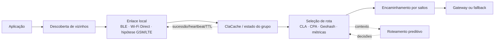

# Rede mesh, comunicação e roteamento do MeshWave

## Metadados

| Campo | Valor |
|---|---|
| ID curatorial | `DOM-03` |
| Status | `REVISÃO` — primeira síntese do lote F2.3; protocolos e implementação não validados |
| Versão do documento | `0.1.0` |
| Última atualização | `2026-10-08` |
| Curador | `Manus — curadoria BCE MeshWave` |
| Confiança geral | Média para a existência das propostas e do histórico de decisões; baixa para implementação, interoperabilidade e operação em rede |
| Documento relacionado no índice | `BCE/INDICE_CURATORIAL.md` — DOM-03 |

## 1. Resumo executivo

As fontes de F2.3 descrevem uma rede mesh MeshWave como uma malha de nós móveis que descobre vizinhos, estabelece enlaces, encaminha dados e escolhe rotas com base em contexto geográfico, qualidade do enlace, reputação, latência, energia e eventualmente inferência bayesiana. A arquitetura aparece em várias formulações: Wi‑Fi Direct/Bluetooth para proximidade; Geohash, CLA e CPA para localização e cache; GSM/LTE/5G como hipótese de transporte de maior alcance; e roteamento preditivo com bandits adaptativos como proposta de otimização.

O lote também preserva uma evolução arqueológica de interface Android para uma rede resiliente. A descoberta passiva foi considerada insuficiente; a proposta passou a incluir criação/conexão de grupo, `ClaCache` replicado, lista de sucessão, heartbeat, TTL e separação entre líder técnico e gateway. Contudo, os artefatos são transcrições, imagens de interface, relatórios e fragmentos; não há projeto Android, firmware, protocolo de mensagens, logs de tráfego, teste de dois nós, código de roteamento isolado ou deployment que permita reproduzir a rede.

**Estado da arte curatorial:** o MeshWave tem uma especificação e um conjunto de hipóteses técnicas coerentes em alguns pontos, mas ainda não há evidência suficiente para afirmar que descoberta, enlace, encaminhamento, roteamento, cache, fallback ou comunicação GSM/LTE funcionem em produção. Resultados e números exibidos em capturas são evidência de uma apresentação ou simulação alegada, não de uma rede operacional.

## 2. Escopo e limites

Entram neste documento descoberta de vizinhos, BLE, Bluetooth, Wi‑Fi Direct, P2P, gestão de grupo, sockets, encaminhamento, cache de localização, CLA/CPA/Geohash, roteamento preditivo, métricas, fallback e alternativas de transporte como GSM/LTE, laser e Briar LAN. Também entram o simulador visual e as evidências de troubleshooting Android quando ajudam a reconstruir decisões e lacunas.

Não entram a definição formal de identidade/DIDs, o modelo ARC/Bayes completo, a persistência de conhecimento, a implantação de hardware ou a segurança/LGPD em profundidade; esses temas são relacionados a DOM-04, DOM-05, DOM-07, DOM-11 e DOM-14. A fonte de laser é tratada como contexto de transporte alternativo, não como implementação MeshWave.

A análise não valida protocolos externos, não executa os aplicativos transcritos, não acessa links de ação ou redirecionadores opacos e não trata o título, o link, a captura ou um rótulo de “concluído” como prova de funcionamento.

## 3. Terminologia

| Termo | Definição adotada | Sinônimos/variações | Fonte |
|---|---|---|---|
| Vizinho | Nó detectável ou alcançável localmente por uma interface de rádio ou enlace P2P. | peer, dispositivo próximo | `KNOWLEDGE/filipe/20260422_165238_Criar interface para projeto no Android Studio - Manus/content.txt` |
| Group Owner | Papel técnico atribuído pelo Wi‑Fi Direct ao nó que cria/coordena um grupo. | líder do grupo, GO | mesma fonte; `.../165337_Como funciona a rede MeshWave_.../content.txt` |
| Lista de sucessão | Lista ordenada de nós candidatos a recriar o grupo quando o líder cai. | sucessão, eleição hierárquica | `.../165238.../content.txt` e `.../165337.../code_blocks.txt` |
| `ClaCache` | Cache compartilhado proposto para localização, membros e estado de sucessão. | cache de localização atual | `.../165238.../content.txt` |
| CPA | Cache Primário de Ativação; a fonte o apresenta como referência inicial e persistente do nó. | CP em algumas transcrições | `.../165238.../content.txt`; `.../165337.../content.txt` |
| CLA | Localização/Cache de Localização Atual ou níveis/células de uma representação geográfica. | camada/área CLA | `.../165701_Hierarquia de CLA.../content.txt`; `.../165509.../content.txt` |
| Geohash | Codificação espacial usada na fonte para localizar uma origem e gerar uma grade. | geohash de origem | `.../165509.../content.txt` |
| Roteamento preditivo | Seleção de rotas com contexto, histórico e modelos de aprendizado. | contextual bandit, Thompson Sampling | `.../171217_Roteamento Preditivo.../content.txt` |
| Fallback | Mudança para outra conectividade quando a malha principal não consegue transportar o tráfego. | celular, LEO, gateway externo | `BCE/temas/arquitetura-geral-e-implantacao.md` |
| GSM mesh | Hipótese de usar rádio GSM/LTE/5G como transporte de longo alcance entre nós que executariam protocolos de malha. | rede celular ad hoc, MANET celular | `.../174924_Capacidade de uma rede GSM Mesh.../content.txt` |

As siglas CLA, CPA e MCP não têm contrato normativo único no lote. Em particular, não foi confirmado que a imagem CLA seja uma codificação Geohash, nem que “CP” e “CPA” sejam sempre o mesmo componente.

## 4. Estado da arte atual

### 4.1 Capacidades e comportamento descritos

O fluxo pretendido é: um nó identifica uma necessidade de comunicação; descobre ou consulta vizinhos; cria ou ingressa em um grupo; mantém o estado local e o cache; escolhe o próximo salto; retransmite dados; e usa um gateway ou transporte alternativo quando necessário. Em uma formulação, a consulta começa em um cache primário e aponta para a localização atual do nó, reduzindo flooding. Em outra, a origem Geohash define a célula `(0,0)` e uma grade de CLAs ao redor é gerada para exploração visual.

A proposta Android distingue descoberta passiva de formação de rede. `discoverPeers` apenas escuta; a rede precisaria procurar um grupo existente, conectar-se a ele ou criar um novo. O papel de Group Owner é tratado como uma limitação técnica do Wi‑Fi Direct, não como o gateway obrigatório. Um nó cliente ou líder, especialmente com melhores recursos, poderia servir como gateway segundo métricas de custo/benefício.

### 4.2 Componentes e responsabilidades

| Componente | Responsabilidade proposta | Estatuto nesta revisão |
|---|---|---|
| Rádio Bluetooth/BLE | Descoberta ou enlace local de baixo consumo. | Especificado como alternativa; nenhum log de descoberta ou teste anexado. |
| Wi‑Fi Direct/P2P | Criação de grupo, conexão entre peers e troca inicial por sockets. | Protótipo alegado/histórico; código e teste físico ausentes. |
| `ClaCache` | Replicar membros, localização e sucessão; apoiar recuperação após falha. | Especificação/proposta; esquema, consistência e atualização não definidos. |
| Geohash/CLA/CPA | Indexar região, origem e caminho de busca. | Proposta visual e de aplicação; sem regra formal que ligue todos os termos. |
| Roteador preditivo | Selecionar rotas por latência, perda, fila, energia e contexto. | Modelo conceitual; fragmentos não demonstram execução. |
| GSM/LTE/5G | Transporte hipotético de longo alcance e maior capacidade. | Hipótese de engenharia; não há prova de comunicação direta entre aparelhos. |
| Gateway | Oferecer saída para rede tradicional, satélite ou outro domínio. | Requisito/proposta; política de seleção e fallback não especificadas. |
| Simulador | Demonstrar topologia, métricas e ajustes de número de dispositivos. | Protótipo visual alegado; não valida rádio ou encaminhamento real. |

### 4.3 Interfaces, entradas e saídas

As interfaces transcritas incluem `discoverPeers`, `createGroup`, `connect`, `BluetoothSendReceiveThread`, `TcpSendReceiveThread`, `P2PSendReceiveThread`, `updateCacheLocal()` e um `Handler` Android. São referências de implementação histórica e de troubleshooting, não contratos de API publicados. A proposta Geohash inclui uma rota HTTP `/api/generate_manual_grid`, recebe `geohash_origem`, `raio_x` e `raio_y`, decodifica a origem e retorna células com Geohash, coordenadas e limites; o código está somente na transcrição, não em um projeto anexado.

Entradas sugeridas para o roteador são latência, perda de pacotes, filas, carga prevista, bateria, reputação, capacidade de processamento/armazenamento, qualidade do sinal, custo e disponibilidade de gateway. Nenhum esquema versionado, unidade, janela temporal, limiar, função de custo completa ou formato de mensagem foi confirmado.

### 4.4 Requisitos, restrições e premissas

As fontes exigem, como intenção de projeto, ausência de ponto único de falha, prioridade à experiência do usuário, preservação da identidade e capacidade de operar com nós móveis e intermitentes. A proposta GSM/LTE adiciona sincronização de tempo/frequência, coordenação de espectro, energia e processamento como restrições críticas. A proposta Wi‑Fi Direct depende de resolver a morte do grupo quando o Group Owner sai. A proposta de cache depende de consistência, heartbeat e expiração, todos ainda sem parâmetros verificáveis.

### 4.5 O que está implementado, prototipado ou apenas proposto

- **Implementado e verificável no repositório BCE:** nenhum componente de rede deste lote; os arquivos brutos são históricos e não foram alterados.
- **Código transcrito:** há trechos extensos de Flask/JavaScript para uma grade Geohash, instruções Java/Android e fragmentos de simulador; não são arquivos de um build reproduzível.
- **Protótipo alegado:** há relatos de aplicativo v1.05, simulador publicado e relatório PDF com gráficos. Não há APK, repositório correspondente, dependências completas, logs, hashes, dataset ou teste independente anexado.
- **Especificado:** sucessão, `ClaCache`, separação líder/gateway, busca CP→CLA, bandits contextuais, recompensa por latência/perda e hipótese GSM mesh.
- **Hipótese:** comunicação direta GSM/LTE sem infraestrutura de operadora, alcance de quilômetros entre aparelhos e capacidade de formar uma infraestrutura celular autônoma.
- **Não confirmado:** fallback, interoperabilidade BLE/Wi‑Fi Direct/GSM, Geohash como base da CLA, sincronização de cache, roteamento efetivo, segurança do encaminhamento e resiliência em partições.

## 5. Arquitetura e modelo conceitual

Este diagrama é uma síntese BCE. A relação entre CLA, CPA e Geohash é inferida de fontes que usam os termos em conjunto, mas a correspondência formal não foi encontrada. A camada de rádio, o plano de controle, a persistência do cache e o formato do pacote continuam sem especificação operacional.

Um modelo de estados mínimo é sugerido pelas fontes: `SEM_GRUPO → DESCOBRINDO → CONECTANDO → CONECTADO → ENCAMINHANDO`; em falha, `CONEXÃO_PERDIDA → ELEGENDO_SUCESSOR → RECRIANDO_GRUPO` ou `FALLBACK`. Esses estados são uma reconstrução curatorial, não estados publicados no código.

## 6. Fluxos e casos de uso

### 6.1 Descoberta e formação de grupo

Pré-condição: rádio e permissões disponíveis. O nó tenta descobrir peers. Se existir grupo com o identificador esperado, conecta-se; caso contrário, cria grupo. O resultado esperado é uma vizinhança com troca de estado por socket. A evidência é a narrativa Android, mas não há log de descoberta, endereço, handshake ou teste entre dois aparelhos.

### 6.2 Recuperação do Group Owner

Pré-condição: grupo conectado e `ClaCache` replicado. Heartbeats detectam ausência do líder; a lista ordenada por reputação escolhe o próximo nó; TTL evita espera indefinida; o sucessor tenta recriar o grupo. O resultado é a continuidade da malha sem o criador original. Trata-se de proposta sem algoritmo de eleição, autoridade de escrita do cache, prevenção de duas eleições simultâneas ou prova de execução.

### 6.3 Busca por localização

A aplicação explora uma cidade ou recebe um Geohash de origem, que é decodificado para latitude/longitude; uma grade é gerada e cada célula recebe coordenadas. Em uma arquitetura de rede, a busca CP→CLA pretende apontar para a localização atual e reduzir flooding. A fonte Geohash traz código transcrito, mas a imagem principal mostra instruções de implantação HTTPS, não uma execução de roteamento.

### 6.4 Escolha de rota preditiva

O contexto pode incluir latência, perda, filas, carga e energia. A proposta de recompensa é `w1 * (1 / latência_normalizada) + w2 * (1 - taxa_perda_pacotes)`. Contextual Bandits com Thompson Sampling fariam exploração/exploração; versões federadas ou por cluster são sugeridas. Não há definição dos braços, prior, atualização posterior, janela de observação, pesos, tratamento de dados ausentes ou comparação reproduzível.

### 6.5 Fallback e gateway

Se o caminho mesh não atender ao objetivo, um nó com conectividade externa poderia atuar como gateway, ou a rede poderia usar celular, satélite/LEO ou outro enlace. A fonte não define prioridade, consentimento, custo, segurança, política de retorno à malha, requisitos de operadora ou comportamento offline. Logo, fallback é intenção arquitetural, não fluxo confirmado.

## 7. Código, algoritmos e parâmetros

Os blocos de Geohash transcrevem uma aplicação Flask com `pygeohash`, geração por polígono/raio, conversão da célula para coordenadas de grade e exportação Excel. O JavaScript usa Leaflet, aceita uma origem como `6gyf7k` e exibe células. Isso é evidência de uma proposta de ferramenta geográfica; não demonstra que a aplicação esteja no repositório, compilada ou ligada à rede mesh.

Os blocos Android registram correções de `Handler`, passagem de `MainActivity` e `List<String>` ao `P2PSendReceiveThread`, e chamadas a `updateCacheLocal()`. Também registram erros de símbolos, construtor e dependências. Não há fontes completas das classes, `AndroidManifest`, Gradle, versão de SDK, teste de instalação ou build final.

O modelo de roteamento preditivo tem uma função de recompensa textual e menções a Thompson Sampling, calibração, commit-reveal, nonce, criptografia homomórfica, ZKP e testbeds FABRIC/COSMOS. O conjunto não contém implementação correspondente; o `code_blocks.txt` registra fórmulas/labels e um bloco de simulação que chama `run_simulation`, sem o módulo completo.

A fonte de erro `ch.hsr.geohash` registra problemas de dependência e de integração entre threads Android. A correção proposta é passar referências explícitas, limpar e reconstruir, mas a sessão termina sem resultado de build. O título não prova que a biblioteca Geohash seja a causa única nem que a correção tenha sido aplicada.

## 8. Evidências e fontes

| Evidência | Tipo | Caminho relativo | O que sustenta | Limitações |
|---|---|---|---|---|
| E03-01 | texto/código transcrito | `KNOWLEDGE/info/20260422_165509_Aplicação Local para Mapeamento de Regiões por Geohash - Manus/` | Origem Geohash, grade, endpoints e UI Leaflet propostos | Código está em transcrição; imagens não mostram a geração da grade; sem build ou deployment verificável |
| E03-02 | texto/imagem | `KNOWLEDGE/info/20260422_165701_Hierarquia de CLA Continental e Roteamento - Manus/` | Referência visual de células, regiões, vértices e polígonos | `previous_task_context.md` citado não está anexado/localizado; sem legenda, CRS, algoritmo ou dados-fonte |
| E03-03 | texto/código transcrito | `KNOWLEDGE/info/20260422_170852_Prosseguimento no Projeto Android Bluetooth - Manus/` | Correção pendente de XML e continuidade de contexto Android | Não prova Bluetooth funcionando nem APK/build |
| E03-04 | texto/código/imagem | `KNOWLEDGE/info/20260422_171217_Roteamento Preditivo com Autenticação Contextual e Inferência Bayesiana - Manus/` | Bandits, recompensa, métricas, ARC e plano de testbed | Predominantemente análise e sugestões; sem artefatos executáveis |
| E03-05 | texto/código/imagem | `KNOWLEDGE/filipe/20260422_165238_Criar interface para projeto no Android Studio - Manus/` | Descoberta ativa, Group Owner, `ClaCache`, sucessão, heartbeat, gateway e erros | Relato/transcrição; a afirmação de compilação não tem APK, log ou commit associado |
| E03-06 | texto/código/link | `KNOWLEDGE/filipe/20260422_165337_Como funciona a rede MeshWave_ - Manus/` | Diário v1.05, intenção de testar dois dispositivos e simulação cancelada | Link de ação e histórico incompleto; código de simulação não está anexado como projeto |
| E03-07 | texto/código/link/imagem | `KNOWLEDGE/dinecy/20260422_171406_Análise do Ciclo de Vida do Plugin de LAN no Briar - Manus/` | Relato de pesquisa/upload de relatório sobre Briar LAN | Não contém o código-fonte do plugin; o histórico menciona material sensível, omitido desta BCE |
| E03-08 | texto/código/link/imagem | `KNOWLEDGE/iury/20260422_162042_Estudo ou tecnologia para envio de dados por laser - Manus/` | Alternativa óptica e seus problemas de alinhamento, acoplamento e atenuação | `content.txt` é praticamente vazio/repetitivo; imagem traz contexto de estudo, não integração MeshWave |
| E03-09 | texto/código/link/imagem | `KNOWLEDGE/iury/20260422_162120_Criar site com simulador de rede mesh - Manus/` | Simulador visual com ajuste de número de dispositivos e alegação de testes local/publicado | Não valida rádio, protocolo, nós reais ou resultados de encaminhamento |
| E03-10 | texto/imagem | `KNOWLEDGE/johann/20260422_174924_Capacidade de uma rede GSM Mesh sem antenas - Manus/` | Hipótese GSM/LTE/5G como transporte, alcance, energia, espectro, sincronização e Fog/Edge | A própria fonte chama o cenário de hipotético; números de alcance são teóricos e não medidos |
| E03-11 | texto/código/imagem | `KNOWLEDGE/mateus/20260422_174421_Package ch.hsr.geohash does not exist error - Manus/` | Erros de integração de threads, Handler, peers e `updateCacheLocal` | Título e conteúdo divergem; build termina sem confirmação |
| E03-12 | texto/código/link/imagem | `KNOWLEDGE/omaci2008/20260422_172337_Roteamento preditivo com genes recessivos e aplicação bayesiana - Manus/` | Relato de relatório atualizado, latência, Geohash, gráficos de latência/sucesso/falsos positivos/negativos | PDF não está entre os artefatos do conjunto; gráficos não têm dataset, código ou protocolo experimental |

Os `links.txt` incluem links de ação, redirecionadores e um destino de relatório externo. Eles foram registrados como referências declaradas, sem seguir endpoints de ação ou reproduzir parâmetros opacos. A fonte Briar menciona token inválido/novo token em seu histórico; nenhum valor foi copiado. O material sensível deve ser rotacionado/revogado se algum valor real ainda estiver presente fora desta síntese.

## 9. Evolução arqueológica

| Período/versão | Formulação/estado | Mudança | Motivo/evidência | Resultado |
|---|---|---|---|---|
| Primeira UI Android | Tela centrada em créditos/reputação | Mudança para conectividade, peers e ações | Diário de bordo transcrito | Interface passou a representar a rede, sem prova de runtime |
| Iterações Android | Descoberta passiva e atualização de lista | Inclusão de criação/conexão ativa de grupo | Peers não apareciam em testes relatados | Requisito de ação ativa; implementação não anexada |
| v1.05 declarada | Group Owner como líder técnico | `ClaCache`, sucessão, heartbeat e TTL | Limitação do Wi‑Fi Direct e risco de ponto único de falha | Arquitetura proposta; teste em dois dispositivos ficou como próximo passo |
| Formulação Geohash | Origem por latitude/longitude | Origem passa a ser um Geohash e grade de CLAs | Melhoria de usabilidade descrita na fonte Geohash | Código transcrito; sem vínculo demonstrado com roteamento de pacotes |
| Roteamento preditivo | Seleção contextual com latência/perda | Bandits adaptativos, clusters e calibração | Relatórios e análises conceituais | Algoritmo e resultados não reproduzíveis no conjunto |
| Hipótese GSM mesh | Celular dependente de ERB | Rádio celular como transporte de nós ad hoc | Discussão de alcance e autonomia | Hipótese de futuro; desafios de espectro, sincronização e energia permanecem |
| Simulador | Interface interativa | Ajuste de dispositivos e dashboard | Captura e relato de testes local/publicado | Demonstração visual alegada; não valida a rede física |

## 10. Decisões tomadas

No âmbito do produto, as fontes registram como decisões ou direcionamentos históricos: abandonar descoberta passiva como mecanismo suficiente; criar/conectar grupos; manter sucessão no `ClaCache`; desacoplar Group Owner de gateway; usar reputação como critério futuro de sucessão; e buscar por Geohash em vez de exigir latitude/longitude no modo manual.

Nesta BCE, essas afirmações são classificadas como **decisões de design registradas na conversa**, não como decisões vigentes de implementação, porque não têm autoridade, versão, commit, critérios de aceite ou teste correspondente. As decisões de governança da curadoria permanecem em `BCE/REGISTRO_DECISOES.md`; nenhuma nova decisão BCE foi necessária para manter DOM-03 como documento único.

## 11. Alternativas, descartes e ideias não adotadas

A descoberta passiva foi considerada insuficiente para formar a malha. A eleição em tempo real foi substituída, no relato, por lista de sucessão pré-ordenada, embora o mecanismo de atualização e consenso não exista. O Group Owner não foi aceito como gateway obrigatório. A entrada manual por latitude/longitude foi substituída na ferramenta Geohash por um código de origem.

Bluetooth/Wi‑Fi Direct aparecem como alternativas locais de menor alcance; GSM/LTE/5G aparece como alternativa de maior alcance; laser/fibra aparece como estudo de transporte especializado. Nenhuma alternativa foi descartada com experimento comparativo. LEO, infraestrutura celular tradicional e gateways externos permanecem possibilidades de fallback, não contratos adotados.

A ideia de roteamento quântico, quando aparece no roadmap arquitetural, não é tratada aqui como capacidade do roteador. Também não se promove a imagem CLA a Geohash, nem se converte o desenho em algoritmo sem legenda e dados-fonte.

## 12. Otimizações, correções e melhorias

As otimizações propostas incluem cache por área para reduzir flooding, busca CP→CLA, seleção de rota por latência/perda/energia, bandits por cluster, heartbeat/TTL, divisão de tarefas entre nós ociosos e separação do gateway. Elas são melhorias de design, não resultados medidos.

As correções Android registradas atacam recursos XML ausentes, referências de UI antigas, passagem de `Handler` e `peers` para threads e chamada qualificada de `updateCacheLocal()`. Os próprios históricos registram novos erros de construtor e sessão interrompida; portanto, o resultado final permanece não confirmado.

## 13. Conflitos e incertezas

| ID | Questão | Fontes em conflito | Impacto | Resolução/ação |
|---|---|---|---|---|
| C03-D03 | Descentralização completa convive com Group Owner, gateway e possível controlador/edge. | `165238`, `165337`, DOM-02 | Pode haver ponto único de falha ou dependência externa. | Definir plano de controle distribuído, eleição, partições e operação sem gateway. |
| C07-D03 | A imagem CLA pode ser confundida com Geohash ou grade executável. | `165701`, `165509`, `omaci2008/172337` | Risco de inferir coordenadas, vizinhança e rota inexistentes. | Recuperar a planilha/contexto citado e publicar legenda, CRS, algoritmo e teste. |
| C08-D03 | Fallback celular/LEO/gateway não tem prioridade nem condição de acionamento. | DOM-02, `165238`, `174924` | Afeta custo, autonomia, privacidade e disponibilidade. | Definir máquina de estados, política de seleção e retorno à malha. |
| C11-D03 | “Compila sem erros”/“funcional” aparece junto a erros e testes futuros. | `165238`, `170852`, `174421` | Não é possível classificar o app como protótipo funcional. | Exigir commit, build limpo, APK/hash, logs e teste físico. |
| C12-D03 | Alcance GSM de quilômetros é apresentado como capacidade teórica e como viabilidade futura. | `174924`, DOM-02 | Números podem ser lidos como desempenho medido. | Marcar como hipótese; medir com SDR/hardware autorizado e cenário definido. |
| C13-D03 | Gráficos de roteamento parecem resultados, mas não têm experimento reproduzível. | `omaci2008/172337`, `171217` | Pode promover ilustração ou simulação alegada a benchmark. | Localizar PDF/dataset/código, parâmetros, seed, baseline e logs. |
| C14-D03 | CLA, CPA, CP e localização atual alternam sem glossário formal. | `165701`, `165509`, `165238`, `165337` | Interfaces e cache podem ser incompatíveis. | Criar glossário normativo e esquema versionado. |
| C15-D03 | O conteúdo laser é vazio, enquanto a imagem representa estudo técnico. | `162042` | A relevância e o nível de detalhe não podem ser inferidos do título. | Tratar como contexto externo até recuperar fonte textual original. |

## 14. Lacunas e questões em aberto

1. Onde está o projeto Android, com versão, Gradle, dependências, permissões, APK e commit da v1.05?
2. Existe um teste de dois ou mais dispositivos que demonstre descoberta, criação de grupo, conexão e troca de dados por sockets?
3. Qual é o formato e a autoridade de escrita do `ClaCache`? Como são resolvidas concorrência, partição, replay, churn e TTL?
4. Qual é a definição formal de CLA, CPA e Geohash, e como a imagem colorida se relaciona com cada uma?
5. Qual algoritmo escolhe o próximo salto e como mede latência, perda, bateria, reputação, fila e qualidade de sinal?
6. Quais são os braços, priors, pesos, janelas e critérios de exploração/exploração do roteamento preditivo?
7. Há dataset, seed, baseline e logs para os gráficos de latência, sucesso, falsos positivos e falsos negativos?
8. Wi‑Fi Direct, Bluetooth, BLE, GSM/LTE/5G e D2D compartilham qual envelope de pacote, MTU, segurança e descoberta?
9. É tecnicamente possível e autorizado usar rádios celulares de aparelhos comerciais para comunicação direta sem ERB? Qual hardware/SDR e modo regulatório seriam necessários?
10. Como se resolvem sincronização de tempo/frequência, espectro, interferência, potência e bateria na hipótese GSM mesh?
11. Qual é a política formal de gateway/fallback, incluindo consentimento, privacidade, custo, retorno e comportamento sem conectividade externa?
12. O simulador publicado é apenas visual ou implementa encaminhamento; onde estão seus fontes, versão, testes e dados?
13. O relatório Briar foi realmente publicado e qual é o conteúdo técnico do plugin; o material sensível histórico foi revogado?
14. Onde estão os arquivos `previous_task_context.md`, planilhas e roteiros citados pelas fontes?

## 15. Relações com outros documentos

- `DOM-01` — visão geral; recebe a síntese das capacidades de rede sem promovê-las a produção.
- `DOM-02` — arquitetura geral; DOM-03 detalha as lacunas de enlace, roteamento e fallback apontadas em C03, C07 e C08.
- `DOM-04` — identidade/DIDs; o vínculo DID/CPA e a privacidade de localização precisam ser separados da lógica de rota.
- `DOM-05` — ARC/Bayes; autenticação contextual e calibração aparecem como dependências do roteamento preditivo.
- `DOM-08` e `DOM-09` — aplicativo, simuladores e visualizações; o simulador e as telas Android são evidências de interface, não de rede.
- `DOM-10` — Android e compatibilidade; os erros de build, Bluetooth e Wi‑Fi Direct devem ser aprofundados ali.
- `DOM-11` — hardware; rádio celular, SDR, energia e nós dedicados dependem desse domínio.
- `DOM-14` — segurança/governança; gateway, cache, reputação, localização e material sensível requerem análise própria.
- `DOM-15` — APIs/protocolos; interfaces de sockets, transportes, fallback e integração devem ser formalizadas ali.
- `GOV-02` — controle mestre e continuidade; o próximo passo está registrado no fechamento F2.3.

## 16. Histórico de versões do documento

| Versão | Data | Alteração | Fontes/commit |
|---|---|---|---|
| `0.1.0` | `2026-10-08` | Primeira síntese F2.3 a partir de 12 fontes; registro de proposta versus implementação, arqueologia, conflitos e lacunas. | Lote `BCE/fontes/ESCOPO_F2_3_REDE_MESH.md`; commit de conteúdo a publicar |

## 17. Próximo passo de curadoria

Processar o próximo lote de fontes ainda não integrado — priorizando evidências verificáveis de Android/Wi‑Fi Direct, código ou testes de Geohash/roteamento e os artefatos citados mas ausentes (`previous_task_context.md`, planilhas, projetos e PDF/datasets) — e atualizar este DOM-03 somente com caminhos, versões, hashes, logs e resultados reproduzíveis; manter `REVISÃO` até existir uma implementação ou experimento de rede confirmável.
