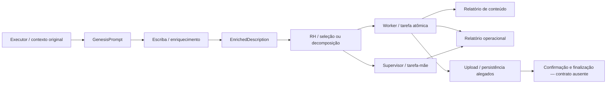

info.sevenrock.com.br | Intervenção curatorial: 2026-10-08 21:33 (-03:00)

# SOFIA, agentes, missões e orquestração

## Metadados

| Campo | Valor |
|---|---|
| ID curatorial | `DOM-06` |
| Status | `REVISÃO` |
| Versão do documento | `0.2.1` |
| Última atualização | `2026-10-08` |
| Curador(es) | Agente BCE MeshWave |
| Confiança geral | `média-baixa` |
| Documento relacionado no índice | [`BCE/INDICE_CURATORIAL.md`](../INDICE_CURATORIAL.md) |

> **Limite de cobertura desta revisão:** F2.6 fechou fisicamente 23 fontes prioritárias. Nesta revisão, nove diretórios tiveram seus arquivos textuais e imagens associados auditados: o item 1 e os itens 16–23. O checkpoint anterior registra primeira passagem textual nos outros 14 itens (2–15), sem atestar auditoria canônica de `code_blocks.txt`, `links.txt` e imagens. No item 1, a extração textual contém repetições e marcadores de truncamento; a imagem foi inspecionada, mas a evidência recuperável é limitada. Portanto, não se declara auditoria completa das 23 fontes nem implementação do sistema.

## 1. Resumo executivo

As fontes descrevem SOFIA como um sistema de obtenção e execução de missões com agentes e supervisão, mas não há, no material consolidado, contrato autoritativo da API, implementação completa ou trilha transacional que confirme o comportamento atual. O modelo operacional anteriormente relatado — Executor → Escriba → RH → Worker, com possibilidade de decomposição em tarefa-mãe/tarefas-filhas — permanece **modelo histórico/proposto**, não arquitetura de produção verificada. A fonte de visão F2.6-01 acrescenta alegações de alto nível sobre roteamento Q-CyPIA, anonimato e ARC-Bayes/PGC, mas não documenta o fluxo de missões ou demonstra execução.

As fontes auditadas dos itens 1 e 16–23 reforçam um problema recorrente: transcrições e capturas de interface narram obtenção de tarefas, consulta de rotas, execução, geração de relatórios, upload e finalização, mas geralmente não incluem método HTTP, requisição e resposta integrais, autenticação, timestamp, request-id, status numérico, payload ou verificação posterior. Uma fonte contém tentativas narradas com `HTTP Error 404: Not Found`; outras mencionam `Not Found`, sem status numérico demonstrável. Essas evidências demonstram o que foi relatado/mostrado, não que as rotas estejam ou não implementadas hoje.

Endpoints concorrentes, estados semânticos não definidos, alegações de sucesso incompatíveis com falhas/espera e duplicações internas extensas mantêm o documento em `REVISÃO`. A classificação distingue **fato observado no artefato**, **implementação alegada**, **protótipo/UI**, **especificação**, **hipótese**, **decisão**, **alternativa**, **descarte**, **conflito** e **lacuna**; repetições de um transcript não são contadas como execuções independentes.

## 2. Escopo e limites

**Inclui:** papéis e fluxo de agentes; obtenção/reivindicação de missão; estados e transições mencionados; API/oráculo; passagem de contexto; relatórios; upload/finalização; falhas relatadas; segurança ligada ao fluxo; evidências e lacunas.

**Fora do escopo principal:** desenho detalhado de persistência, sincronização, ChromaDB e banco vetorial (DOM-07); operação e recuperação de infraestrutura (DOM-13); Android (DOM-10); identidade e ARC/Bayes (DOM-04/DOM-05); topologia mesh (DOM-03). Fontes com conteúdo médico, financeiro ou de outra tarefa externa são contexto das missões, não requisitos do MeshWave sem evidência independente.

**Cobertura e proveniência:** o escopo está registrado em `BCE/fontes/ESCOPO_F2_6_SOFIA_AGENTES_MISSOES.md`. Os 23 caminhos foram validados fisicamente. O checkpoint `BCE/sessoes/2026-10-08_f2-6-abertura.md` registra primeira passagem textual anterior em 15/23; nesta revisão, F2.6-01 e F2.6-16–23 tiveram `content.txt`, `code_blocks.txt`, `links.txt` e imagens conferidos. Para F2.6-01, os arquivos foram lidos por inteiro, mas a própria extração traz 24 marcadores de truncamento em `content.txt` e dois em `code_blocks.txt`; a captura preserva apenas o trecho visível da interface. Os outros 14 diretórios (itens 2–15) não são declarados auditados nos seus arquivos auxiliares/imagens. Os nove conjuntos reservados de persistência/Chroma permanecem fora do lote, salvo dependência direta.

## 3. Terminologia

| Termo | Definição de trabalho | Estado / fonte |
|---|---|---|
| SOFIA | Serviço/oráculo descrito como fonte de missões e instruções. | Nome e uso narrado; contrato atual não confirmado. Escopo F2.6 e fontes abaixo. |
| Missão/tarefa | Unidade de trabalho que seria consultada, reivindicada, executada, reportada e finalizada. | Procedimentos variam; schema e lifecycle não confirmados. |
| Tarefa-mãe / filha | Relação de decomposição atribuída ao RH, com referência histórica a `parent_task_id`. | Diagnóstico/proposta do checkpoint F2.6; sem contrato/API validado. |
| Executor | Componente referido como iniciador/portador do contexto original. | Nome e função narrados; implementação atual não verificada. |
| Escriba | Agente descrito como enriquecedor de contexto. | Proposta/diagnóstico histórico; contrato não confirmado. |
| RH | Componente que decide atribuição/persona e pode decompor tarefa. | Comportamento relatado em fontes anteriores; não validado no backend. |
| Worker / agente atômico | Agente que executaria a tarefa e produziria relatórios. | Implementação completa e execução reproduzível ausentes. |
| `GenesisPrompt` | Contexto original da missão/fontes. | Nome observado em fontes anteriores; estrutura e persistência desconhecidas. |
| `EnrichedDescription` | Descrição enriquecida atribuída ao Escriba. | Nome observado em fontes anteriores; contrato desconhecido. |
| `FinalReport.md` | Relatório de conteúdo mencionado como saída. | Previsto/alegado; arquivo e confirmação de persistência não são demonstrados por esta amostra. |
| `OperationalReport.md` | Relatório da jornada operacional, inclusive supervisão. | Correção proposta historicamente; cobertura efetiva desconhecida. |
| Oráculo/API | Conjunto de caminhos chamados `/oracle`, `/api/v1/oracle/...`, `/api/v1/tasks/...` ou semelhantes nos registros. | Referências incompatíveis; nenhum endpoint canônico validado. |
| “Concluída” | Texto exibido em transcrição/cartão/UI/replay. | Não equivale, sem confirmação de servidor, a missão finalizada ou artefato persistido. |

## 4. Estado da arte atual

### 4.1 Capacidades e comportamento

As fontes sustentam que houve instruções e tentativas narradas para consultar um oráculo, localizar/assumir tarefas, executar análise, criar relatórios e salvá-los/finalizá-los. Em uma fonte, o transcript descreve buscas por rotas de tarefa que retornariam `HTTP Error 404: Not Found`; em outros, aparecem `Not Found` textual ou ausência de endpoint encontrado. Relatos adicionais afirmam que não havia tarefas pendentes, que dados foram carregados ou que um relatório foi enviado. Sem respostas brutas e identificadores de tentativa, esses relatos permanecem **não confirmados como transações de produção**.

A evidência atual permite afirmar **que o material contém** esses procedimentos, erros e mensagens; não permite afirmar que a API atual tenha (ou não tenha) as rotas, que uma missão tenha sido reivindicada, executada, persistida ou finalizada, ou que os relatórios alegados tenham sido aceitos pelo servidor.

### 4.2 Componentes e responsabilidades relatadas

| Componente | Responsabilidade relatada | Classificação |
|---|---|---|
| Executor | Origina a missão e o contexto/fontes. | Modelo histórico, não contrato verificado. |
| Escriba | Enriquecimento da descrição e passagem de contexto. | Diagnóstico/proposta histórica. |
| RH | Escolha de execução e possível fatoração em filhas. | Diagnóstico/proposta histórica. |
| Worker/agente atômico | Execução e geração de relatório final/operacional. | Intenção/código transcrito; sem build/execução independente verificados. |
| Supervisor/tarefa-mãe | Coordenação e agregação de tarefas-filhas. | Comportamento alegado; estados e agregação não especificados. |
| API/oráculo | Busca, obtenção e atualização de tarefa; upload é mencionado separadamente. | Endpoints e payloads contraditórios/incompletos. |

### 4.3 Interfaces, entradas e saídas

Caminhos e artefatos mencionados incluem `/api/v1/oracle`, `/api/v1/oracle/manual`, `/api/v1/oracle/tasks`, `/api/v1/oracle/missions`, `/api/v1/tasks/`, `/api/v1/tasks/next`, `/api/v1/tasks/{id}`, rotas de leitura de `TASK-*.md`, e rotas de upload como `/api/v1/artifacts`, `/api/v1/artifacts/upload` e `/api/v1/upload-oracle-manual`. Trata-se de inventário de menções, alternativas e tentativas históricas, **não de um mapa de endpoints aprovados**. Alguns caminhos aparecem como hipóteses ou são abandonados após erro narrado.

Uma fonte posterior menciona textualmente `PATCH /api/v1/tasks/63` com `{status_id: 3}`. Não define o significado de `3`, autenticação, corpo integral, servidor, resposta, nem ligação verificável com upload. A numeração e os campos não constituem schema confirmado.

### 4.4 Requisitos, restrições e premissas

- Separar obter, reivindicar, executar, produzir artefato, carregar, confirmar persistência e finalizar estado.
- Preservar contexto original e enriquecido até o agente que produz o resultado, se a arquitetura histórica vier a ser confirmada.
- Definir estados nominais e transições, inclusive tarefa-mãe/filhas, erro, timeout, retry e agregação.
- Exigir resposta verificável para cada transição e confirmar o artefato após upload.
- Não desativar validação TLS como solução aceitável; `verify=False` aparece como workaround inseguro em achado provisório do checkpoint F2.6.
- Não tratar mensagem de UI, replay, cartão de arquivo ou texto “Tarefa concluída” como evidência de backend.
- Não executar chamadas externas durante a curadoria; esta revisão não chamou API, reivindicou missão, enviou arquivo nem alterou serviço.

### 4.5 Implementado, prototipado ou apenas proposto

- **Implementação confirmada no repositório desta curadoria:** nenhum cliente SOFIA, contrato autoritativo, código completo de agente ou integração de produção foi estabelecido pelos oito conjuntos analisados.
- **Implementação alegada/transcrita:** scripts, correção de identificador, PATCH de estado, leitura de tarefas, upload e geração de relatórios. Os trechos são parciais, repetidos ou sem fontes executáveis associadas.
- **Protótipo/UI:** capturas `FULL.png` e replay de tarefa mostram mensagens/estados e às vezes cartões de arquivo; não provam resposta HTTP ou persistência.
- **Especificação/procedimento:** instruções para buscar, executar, reportar e carregar; rotas concorrentes sem contrato consolidado.
- **Hipótese/proposta:** Git/GitHub como canal de distribuição, GitHub Actions, contêineres, decomposição de missões e estados/papéis descritos no checkpoint de abertura.
- **Não confirmado:** produção, teste de carga, disponibilidade das rotas, execução de missão, resultado de pesquisa, upload, transição final ou persistência.

## 5. Arquitetura e modelo conceitual

O pipeline conceitual abaixo preserva a história registrada; não representa implementação atual confirmada:

O problema histórico de supervisão é que o lançador aguardaria um estado terminal da tarefa-mãe enquanto o RH criaria subtarefas; a mãe permaneceria intermediária e o lançador poderia ficar bloqueado. Outra perda relatada ocorre quando links/contexto originais não chegam ao Worker junto com a descrição enriquecida. A correção proposta era manter ambos os contextos e gerar relatório operacional também para supervisão. Não há patch atual, teste ou log que confirme a adoção dessas correções.

## 6. Fluxos e casos de uso

### 6.1 Obtenção e execução de missão (procedimento alegado)

1. **Pré-condição:** endpoint e autenticação definidos — não confirmados.
2. **Consulta:** procurar tarefa/orientação por uma das rotas mencionadas — a seleção de rota diverge entre fontes.
3. **Reivindicação/atribuição:** algumas transcrições alegam PATCH/assunção ou atualização de tarefa, sem request/response auditável.
4. **Execução:** procedimento descrito em linguagem natural; payload, código integral e resultados variam ou faltam.
5. **Relatório:** nomes como `FinalReport.md`, `OperationalReport.md` e outros arquivos aparecem; conteúdo/artefato nem sempre está presente no diretório de origem.
6. **Upload:** rotas variam ou são omitidas; falta recibo, hash/ID e resposta.
7. **Finalização:** frases “concluída” e `status_id=3` aparecem, mas sem semântica definida nem consulta posterior.
8. **Falhas/recuperação:** 404 explícito em uma fonte; `Not Found`, 502, TLS e problema de navegador constam nos achados provisórios da abertura; não há matriz de causa, retries e recuperação confirmada.

### 6.2 Supervisão e contexto (histórico/proposta)

O RH poderia decompor a tarefa e associar filhas por `parent_task_id`; o supervisor agregaria resultados e emitiria relatório operacional. A hipótese de correção para launcher travado é executar diretamente certos tipos de missão. Ela pode evitar o bloqueio nesses casos, mas desativa decomposição e não resolve genericamente agregação, falha parcial, timeout ou encerramento da mãe.

## 7. Código, algoritmos e parâmetros

Não há algoritmo ou cliente de API completo validado nesta unidade. O que aparece nos blocos de código é fragmentário e/ou textual:

- um trecho de processamento usa um booleano `new_tasks_found`, imprime mensagens e retorna; não mostra chamada HTTP, autenticação, parsing, execução, persistência nem tratamento de resposta;
- marcadores e exemplos mencionam arquivos `TASK-*.md`, scripts de busca/processamento, rotas `/oracle` e `/tasks`, e um PATCH com `status_id`; esses trechos não formam implementação reproduzível;
- alguns diretórios têm `code_blocks.txt` apenas como marcador, checklist ou fragmento de transcript;
- o checkpoint de abertura atribui GitHub Actions, contêineres, branches e permissões mínimas a uma proposta de automação de agentes, não a implantação verificada.

Nenhum teste/build/execução foi reproduzido nesta curadoria. Códigos HTTP citados são transcrições de tentativas passadas e não foram consultados novamente.

## 8. Evidências e fontes

### 8.1 Nove fontes — leitura profunda dos itens F2.6-01 e F2.6-16–23

Em todos os itens a seguir, `content.txt`, `code_blocks.txt` e `links.txt` foram inspecionados integralmente; imagens raster existentes foram visualizadas. “Observado” refere-se ao artefato/transcript, não a uma nova requisição.

| ID | Caminho relativo | Evidência e classificação | Limitação |
|---|---|---|---|
| F2.6-01 | `KNOWLEDGE/johann/20260422_175016_SOFIA and MeshWave Ecosystem Overview - Manus/` | `content.txt` e `code_blocks.txt` são extrações altamente repetitivas: respectivamente 303 linhas/24 marcadores de truncamento e 11 linhas/2 marcadores; há 14 linhas de conteúdo distintas em `content.txt` (mais a linha vazia). `code_blocks.txt` não contém código executável recuperável, apenas fragmento repetido de texto. `FULL.png` (1280×845) mostra captura de UI, página 2/5, com menções a `GLOBALMESHWAVE-Consolidado11Maio2025.md`, Q-CyPIA, seleção de múltiplas rotas com anonimato, ARC-Bayes/PGC, presença física e validação futura em testbeds/estabilidade do fluxo assíncrono. Classificação: visão/especificação narrativa e alegações de capacidade; próximos passos são proposta; texto de leitura e conclusão da reprodução são fatos observados na captura, não prova de backend. `links.txt` contém somente `https://help.manus.im/`. | O texto da extração termina em fragmento (`...baix`) e replica o mesmo conteúdo; a captura mostra apenas uma parte renderizada e não permite examinar os documentos-fonte citados. Não há código, contrato de API, log de execução, teste de testbed ou evidência de Q-CyPIA/PGC em produção. O link de suporte não é documentação técnica do SOFIA. O conjunto sobrepõe-se a DOM-01/DOM-02/DOM-03/DOM-05; não foi promovido a nova descrição do fluxo de agentes. |
| F2.6-16 | `KNOWLEDGE/iury/20260422_161748_Como acessar e verificar missões na API Sofia - Manus/` | Relata `Not Found` para `/api/v1/oracle/tasks`, `/api/v1/oracle/missions` e leitura direta de Markdown; UI mostra espera. Hipóteses de `/tasks`/`/missions` e Git são abandonadas ou não confirmadas. | Sem método, payload, headers, URL-base consistente, status numérico ou resposta completa; ciclos repetidos não são tentativas independentes. `FULL.png` e `img_000.jpg` mostram UI/corpo textual de erro, não tráfego completo. |
| F2.6-17 | `KNOWLEDGE/iury/20260422_161834_Como acessar e executar missões na API Sofia - Manus/` | Instrui consultar o manual `/api/v1/oracle/manual`; relata busca sem endpoint específico e bloqueio/pedido de endpoint. | Não mostra execução ou código HTTP. Forte repetição do replay; `FULL.png` é interface/espera. |
| F2.6-18 | `KNOWLEDGE/iury/20260422_161913_Instruções para a Tarefa no Sofia API Oráculo - Manus/` | Transcrição alterna instruções e alegações de upload/finalização de `Final_Report_TSK42.md`, pesquisa e testes de carga; contém metadados `task_finalization`. | Links vazios; sem corpo do relatório, manual, método/payload/resposta, métrica de teste ou prova de persistência. Instruções contradizem entrega ao usuário versus salvamento via API; `FULL.png` só comprova UI. |
| F2.6-19 | `KNOWLEDGE/mateus/20260422_174112_Como usar a API Sofia para obter tarefas disponíveis_ - Manus/` | `/api/v1/oracle` é escolhido em lugar de `/oraculo` e `/tasks`; transcrição afirma “sem tarefas”/dados carregados. Há snippet parcial de `process_tasks.py`; registra `verify=False` e esgotamento de créditos Manus. | Sem fetch completo, request/response, status, estado semântico ou log; sucesso alegado não verificável. `FULL.png` mostra transcript/replay. Links incluem material de upgrade; nenhum segredo foi copiado. |
| F2.6-20 | `KNOWLEDGE/natalia/20260422_171420_Instruções para Missão via Sofia API Manual - Manus/` | Alega envio de relatório e finalização; também diagnostica falha por finalizar sem garantir upload. Menciona `PATCH /api/v1/tasks/63` e `{status_id: 3}`. | Endpoint/método do upload e recibo ausentes; sem significado de `3`, resposta, cronologia ou confirmação. Transcrição repetida; `FULL.png` mostra apenas UI. |
| F2.6-21 | `KNOWLEDGE/natalia/20260422_171528_Como acessar sofia-api.meshwave.com.br e receber instruções - Manus/` | Alega acesso a `/api/v1/oracle`, atribuição e relatório de pesquisa/IOF; UI mostra arquivo e tarefa concluída. | `links.txt` vazio; sem pesquisa rastreável, request/response, submissão confirmada ou retorno da API. Checklist aparece sem marcação apesar da conclusão alegada; `FULL.png` é replay. Conclusões sobre IOF não são requisitos MeshWave. |
| F2.6-22 | `KNOWLEDGE/filipe/20260422_165023_Projeto Sofia_ Dossiê de Recrutamento e Onboarding - Manus/` | Apesar do título, conteúdo trata de análise competitiva de arquitetura; relata correção de `id` para `task_id`, pesquisa em páginas e relatório a submeter. Discute monólito, camadas e microsserviços. | Código/links ausentes; atribuição e pesquisa não confirmadas. Conflito entre título e conteúdo; UI termina esperando usuário, não confirma submissão. `FULL.png` não prova backend. |
| F2.6-23 | `KNOWLEDGE/natalia/20260422_171636_Projeto Sofia_ Dossiê de Recrutamento e Onboarding - Manus/` | 21 pares comando/saída narrados relatam `HTTP Error 404: Not Found` ao obter detalhes; existem alegações de assunção via PATCH e atualização sem resposta técnica. | Não há script, método completo, payload, URL-base, autenticação, estado final ou relatório. Link de assinatura/upgrade foi tratado como material sensível e omitido. `FULL.png` mostra erro/replay, não sucesso. |

### 8.2 Primeira passagem textual anterior — cobertura parcial

O checkpoint `BCE/sessoes/2026-10-08_f2-6-abertura.md` registra primeira passagem textual em 15/23 fontes, incluindo visão/contexto, material de agentes e fontes operacionais. Nesta revisão, F2.6-01 foi auditada diretamente; portanto, permanecem somente os itens 2–15 com primeira passagem textual anterior e sem auditoria canônica de todos os arquivos/imagens. Os achados provisórios da abertura incluem o fluxo Executor → Escriba → RH → Worker, fatoração e bloqueio da tarefa-mãe, perda de contexto, relatórios propostos, endpoints/estados concorrentes, tentativas de upload, falhas 404/502/TLS e propostas GitHub Actions/contêineres. Eles não são convertidos em fatos de implementação por esta leitura do item 1.

### 8.3 Material sensível

Na leitura profunda de F2.6-01 e F2.6-16–23, não foram reproduzidos tokens, senhas, PATs, credenciais ou dados pessoais. Um link de upgrade/assinatura presente em uma fonte final foi omitido. Endpoints e identificadores de tarefa aparecem apenas na medida necessária para documentar evidência técnica. Se uma revisão futura encontrar credenciais reais, registrar somente existência/localização e solicitar rotação/revogação, sem copiar o valor.

## 9. Evolução arqueológica

| Período/versão | Formulação/estado | Mudança relatada | Motivo/evidência | Resultado atual na curadoria |
|---|---|---|---|---|
| Registros operacionais anteriores à F2.6 | Executor/Escriba/RH/Worker; tarefa-mãe e filhas; contexto original e enriquecido; relatórios final/operacional. | Correções propostas para execução direta em cenário específico, preservar ambos os contextos e gerar relatório no caminho supervisor. | Lote 002 e síntese de abertura F2.6. | Problemas e propostas preservados; implementação atual não confirmada. |
| Transcripts de missão/API | Rotas REST e leitura de Markdown/Git aparecem como possibilidades. | Algumas alternativas são descartadas após `Not Found`/404 narrado; `/oracle` é preferido em uma fonte; outras fontes alegam acesso/upload sem prova. | F2.6-16 a F2.6-23. | Não há reconciliação normativa; cada ocorrência permanece contextual e não representa contrato. |
| Transcripts de upload | Relatório e estado final são apresentados como concluídos. | Aparece diagnóstico de que finalização ocorreu sem upload garantido; propostas de PATCH/status. | F2.6-18, F2.6-20, F2.6-21. | Conflito de sequência e de prova; nenhum recibo ou consulta posterior. |
| Replays/UI | Mensagens, cartões de relatório, “concluída”, “esperando”, indicadores de etapa. | Repetição e fragmentação abundantes. | `FULL.png` de F2.6-01 e imagens dos itens 16–23. | UI/replay é evidência de conteúdo exibido, não execução backend. F2.6-01 mostra conclusão da reprodução no produto, mas o texto visível também diz que o contexto ficou muito longo e sugere iniciar outro chat. |
| Visão de ecossistema (item 1) | Relato de colaboração Q-CyPIA/SDN com seleção de rotas anônimas, ARC-Bayes/PGC e validação futura em testbeds. | Especificação/alegação narrativa. | F2.6-01 `FULL.png`; extrações `content.txt`/`code_blocks.txt`. | Fonte secundária e truncada; conteúdo adjacente a roteamento/arquitetura/ARC, não contrato de agente. Não confirma implementação nem resultado de teste. |

## 10. Decisões curatoriais e técnicas relatadas

Não se registra decisão técnica atual de API/produção. Decisões ou mudanças **relatadas** nas fontes incluem: trocar `id` por `task_id` em script; preferir `/oracle` a `/oraculo`/`/tasks` em um procedimento; abandonar acesso direto a certas rotas após `Not Found`; usar Git/GitHub como hipótese; exigir upload antes da finalização; e considerar execução direta versus decomposição.

Essas entradas não são recomendação de implementação nem decisão MeshWave aprovada, porque faltam especificação versionada, código completo, commit do produto, teste e resposta verificável. O registro de decisões BCE (`BCE/REGISTRO_DECISOES.md`) rege a curadoria; nenhuma nova decisão BCE foi necessária para manter DOM-06 em revisão.

## 11. Alternativas, descartes e ideias não adotadas

| Alternativa/ideia | Registro | Estado curatorial |
|---|---|---|
| `/tasks`, `/missions`, acesso a `TASK-*.md` ou Git push | Hipóteses e alternativas em F2.6-16; algumas abandonadas após erro narrado. | Não confirmar como endpoint nem como descarte global; falta contrato. |
| `/oraculo` ou `/tasks` versus `/oracle` | F2.6-19 relata preferência/correção para `/oracle`. | Decisão localizada do transcript, não norma global. |
| Execução direta versus decomposição supervisionada | Proposta histórica em fontes operacionais e pergunta de planejamento em F2.6-22. | Trade-off aberto; sem política de tipos de missão. |
| Entregar relatório ao usuário versus guardar no SOFIA | Contradição nos transcripts F2.6-18 e F2.6-20/21. | Não resolver sem fluxo de produto/contrato aprovado. |
| Desabilitar TLS (`verify=False`) | Workaround relatado em F2.6-19 e abertura do lote. | Não adotar; inseguro e sem comprovação de correção. |
| Monólito, arquitetura em camadas, microsserviços | Comparação narrativa em F2.6-22. | Alternativas conceituais; sem contexto, benchmarks ou decisão aprovada. |

## 12. Otimizações, correções e melhorias

As fontes anteriores propõem preservar contexto original junto ao enriquecido, corrigir sincronização da tarefa-mãe, produzir relatório operacional também para supervisão e separar upload de finalização. As fontes finais mencionam ajustes de endpoint/identificador, checklist, validação de artefato e testes de carga, mas não apresentam resultados reproduzíveis.

Nenhuma melhoria pode ser declarada implantada. Uma proposta segura para validação futura é implementar teste de integração com ambiente identificado e dados controlados, TLS habilitado, logs redigidos, idempotência, recibo/hash de artefato e consulta do estado após cada transição; só então atualizar o status de evidência.

## 13. Conflitos e incertezas

| ID | Questão | Fontes em conflito | Impacto | Resolução/ação |
|---|---|---|---|---|
| C06-01 | Quais rotas são canônicas para consulta, missão, detalhe e upload? | Escopo F2.6; F2.6-16/17/19/20/21/23; achados provisórios dos 15 anteriores. | Não é possível reproduzir integração nem comparar erros. | Obter OpenAPI/manual versionado e validar contra cliente/servidor autorizados. |
| C06-02 | “Não há tarefas” versus erro tratado como resposta vazia? | F2.6-19 versus 404/Not Found de F2.6-16/17/23. | Risco de mascarar falha como fila vazia. | Preservar status e corpo bruto, separar erro de resposta vazia. |
| C06-03 | O que significa `status_id=3` e quais transições são válidas? | F2.6-20; menções numéricas no checkpoint F2.6. | Estado não auditável; risco de encerrar antes do upload. | Obter enum/modelo de task e tabela de transições versionada. |
| C06-04 | O upload ocorre antes da finalização e foi confirmado? | F2.6-18/20/21. | Relatório pode não persistir apesar da UI “concluída”. | Exigir resposta/ID/hash e consulta posterior do artefato/estado. |
| C06-05 | Quantas tentativas realmente ocorreram? | Fontes F2.6 com repetição/cópias/replays; F2.6-23 contém pares comando/saída repetidos. | Contagem de texto pode superestimar atividade. | Correlacionar timestamps, request-id e logs; não contar repetições. |
| C06-06 | Quais alegações de execução, pesquisa, carga e conclusão são verificáveis? | F2.6-18/19/21/22; UI versus espera/checklist. | Risco de promover narrativa a resultado. | Recuperar artefatos e logs; manter “não confirmado” até então. |
| C06-07 | Como tarefa-mãe, subtarefas e Worker compartilham contexto e estado? | Lote 002 e checkpoint F2.6 provisório. | Pode causar bloqueio e perda de contexto. | Validar código/modelos e teste integrado; definir agregação e falhas parciais. |
| C06-08 | TLS foi reabilitado após workaround? | F2.6-19 e checkpoint de abertura. | Risco de integridade/autenticidade. | Inspecionar configuração segura e logs; não repetir `verify=False`. |
| C06-09 | Títulos, tarefa efetiva e conteúdo coincidem? | F2.6-22, cujo título difere do foco da tarefa no transcript. | Classificação baseada em título seria enganosa. | Usar conteúdo, não título; manter discrepância arqueológica. |

## 14. Lacunas e questões em aberto

1. **Completar auditoria dos itens 2–15:** conferir `content.txt`, `code_blocks.txt`, `links.txt` e imagens associados; o item 1 foi conferido, mas sua extração continua limitada e só apresenta um fragmento da visão na captura. Caminhos: itens 2–15 de `BCE/fontes/ESCOPO_F2_6_SOFIA_AGENTES_MISSOES.md`.
2. Obter OpenAPI/manual e código efetivamente implantado, com versão/commit e ambiente identificado.
3. Registrar para cada endpoint: método, base URL, auth (sem valores), headers, schema de request/response, status, filtros, paginação, idempotência e limites.
4. Definir ciclo de vida nominal: pending, claimed, running, blocked, failed, retrying, report-uploaded, completed; esses nomes são proposta de modelagem, não estados observados/confirmados.
5. Definir semântica dos IDs numéricos e transições autorizadas, inclusive tarefa-mãe/filhas e agregação.
6. Distinguir download/obtenção, claim, execução, upload, confirmação de artefato e finalização; registrar recibo e verificação posterior.
7. Localizar conteúdo real de `FinalReport.md`, `OperationalReport.md` e outros artefatos alegados e comparar checksums/logs sem reproduzir dados sensíveis.
8. Reproduzir 404/502/TLS somente em ambiente autorizado, com TLS verificado e logs redigidos; causa original permanece **não confirmada**.
9. Verificar se `GenesisPrompt` e `EnrichedDescription` são campos reais, como são sequenciados e persistidos e se fonte/link chega ao Worker.
10. Determinar origem e status de `parent_task_id`, timeouts, retries, idempotência, dead-letter e recuperação.
11. Separar falhas do serviço de erros de navegador, créditos Manus e estado de replay/UI.
12. Relacionar a persistência/contexto de missão ao DOM-07/DOM-13, sem misturar o escopo até obter contratos.

## 15. Relações com outros documentos

- [DOM-01 — Visão geral](visao-geral-ecossistema-meshwave.md): contexto do ecossistema e Q-CyPIA, ainda hipótese arquitetural.
- [DOM-02 — Arquitetura e implantação](arquitetura-geral-e-implantacao.md): dependências e propostas de implantação.
- [DOM-03 — Rede mesh](rede-mesh-comunicacao-e-roteamento.md): redes e roteamento, não fluxo de missões.
- [DOM-04 — Identidade/DIDs](identidade-dids-e-identificador-de-equipamento.md): identidade e autorização.
- [DOM-05 — ARC/Bayes](arc-autenticacao-contextual-e-bayes.md): autenticação contextual.
- DOM-07 — Persistência, memória e base vetorial: armazenamento de contexto, sincronização e `task_blocks`.
- DOM-12 — Desenvolvimento/versionamento: repositórios, scripts, branches e releases.
- DOM-13 — Implantação/operação: Cloudflare, recuperação, TLS e operação.
- DOM-14 — Segurança/privacidade: gestão de credenciais, acesso mínimo, dados de missão e auditoria.
- DOM-15 — APIs/integrações: contrato de Sofia API e interoperabilidade.
- GOV-02/GOV-03/GOV-04 — controle mestre, índice e decisões curatoriais.

## 16. Histórico de versões do documento

| Versão | Data | Alteração | Fontes/commit |
|---|---|---|---|
| `0.1.0` | `2026-10-08` | Síntese inicial baseada no Lote 002 e no checkpoint textual. | `BCE/sessoes/2026-10-08_f2-6-abertura.md`; commit anterior indicado no histórico do repositório. |
| `0.2.0` | `2026-10-08` | Acrescenta leitura profunda dos oito diretórios finais, conflitos de API/estado, imagens e limite explícito de cobertura dos 15 anteriores. | F2.6-16–F2.6-23; commit de conteúdo a registrar no controle mestre. |
| `0.2.1` | `2026-10-08` | Inclui a auditoria F2.6-01, documenta a extração truncada/repetitiva e recalcula a cobertura profunda para 9/23; mantém as alegações de Q-CyPIA/PGC como narrativa não verificada. | F2.6-01 `content.txt`, `code_blocks.txt`, `links.txt`, `FULL.png`; checkpoint `BCE/sessoes/2026-10-08_f2-6-item01-abertura.md`. |

> A convenção comunicada para versionamento do sistema MeshWave considera o estado atual dos módulos como versão `1.0` e incrementos futuros como `1.01`, `1.02` etc. Essa convenção de versão de produto não altera retroativamente o histórico numérico deste documento curatorial; a versão do módulo SOFIA/API em si permanece **não confirmada** nas fontes analisadas.

## 17. Próximo passo de curadoria

Concluir a auditoria canônica dos itens 2–15 listados em `BCE/fontes/ESCOPO_F2_6_SOFIA_AGENTES_MISSOES.md`, lendo cada `content.txt`, `code_blocks.txt`, `links.txt` e imagem associada. Atualizar esta matriz e só então decidir se a unidade F2.6 pode ser fechada; manter DOM-06 em `REVISÃO` até contrato, código e execução serem verificáveis.
