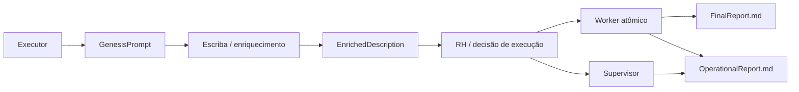

# SOFIA, agentes, missões e orquestração

## Metadados

| Campo | Valor |
|---|---|
| ID curatorial | `DOM-06` |
| Status | `EM_CURADORIA` |
| Versão | `0.1.0` |
| Última atualização | `2026-10-08` |
| Confiança geral | `média-baixa` |
| Fontes principais | `CLASSIFICACAO_LOTE_002.md` e fontes do Lote 002 |

## 1. Resumo executivo

As fontes do Lote 002 descrevem SOFIA como um ecossistema de agentes que recebe missões, enriquece contexto, decide um modo de execução, executa tarefas e produz artefatos de relatório. O pipeline histórico citado contém, pelo menos, Executor, Escriba, RH, Worker e, em alguns casos, uma tarefa supervisora que coordena subtarefas.

O material também registra falhas de projeto e correções propostas: fatoração automática indesejada de uma missão em subtarefas; perda de links e contexto entre blocos; geração de relatórios rasos; e ausência de relatório operacional no caminho supervisor. Essas falhas são evidência valiosa da evolução arqueológica, mas os trechos analisados não provam que os patches propostos sejam a versão atualmente implantada.

## 2. Pipeline conceitual

Este fluxo é uma síntese das fontes. Os nomes dos blocos e artefatos aparecem no material, mas os contratos exatos, persistência, estados numéricos e autenticação da API devem ser validados no código-fonte real.

## 3. Problema de fatoração e supervisão

O lançador de um white paper foi descrito como esperando que uma missão chegasse a um estado final. O RH, entretanto, pode transformar a missão em tarefa-mãe e criar tarefas-filhas. Nesse caso, a mãe permanece em um estado intermediário e o lançador não recebe a transição esperada, ficando preso no primeiro ciclo.

A correção proposta foi forçar execução direta para aquela classe específica de missão. Essa é uma escolha contextual, não uma regra universal: impedir fatoração pode simplificar a geração de um documento seriado, mas reduz a capacidade de decomposição para missões realmente complexas. Uma solução mais geral precisaria definir estados de supervisão, agregação de filhas, falhas parciais e conclusão da mãe.

## 4. Problema de perda de contexto

A fonte relata que links de repositórios eram incluídos no bloco de origem, mas o Worker usava somente a descrição enriquecida. O resultado era um relatório genérico, sem conexão com os repositórios de referência.

A correção proposta combina `GenesisPrompt` e `EnrichedDescription` no prompt final do Worker. Curatorialmente, esta mudança é importante porque explicita uma regra de proveniência: o enriquecimento não deve apagar as fontes originais. O pipeline deve transportar contexto permanente e contexto derivado até o ponto que gera o artefato final.

## 5. Relatórios operacionais

A fonte diferencia dois artefatos:

- `FinalReport.md`: resultado detalhado da missão;
- `OperationalReport.md`: narrativa da jornada da tarefa pelo sistema, incluindo criação, enriquecimento, decisão e execução.

Foi identificado um defeito no qual o relatório operacional era gerado para missões atômicas, mas não para a tarefa-mãe em execução supervisora. A correção proposta chama a mesma rotina de geração no caminho supervisor.

Essa distinção deve ser mantida na BCE: um relatório de conteúdo não substitui a arqueologia operacional que explica como o resultado foi produzido.

## 6. Estado e transições

O material menciona estados numéricos para reivindicação, liberação, execução, sucesso e falha, além de estados de tarefa-mãe e filhas. Os números aparecem no código histórico, mas não devem ser tratados como contrato vigente sem conferir a API e os modelos atuais.

A especificação mínima que falta é:

1. catálogo nominal dos estados;
2. transições permitidas;
3. agente autorizado por transição;
4. comportamento em timeout;
5. idempotência de reivindicação;
6. relação entre tarefa-mãe e filhas;
7. agregação de resultados;
8. armazenamento de blocos e artefatos;
9. recuperação após falha;
10. auditoria de autor, timestamp e versão do contexto.

## 7. Arqueologia das decisões

| Fase | Problema | Decisão/correção proposta | Trade-off |
|---|---|---|---|
| lançador inicial | missão-mãe não alcançava o estado esperado | forçar execução direta para white paper | reduz fatoração e pode limitar missões complexas |
| geração inicial | links do GitHub não chegavam ao Worker | combinar contexto Genesis e enriquecido | aumenta prompt e exige controle de tamanho |
| relatório operacional | caminho supervisor não produzia relatório | gerar `OperationalReport` também para a mãe | exige tratamento de agregação e contexto supervisor |
| curadoria atual | contexto conversacional não é persistente | BCE, checkpoints e prompt de retomada | aumenta disciplina documental, reduz perda de continuidade |

## 8. Interfaces e artefatos observados

| Elemento | Função inferida | Evidência | Estado |
|---|---|---|---|
| `GenesisPrompt` | contexto original da missão e fontes permanentes | código/texto do Lote 002 | nome observado; contrato não confirmado |
| `EnrichedDescription` | descrição enriquecida pelo Escriba | código/texto do Lote 002 | nome observado; contrato não confirmado |
| RH | decisão de execução e atribuição de persona | diagnóstico e código histórico | proposta/versão histórica |
| Worker | execução final e geração de relatórios | código histórico | proposta/versão histórica |
| `FinalReport.md` | relatório de conteúdo | código/texto | artefato planejado/produzido em alguns fluxos |
| `OperationalReport.md` | relatório da jornada operacional | código/texto | correção proposta para todos os caminhos |
| tarefa supervisora | acompanha e agrega subtarefas | diagnóstico | comportamento observado em histórico, não validado na API atual |

## 9. Relação com MeshWave e Q-CyPIA

A fonte de visão geral associa a IA de roteamento a um orquestrador Q-CyPIA gerenciado por SDN. Neste documento, essa relação permanece como hipótese arquitetural: SOFIA pode coordenar agentes e missões que consultam serviços de roteamento, mas não há no lote um contrato que mostre a chamada, o formato da política de anonimato ou a resposta do Q-CyPIA.

A interoperabilidade futura deve preservar a origem da missão, as políticas de segurança, as fontes consultadas e os artefatos gerados. O pipeline de agentes não deve transformar uma proposta de roteamento em fato operacional sem uma evidência de execução.

## 10. Segurança e governança

O pipeline manipula contexto, repositórios, relatórios e possivelmente credenciais de APIs. O material analisado contém referências a autenticação e a dados de acesso em históricos operacionais. Esses valores não fazem parte deste documento. O desenho definitivo deve usar armazenamento seguro de segredos, escopo mínimo de permissões, rotação, auditoria e separação entre contexto público e privado.

Também deve existir controle de autorização para ações de alto impacto: alteração de código, publicação de artefatos, mudança de estado de missão e acesso a fontes privadas.

## 11. Lacunas prioritárias

1. localizar os repositórios e versões efetivas de `rh_agent.py`, `worker_agent.py` e `launch_whitepaper_genesis.py`;
2. conferir se os estados numéricos continuam válidos;
3. documentar o contrato dos blocos e a ordem de sequência;
4. definir o protocolo de supervisão e agregação;
5. medir limites de contexto e estratégia para links extensos;
6. verificar persistência, idempotência e recuperação;
7. mapear autenticação e autorização sem registrar segredos;
8. relacionar SOFIA com a API de missões, Chroma/persistência e o sistema de conhecimento.

## 12. Evidências

- `KNOWLEDGE/johann/20260422_175016_SOFIA and MeshWave Ecosystem Overview - Manus/` — relação proposta entre IA de roteamento, Q-CyPIA e SDN.
- `KNOWLEDGE/johann/20260422_175100_SOFIA and MeshWave Ecosystem Documents - Manus/` — diagnóstico do pipeline, fatoração, perda de contexto e relatórios.
- `KNOWLEDGE/info/20260422_174348_Complementar Módulos Faltantes do Diagrama de Implantação - Manus/` — roteiros de integração e módulos futuros, úteis como roadmap, não como prova de execução.
- `BCE/PROMPT_RETOMADA_AGENTE.md` — regra atual para preservação de contexto e continuidade da curadoria.

## 13. Próximo passo

Localizar e processar as fontes específicas da Sofia API, persistência, agentes e relatórios operacionais; confrontar este modelo com código real e registrar uma matriz de estados e transições somente após encontrar evidência verificável.
