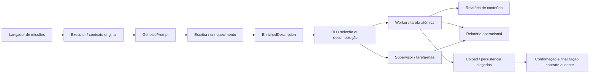

# SOFIA, agentes, missões e orquestração

## Metadados

| Campo | Valor |
|---|---|
| ID curatorial | `DOM-06` |
| Status | `REVISÃO` |
| Versão do documento | `0.2.7` |
| Última atualização | `2026-10-09` |
| Curador(es) | Agente BCE MeshWave |
| Confiança geral | `média-baixa` |
| Documento relacionado no índice | [`BCE/INDICE_CURATORIAL.md`](../INDICE_CURATORIAL.md) |

> **Limite de cobertura desta revisão:** F2.6 fechou fisicamente 23 fontes prioritárias. Quinze diretórios tiveram seus artefatos disponíveis auditados em profundidade: itens 1–7 e 16–23. Os itens 8–15 têm apenas primeira passagem textual anterior; seus `code_blocks.txt`, `links.txt` e imagens ainda não foram auditados canonicamente. Os itens 1–7 contêm extrações repetitivas, fragmentadas ou com evidência limitada à UI. F2.6-04 é uma passagem de contexto de redesign frontend; F2.6-05 registra proposta de continuidade via `task_blocks`; F2.6-06 acrescenta um guia proposto de automação de agentes e permissões; F2.6-07 acrescenta propostas de curadoria e de um dossiê consolidado, além de instruções históricas sobre Git e acesso local. Nenhum desses materiais comprova o estado implantado do SOFIA, GitHub Apps, workflows, agentes ou acesso a repositório/banco vetorial. Portanto, não se declara auditoria completa das 23 fontes nem implementação do sistema.

## 1. Resumo executivo

As fontes descrevem SOFIA como um sistema de obtenção e execução de missões com agentes e supervisão, mas não há, no material consolidado, contrato autoritativo da API, implementação completa ou trilha transacional que confirme o comportamento atual. O modelo operacional anteriormente relatado — Executor → Escriba → RH → Worker, com possibilidade de decomposição em tarefa-mãe/tarefas-filhas — permanece **modelo histórico/proposto**, não arquitetura de produção verificada. A fonte de visão F2.6-01 acrescenta alegações de alto nível sobre roteamento Q-CyPIA, anonimato e ARC-Bayes/PGC, mas não documenta o fluxo de missões ou demonstra execução.

As fontes auditadas dos itens 1–7 e 16–23 reforçam um problema recorrente: transcrições e capturas de interface narram obtenção de tarefas, consulta de rotas, execução, geração de relatórios, upload e finalização, mas geralmente não incluem método HTTP, requisição e resposta integrais, autenticação, timestamp, request-id, status numérico, payload ou verificação posterior. Uma fonte contém tentativas narradas com `HTTP Error 404: Not Found`; outras mencionam `Not Found`, sem status numérico demonstrável. Essas evidências demonstram o que foi relatado/mostrado, não que as rotas estejam ou não implementadas hoje.

F2.6-02 acrescenta uma sequência de propostas corretivas para missões white-paper: forçar despacho direto pelo RH, preservar `GenesisPrompt` junto de `EnrichedDescription`, gerar `FinalReport.md` e `OperationalReport.md`, trocar a espera do lançador de um status de liberação para polling por `task_id`, e depois buscar detalhes completos da tarefa-mãe após relato de `NoneType` no Worker supervisor. A própria conversa registra que a correção anterior não resolveu o problema observado. São propostas e diagnósticos narrados; não há prova de que os patches foram aplicados ou passaram em execução.

F2.6-03 é uma extração de replay/UI altamente repetitiva: o texto extraído contém sobretudo o título, controles e “Reprodução da tarefa Manus concluída”. A imagem preserva uma descrição do fluxo proposto (launcher → RH em modo estrategista/monitor → Executor → Escriba → RH → Worker), com estados 31, 41 e 1, além de um cartão de arquivo de código e a mensagem “algum erro grave... Este era nosso antigo launch”. A mesma tela diz que a arquitetura está correta, mas mostra também que o contexto ficou longo e recomenda iniciar outro chat. Isso documenta o conteúdo exibido na interface, não validação do fluxo, execução do código, estado do backend ou correção arquitetural. `code_blocks.txt` não contém código recuperável; `links.txt` contém somente o endereço de suporte do Manus, não documentação do SOFIA.

F2.6-05 apresenta a proposta de um diretório local simulando um banco, com `task_blocks` como log sequencial de relatórios/plano/progresso/problemas para permitir retomada por outro agente. O transcript também afirma que o repositório tem `sentinel.py`, `sofia_db`, `tasks`/`task_blocks` e missões assíncronas, mas não inclui fonte, schema ou logs que sustentem essas afirmações. A proposta, os detalhes de arquitetura e as alegações do replay permanecem não verificados; não são tratados como implementação nem decisão técnica aprovada.

F2.6-06 acrescenta um guia transcrito que propõe agentes centralizadores ACR/AGF e especialistas, estrutura de diretórios, GitHub App ou PAT, segredos do Actions, Docker/GitHub Actions, commits automáticos, relatórios por e-mail, logging e monitoramento. `content.txt` e `code_blocks.txt` repetem extensamente a mesma conversa; o YAML/Dockerfile é exemplo de infraestrutura, não código de agentes. O guia recomenda menor privilégio, mas seu exemplo lista várias permissões de escrita e escopos PAT amplos. A captura de UI mostra um cartão `implementation_guide.pdf` e “Tarefa concluída”; esse PDF não está entre os quatro artefatos do diretório. Tudo permanece proposta/alegação histórica, sem app, workflow, credenciais, arquivo PDF ou execução de agentes verificados.

F2.6-07 é uma transcrição repetitiva sobre classificar arquivos ambíguos, sugerir comandos `git mv`, criar um `ECOSYSTEM_MASTER_BLUEPRINT.md` e operar futuramente sobre um repositório; inclui ainda orientação histórica para remover `index.lock`, criar PAT de escopo amplo e executar `git add`/`commit`/`push`, seguida por perguntas sobre acesso via Cloudflare, banco vetorial local e SSH. O mesmo texto apresenta a sinergia MeshWave/SOFIA e um exemplo com ARC, MeshBlockchain e Q-CyPIA. **Classificação:** propostas, instruções e alegações presentes na transcrição; não prova que arquivos foram movidos, relatório criado, PAT configurado, acesso concedido, sistema conectado ou arquitetura implementada. As instruções operacionais embutidas são evidência histórica, não autorização atual. Nesta curadoria, nenhum comando da fonte foi executado, nenhum banco vetorial acessado e nenhuma credencial utilizada.

Endpoints concorrentes, estados semânticos não definidos, alegações de sucesso incompatíveis com falhas/espera e duplicações internas extensas mantêm o documento em `REVISÃO`. F2.6-04 registra sobretudo contexto e propostas de redesign de frontend, com alegações de deployment/backend sem evidência técnica independente. A classificação distingue **fato observado no artefato**, **implementação alegada**, **protótipo/UI**, **especificação**, **hipótese**, **decisão**, **alternativa**, **descarte**, **conflito** e **lacuna**; repetições de um transcript não são contadas como execuções independentes.

## 2. Escopo e limites

**Inclui:** papéis e fluxo de agentes; obtenção/reivindicação de missão; estados e transições mencionados; API/oráculo; passagem de contexto; relatórios; upload/finalização; falhas relatadas; segurança ligada ao fluxo; evidências e lacunas.

**Fora do escopo principal:** desenho detalhado de persistência, sincronização, ChromaDB e banco vetorial (DOM-07); operação e recuperação de infraestrutura (DOM-13); Android (DOM-10); identidade e ARC/Bayes (DOM-04/DOM-05); topologia mesh (DOM-03). Fontes com conteúdo médico, financeiro ou de outra tarefa externa são contexto das missões, não requisitos do MeshWave sem evidência independente.

**Cobertura e proveniência:** o escopo está registrado em `BCE/fontes/ESCOPO_F2_6_SOFIA_AGENTES_MISSOES.md`. Os 23 caminhos foram validados fisicamente. A primeira passagem anterior cobre 15/23; a auditoria canônica agora cobre os itens 1–7 e 16–23 (15/23). Os checkpoints registram o pré-registro dos itens 2–7. Em F2.6-05, `content.txt` tem 1.178 linhas/86.583 bytes; das 1.000 linhas não vazias, 56 são distintas literalmente e 944 ocorrências são repetições exatas. `code_blocks.txt` tem 15 linhas/162 bytes, apenas nomes/termos e separador, sem código executável; `links.txt` está vazio; `FULL.png` (1280×845) e `img_000.jpg` (894×768, conteúdo WebP apesar da extensão `.jpg`) foram inspecionadas. `FULL.png` mostra um replay/UI com alegações do assistente; `img_000.jpg` mostra uma página GitHub e prévia de dossiê, evidência visual pontual, não validação externa do repositório. Nenhum link foi acessado. Em F2.6-04, `content.txt` tem 3.827 linhas/208.378 bytes, com repetição extensa (224 linhas literais distintas após deduplicação exata); `code_blocks.txt` tem 167 linhas/1.652 bytes com fragmentos HTML/CSS de Vite/Vue, sem código de API/backend; `links.txt` tem 32 bytes e uma referência ao serviço SOFIA, não acessada; `FULL.png` (1280×845) foi inspecionada. Em F2.6-03, `content.txt` tem 127 linhas/2.626 bytes e repete principalmente rótulos da interface; `code_blocks.txt` tem 82 bytes e contém apenas linhas vazias/separador, sem código recuperável; `links.txt` tem 22 bytes e contém apenas link de suporte; `FULL.png` (1280×845) foi inspecionada. Em F2.6-02, `content.txt` (32.880 linhas; 1.316.349 bytes) e `code_blocks.txt` (2.062 linhas; 90.887 bytes) foram lidos em passagens com repetições exatas colapsadas para análise; `links.txt` tem 0 bytes; `FULL.png` (1280×845) foi inspecionada. Em F2.6-06, `content.txt` tem 6.418 linhas/357.037 bytes; 5.476 linhas não vazias, 397 linhas literais distintas e 5.079 repetições além da primeira, examinadas em sequência única com frequências preservadas. `code_blocks.txt` tem 302 linhas/6.115 bytes, com Dockerfile/YAML e trechos repetidos, sem implementação de agentes; `links.txt` está vazio; `FULL.png` (1006×781) foi inspecionada. A imagem mostra apenas UI/replay e um cartão de PDF alegado; o PDF não consta no conjunto. Em F2.6-07, `content.txt` tem 3.562 linhas físicas/246.868 bytes, 2.987 linhas não vazias, 202 literais distintas e 2.785 repetições além da primeira; as frequências foram preservadas e as repetições não foram contadas como eventos. `code_blocks.txt` tem 128 linhas/2.046 bytes com comandos e nomes de artefatos transcritos, sem código de produto; `links.txt` tem 22 bytes e somente o link de suporte do Manus, não acessado; `FULL.png` (1280×845) foi inspecionada. A captura mostra texto sobre PAT/push e perguntas de acesso local, não operação concluída. Os quatro artefatos somam 344.271 bytes; os tamanhos e SHA-256 conferidos coincidem com o pré-registro do checkpoint anterior. Nenhum código foi executado, nenhum link acessado, nenhuma chamada externa feita e nenhum valor literal de credencial foi observado. O transcript contém identificadores de usuário/host e caminho de armazenamento local, omitidos deste documento por minimização. As repetições não são execuções independentes. Permanecem pendentes os itens 8–15 e os nove conjuntos reservados de persistência/Chroma, salvo dependência direta.

## 3. Terminologia

| Termo | Definição de trabalho | Estado / fonte |
|---|---|---|
| SOFIA | Serviço/oráculo descrito como fonte de missões e instruções. | Nome e uso narrado; contrato atual não confirmado. Escopo F2.6 e fontes abaixo. |
| `task_blocks` | Tabela/log sequencial proposto para registrar plano, progresso, problemas e passagem de contexto entre agentes; “blockchain” é analogia usada no transcript. | Proposta em F2.6-05; schema, persistência, integridade e implementação não confirmados. |
| Missão/tarefa | Unidade de trabalho que seria consultada, reivindicada, executada, reportada e finalizada. | Procedimentos variam; schema e lifecycle não confirmados. |
| Tarefa-mãe / filha | Relação de decomposição atribuída ao RH, com referência histórica a `parent_task_id`. | Diagnóstico/proposta do checkpoint F2.6; sem contrato/API validado. |
| Executor | Componente referido como iniciador/portador do contexto original. | Nome e função narrados; implementação atual não verificada. |
| Escriba | Agente descrito como enriquecedor de contexto. | Proposta/diagnóstico histórico; contrato não confirmado. |
| RH | Componente que decide atribuição/persona e pode decompor tarefa. | Comportamento relatado em fontes anteriores; não validado no backend. |
| Worker / agente atômico | Agente que executaria a tarefa e produziria relatórios. | Implementação completa e execução reproduzível ausentes. |
| `GenesisPrompt` | Contexto original da missão/fontes. | Nome observado em fontes anteriores; estrutura e persistência desconhecidas. |
| `EnrichedDescription` | Descrição enriquecida atribuída ao Escriba. | Nome observado em fontes anteriores; contrato desconhecido. |
| `FinalReport.md` | Relatório de conteúdo mencionado como saída. | Previsto/alegado; arquivo e confirmação de persistência não são demonstrados por esta amostra. |
| `OperationalReport.md` | Relatório da jornada operacional, inclusive supervisão. | Correção proposta historicamente; cobertura efetiva desconhecida. |
| Lançador / `launch_whitepaper_genesis.py` | Script transcrito para iniciar missões de white paper em sequência e monitorar uma tarefa. | Substituições propostas; não há execução independente nem contrato validado. |
| ACR | Agente centralizador proposto para acompanhar especialistas, gerar relatórios de contexto e enviar links por e-mail. | F2.6-06; não há código, configuração de e-mail ou agente verificado. |
| AGF | Agente proposto para monitorar créditos e acionar recargas por API. | F2.6-06; API, autorização, integração e operação não confirmadas. |
| GitHub App / PAT | Métodos de autenticação sugeridos para automação de repositório. | F2.6-06; nenhum app/token foi observado ou configurado nesta curadoria. |
| `client_request_uuid`, `task_id`, `parent_task_id` | Identificadores usados nos snippets para localizar tarefa e relacionar tarefa-mãe/filhas. | Campos citados no transcript; schema e semântica não confirmados. |
| `status_id` | Número usado nos snippets para representar estados como 1, 3, 5, 20, 41, 50 e 52. | Valores transcritos sem enum, transições autorizadas ou significado oficial. |
| Oráculo/API | Conjunto de caminhos chamados `/oracle`, `/api/v1/oracle/...`, `/api/v1/tasks/...` ou semelhantes nos registros. | Referências incompatíveis; nenhum endpoint canônico validado. |
| “Concluída” | Texto exibido em transcrição/cartão/UI/replay. | Não equivale, sem confirmação de servidor, a missão finalizada ou artefato persistido. |

## 4. Estado da arte atual

### 4.1 Capacidades e comportamento

As fontes sustentam que houve instruções e tentativas narradas para consultar um oráculo, localizar/assumir tarefas, executar análise, criar relatórios e salvá-los/finalizá-los. Em uma fonte, o transcript descreve buscas por rotas de tarefa que retornariam `HTTP Error 404: Not Found`; em outros, aparecem `Not Found` textual ou ausência de endpoint encontrado. Relatos adicionais afirmam que não havia tarefas pendentes, que dados foram carregados ou que um relatório foi enviado. Sem respostas brutas e identificadores de tentativa, esses relatos permanecem **não confirmados como transações de produção**.

A evidência atual permite afirmar **que o material contém** esses procedimentos, erros e mensagens; não permite afirmar que a API atual tenha (ou não tenha) as rotas, que uma missão tenha sido reivindicada, executada, persistida ou finalizada, ou que os relatórios alegados tenham sido aceitos pelo servidor.

F2.6-05 acrescenta uma ideia de recuperação local: um diretório simularia o banco e `task_blocks` registraria sequencialmente o arquivo inicial/plano e, por tarefa, o que se pretende fazer, o que foi feito, problemas e resolução pendente, para outro agente retomar após interrupção/créditos esgotados. **Classificação:** proposta de fluxo de continuidade expressa no transcript; não há arquivo/schema/dados do simulador nem implementação comprovada. O mesmo transcript atribui ao SOFIA uma tabela `task_blocks` dentro de `sofia_db`; a relação entre a tabela alegada e o simulador local proposto não é esclarecida.

A resposta do assistente no replay afirma ter analisado repositório e dossiê, e atribui ao sistema `sentinel.py`, FastAPI, frontend Vite, túnel Cloudflare, Appsmith, `sofia_db`, `tasks`, `conversation_root_id`, missões assíncronas e otimização de `get_mission_status`. Esses são **relatos exibidos na transcrição/UI**, sem inspeção independente do código, schema, commit ou execução nesta unidade.

F2.6-02 contém um relato de tarefas com `parent_task_id` e uma tarefa-mãe parada em status 50, além da mensagem `argument of type 'NoneType' is not iterable`. A narrativa atribui o erro a `blocks` ausente/`None` no objeto simplificado recebido pelo supervisor; o código posterior propõe buscar `GET /tasks/{task_id}` antes de iterar. O transcript não inclui resposta JSON bruta, esquema da API, logs completos correlacionados nem resultado da aplicação da correção, então causa-raiz e resolução permanecem **alegadas/não confirmadas**.

F2.6-06 descreve uma estrutura proposta de diretórios `phases/`, `agents/` e `generated_content/`; agentes especialistas por módulo; ACR para consolidar relatórios e enviar links por e-mail; AGF para monitorar créditos e acionar recargas; e GitHub Actions/Docker para executar e publicar alterações. O conjunto contém um roteiro e um exemplo de workflow, não uma estrutura implementada ou configuração real. O trecho sobre recarga de créditos é apenas proposta de automação externa, sem API, autorização ou operação demonstrada.

F2.6-07 apresenta um plano para classificar/mover arquivos ambíguos, criar `ECOSYSTEM_MASTER_BLUEPRINT.md` e operar futuramente sobre um repositório; inclui instruções históricas de Git e perguntas sobre acesso por SSH/Cloudflare e banco vetorial local. A transcrição menciona um repositório e caminho de máquina distintos do checkout desta curadoria; a relação entre eles e `Foundation_MeshWave` não está confirmada. As falas não demonstram que qualquer acesso tenha sido concedido ou que a reorganização tenha ocorrido.

### 4.2 Componentes e responsabilidades relatadas

| Componente | Responsabilidade relatada | Classificação |
|---|---|---|
| Executor | Origina a missão e o contexto/fontes. | Modelo histórico, não contrato verificado. |
| Escriba | Enriquecimento da descrição e passagem de contexto. | Diagnóstico/proposta histórica. |
| RH | Escolha de execução e possível fatoração em filhas. | Diagnóstico/proposta histórica. |
| Worker/agente atômico | Execução e geração de relatório final/operacional. | Intenção/código transcrito; sem build/execução independente verificados. |
| Supervisor/tarefa-mãe | Coordenação e agregação de tarefas-filhas. | Comportamento alegado; estados e agregação não especificados. |
| `task_blocks` / simulador local | Log sequencial para preservar plano, progresso e problemas entre agentes; proposta em F2.6-05. | Intenção no transcript, sem schema, código ou persistência verificados; detalhe de armazenamento relacionado a DOM-07. |
| Orquestração/DB relatados | `sentinel.py` e `sofia_db` com `tasks`/`task_blocks`, conforme resposta do assistente no transcript. | Alegação não verificada por código, esquema ou acesso independente ao repositório. |
| Curador / `ECOSYSTEM_MASTER_BLUEPRINT.md` | Papel e documento consolidado propostos em F2.6-07 para reorganizar e explicar o ecossistema. | Plano transcrito; a fonte não contém o arquivo nem prova de curadoria executada. |
| Lançador de white paper | Criar cada missão e aguardar o estado da tarefa antes de avançar. | Código transcrito em versões que primeiro esperavam status 1/3 e depois faziam polling por `task_id` até status 3; nenhuma versão foi executada nesta curadoria. |
| ACR / AGF | Centralização de relatórios/notificações e monitoramento/recarga de créditos, respectivamente; papéis propostos no guia. | F2.6-06, sem agentes implementados, integração de e-mail ou API financeira verificados. |
| Especialistas / GitHub Actions | Execução por módulo, contêineres e workflows agendados/manuais com commit/push. | F2.6-06 contém exemplos e recomendações; não comprova workflows instalados nem agentes executados. |
| API/oráculo | Busca, obtenção e atualização de tarefa; upload é mencionado separadamente. | Endpoints e payloads contraditórios/incompletos. |

### 4.3 Interfaces, entradas e saídas

Caminhos e artefatos mencionados incluem `/api/v1/oracle`, `/api/v1/oracle/manual`, `/api/v1/oracle/tasks`, `/api/v1/oracle/missions`, `/api/v1/tasks/`, `/api/v1/tasks/next`, `/api/v1/tasks/{id}`, rotas de leitura de `TASK-*.md`, e rotas de upload como `/api/v1/artifacts`, `/api/v1/artifacts/upload` e `/api/v1/upload-oracle-manual`. Trata-se de inventário de menções, alternativas e tentativas históricas, **não de um mapa de endpoints aprovados**. Alguns caminhos aparecem como hipóteses ou são abandonados após erro narrado.

Uma fonte posterior menciona textualmente `PATCH /api/v1/tasks/63` com `{status_id: 3}`. Não define o significado de `3`, autenticação, corpo integral, servidor, resposta, nem ligação verificável com upload. A numeração e os campos não constituem schema confirmado.

F2.6-02 transcreve ainda `GET /tasks/`, `GET /tasks/{task_id}`, `GET /tasks/{task_id}/blocks` e `PATCH /tasks/{task_id}` em scripts apontados para `http://127.0.0.1:8000`, com IDs de status numéricos. Esses caminhos e a base local são detalhes do código proposto, não endpoints atuais aprovados; não há autenticação, respostas de API ou documentação de contrato nesta fonte.

### 4.4 Requisitos, restrições e premissas

- Separar obter, reivindicar, executar, produzir artefato, carregar, confirmar persistência e finalizar estado.
- Preservar contexto original e enriquecido até o agente que produz o resultado, se a arquitetura histórica vier a ser confirmada.
- Definir estados nominais e transições, inclusive tarefa-mãe/filhas, erro, timeout, retry e agregação.
- Exigir resposta verificável para cada transição e confirmar o artefato após upload.
- Não desativar validação TLS como solução aceitável; `verify=False` aparece como workaround inseguro em achado provisório do checkpoint F2.6.
- Não tratar mensagem de UI, replay, cartão de arquivo ou texto “Tarefa concluída” como evidência de backend.
- Não executar chamadas externas durante a curadoria; esta revisão não chamou API, reivindicou missão, enviou arquivo nem alterou serviço.
- F2.6-06 aconselha menor privilégio, mas exemplifica permissões `Contents`, `Pull requests`, `Issues` e `Actions` com escrita e escopos PAT amplos. Isso é uma tensão interna da recomendação, não uma configuração aprovada; permissões reais devem ser justificadas por operação e escopo.
- Nomes de secrets (`GITHUB_APP_ID`, `GITHUB_APP_PRIVATE_KEY`, `GITHUB_PAT`, `MANUS_API_KEY`, `EMAIL_SENDER_API_KEY`) aparecem como placeholders, sem valores. Não criar apps, PATs, secrets, workflows, envios de e-mail ou recargas de crédito a partir desta fonte sem autorização específica.
- F2.6-07 menciona PAT, SSH, Cloudflare e banco vetorial local como possibilidades/instruções históricas, sem fornecer contrato de acesso nem comprovar autorização ou conexão. Nenhum acesso remoto, credencial ou banco foi usado nesta auditoria.

### 4.5 Implementado, prototipado ou apenas proposto

- **Implementação confirmada no repositório desta curadoria:** nenhum cliente SOFIA, contrato autoritativo, código completo de agente ou integração de produção foi estabelecido pelos quinze conjuntos auditados em profundidade.
- **Implementação alegada/transcrita:** além de scripts e rotas citados por fontes anteriores, F2.6-02 contém versões sugeridas de `rh_agent.py`, `worker_agent.py` e `launch_whitepaper_genesis.py`; não há cópia desses arquivos-fonte de aplicação, commit do produto, teste ou execução confirmada.
- **Protótipo/UI:** capturas `FULL.png` e replay de tarefa mostram mensagens/estados e às vezes cartões de arquivo; não provam resposta HTTP ou persistência.
- **Especificação/procedimento:** instruções para buscar, executar, reportar e carregar; F2.6-02 também propõe despacho direto para um caso de white paper, passagem de dois blocos de contexto e espera por status terminal, sem contrato consolidado.
- **Proposta de persistência/continuidade:** F2.6-05 descreve diretório local como simulador de DB e `task_blocks` como log para retomada; não há schema nem implementação confirmados.
- **Proposta de automação multiagente:** F2.6-06 descreve ACR/AGF/especialistas, GitHub App/PAT, armazenamento de placeholders de segredo, Docker e Actions. O guia e exemplos transcritos não provam app, workflow, agente, credenciais ou execução existentes.
- **Proposta de curadoria/repositório:** F2.6-07 sugere realocação de arquivos, um dossiê mestre e operações Git, e menciona acesso remoto/local; não há diff, arquivo de dossiê, concessão de acesso, integração ou execução demonstrados.
- **Hipótese/proposta:** Git/GitHub como canal de distribuição, GitHub Actions, contêineres, decomposição de missões e estados/papéis descritos no checkpoint de abertura.
- **Não confirmado:** produção, teste de carga, disponibilidade das rotas, aplicação dos patches, execução de missão, resultado de pesquisa, upload, transição final ou persistência.

## 5. Arquitetura e modelo conceitual

O pipeline conceitual abaixo preserva a história registrada; não representa implementação atual confirmada:

O problema histórico de supervisão é que o lançador aguardaria um estado terminal da tarefa-mãe enquanto o RH criaria subtarefas; a mãe permaneceria intermediária e o lançador poderia ficar bloqueado. Outra perda relatada ocorre quando links/contexto originais não chegam ao Worker junto com a descrição enriquecida. F2.6-02 apresenta primeiro a hipótese de forçar o RH a executar diretamente esta classe de white paper; mais tarde, o usuário relata que o modo supervisor ainda falha e que o lançador não avança. A conversa então corrige o foco para `blocks` ausente/`None` e propõe buscar os detalhes da tarefa-mãe. Não há patch atual, teste ou log que confirme qualquer correção.

A proposta F2.6-05 de diretório/log local é um caso de continuidade de contexto, não um componente de API ou supervisor validado. A relação com tabelas de produção, consistência, ordem, autoria e recuperação precisa ser examinada junto de DOM-07 e contra código autorizado; não se presume que a analogia a “blockchain” implique hash, consenso ou imutabilidade técnica.

F2.6-06 também propõe agentes centralizadores, agentes especialistas e execução automatizada via GitHub Actions/contêineres. Não há workflow, imagem de contêiner, agente ou branch protection versionados nos artefatos da fonte. Essa proposta é relacionada a DOM-12 (repositórios/automação), DOM-13 (operação) e DOM-14 (credenciais e permissões), não um fluxo de missão SOFIA confirmado.

## 6. Fluxos e casos de uso

### 6.1 Obtenção e execução de missão (procedimento alegado)

1. **Pré-condição:** endpoint e autenticação definidos — não confirmados.
2. **Consulta:** procurar tarefa/orientação por uma das rotas mencionadas — a seleção de rota diverge entre fontes.
3. **Reivindicação/atribuição:** algumas transcrições alegam PATCH/assunção ou atualização de tarefa, sem request/response auditável.
4. **Execução:** procedimento descrito em linguagem natural; payload, código integral e resultados variam ou faltam.
5. **Relatório:** nomes como `FinalReport.md`, `OperationalReport.md` e outros arquivos aparecem; conteúdo/artefato nem sempre está presente no diretório de origem.
6. **Upload:** rotas variam ou são omitidas; falta recibo, hash/ID e resposta.
7. **Finalização:** frases “concluída” e `status_id=3` aparecem, mas sem semântica definida nem consulta posterior.
8. **Falhas/recuperação:** 404 explícito em uma fonte; `Not Found`, 502, TLS e problema de navegador constam nos achados provisórios da abertura; não há matriz de causa, retries e recuperação confirmada.

### 6.2 Supervisão e contexto (histórico/proposta)

O RH poderia decompor a tarefa e associar filhas por `parent_task_id`; o supervisor agregaria resultados e emitiria relatório operacional. A hipótese de correção para launcher travado é executar diretamente certos tipos de missão. Ela pode evitar o bloqueio nesses casos, mas desativa decomposição e não resolve genericamente agregação, falha parcial, timeout ou encerramento da mãe.

### 6.3 Sequência de missões white-paper (proposta transcrita em F2.6-02)

Uma versão inicial do lançador cria a missão com `client_request_uuid` e avança quando a tarefa alcança status 1 ou 3; o próprio transcript depois identifica que status 1 representa liberação, não conclusão, e que isso pode disparar as 23 missões sem esperar o trabalho terminar. Uma versão posterior procura o `task_id` pelo UUID e faz polling até status 3. O usuário relata, porém, que a tarefa-mãe permanece em 50 por erro do Worker supervisor. A sequência documenta iteração e revisão de diagnóstico, não comprova que qualquer versão do script foi aplicada ou que o fluxo final funcionou.

### 6.4 Log de continuidade local (proposta transcrita em F2.6-05)

1. Criar um diretório local que simule o banco de dados e guardar o arquivo da tarefa/plano como referência inicial.
2. Para cada tarefa, registrar sequencialmente intenção, trabalho realizado, problemas e como foram resolvidos ou permanecem pendentes.
3. Permitir que outro agente leia o log e retome após interrupção ou esgotamento de créditos.

Os passos acima resumem uma **proposta do usuário preservada no transcript**, não sistema existente. `code_blocks.txt` não contém arquivo de implementação, schema, política de append-only, proteção contra concorrência ou mecanismo de recuperação; “blockchain” permanece analogia, não garantia técnica.

### 6.5 Automação de agentes via repositório (proposta transcrita em F2.6-06)

1. Criar estrutura de diretórios e branches protegidas/separadas.
2. Autenticar automações com GitHub App ou PAT e guardar placeholders de credenciais em secrets do Actions.
3. Executar agente Python ou contêiner por acionamento manual/agendado; coletar resultados e fazer commit/push automatizados.
4. ACR consolidaria relatórios e enviaria links; AGF monitoraria créditos e poderia acionar recarga por API.

Este fluxo resume recomendações e exemplos do guia, não operações observadas no repositório atual. A fonte não demonstra políticas de proteção configuradas, app instalado, permissão real, secrets presentes, workflow executado, agente implantado, relatório enviado ou recarga. A variante de PAT/secrets e a proposta de recarga requerem revisão de escopo e autorização antes de qualquer implementação.

## 7. Código, algoritmos e parâmetros

Não há algoritmo ou cliente de API completo validado nesta unidade. F2.6-02 contém trechos extensos e várias versões de três scripts, repetidos ao longo de uma transcrição de 32.880 linhas. F2.6-05 `code_blocks.txt` (162 bytes/15 linhas) contém apenas um separador e nomes/termos como `sentinel.py`, `sofia_db`, `tasks` e `task_blocks`; não é código executável nem schema. F2.6-06 `code_blocks.txt` (6.115 bytes/302 linhas) contém estrutura de diretórios, comandos, Dockerfile e exemplo YAML de GitHub Actions repetidos; não inclui implementação funcional de agentes. O exemplo usa placeholders de `GITHUB_PAT`, commit/push automatizados e versões fixadas de actions; nada disso foi aplicado ou validado contra o repositório/produto.

- **RH (`rh_agent.py`):** proposta específica para white paper que lê status 41, reivindica como 20 e força execução direta/liberação em 1; `determine_persona()` retorna o valor constante `999999`. Os números e a regra não têm contrato nem justificativa externa na fonte.
- **Worker (`worker_agent.py`):** proposta para combinar `GenesisPrompt` e `EnrichedDescription`, gerar os dois relatórios e atualizar status 52/3; versões de supervisor primeiro recebem um objeto sem detalhes e depois buscam os detalhes completos em `GET /tasks/{task_id}` antes de extrair a descrição enriquecida.
- **Lançador (`launch_whitepaper_genesis.py`):** versão inicial considera status 1 suficiente para seguir; versões posteriores localizam a tarefa pelo UUID e esperam o status 3 do `task_id`. O código não traz resultado de teste ou execução.
- **Erro reportado:** o transcript contém `argument of type 'NoneType' is not iterable` e relato de tarefa-mãe presa em status 50. A correção posterior busca o objeto detalhado; porém, em Python, `obj.get('blocks', [])` ainda retorna `None` se a chave existir explicitamente com valor `None`. Assim, o próprio trecho não demonstra que o caso reportado está resolvido.
- **Riscos aparentes nos snippets, não resultados observados:** loops de polling sem prazo máximo; caminhos de erro/status 5 não tratados como terminais em alguns loops; supervisor que prossegue se não encontrar filhas; prompts de síntese com reticências (`...`) em lugar de instruções completas; ausência de testes e respostas da API. Esses pontos exigem validação contra código real antes de qualquer adoção.
- **Limite de F2.6-06:** o YAML/Dockerfile e os comandos são exemplos transcritos; não há código-fonte de agente, workflow real, execução, artifact de build ou log. Os nomes de secrets no exemplo não contêm valores de credenciais.
- **Limite de F2.6-07:** `code_blocks.txt` (128 linhas/2.046 bytes) reúne comandos `git mv`, `git add`, `git commit`, `git push` e nomes de arquivos mencionados na conversa; não é código do SOFIA, integração de acesso ou implementação de DB vetorial. A fonte inclui instruções para remover `index.lock` e criar/usar PAT, mas elas não foram executadas. Não há diff, commit de origem, credencial, sessão SSH/Cloudflare, schema vetorial ou log de acesso verificável.

Os arquivos são transcrições de conversa/código, não os arquivos executáveis do projeto. `code_blocks.txt` tem 2.062 linhas e repete trechos; `links.txt` está vazio. A inspeção foi feita em passagens com duplicatas exatas colapsadas para revisão, preservando os originais. Nenhum código copiado/transcrito das fontes foi executado nesta curadoria; códigos HTTP e logs são relatos passados, não consultas atuais.

## 8. Evidências e fontes

### 8.1 Quinze fontes — leitura profunda dos itens F2.6-01–07 e F2.6-16–23

Nos itens a seguir, `content.txt`, `code_blocks.txt` e `links.txt` foram inspecionados; todas as imagens raster existentes foram visualizadas. Nos itens 1, 2, 4, 5 e 6, os transcripts extensos foram revistos com atenção a repetições, fragmentação e artefatos de OCR; isso não elimina limites de extração nem transforma repetição de linha/tela em tentativa ou execução independente. “Observado” refere-se ao artefato/transcript, não a uma nova requisição.

| ID | Caminho relativo | Evidência e classificação | Limitação |
|---|---|---|---|
| F2.6-01 | `KNOWLEDGE/johann/20260422_175016_SOFIA and MeshWave Ecosystem Overview - Manus/` | `content.txt` e `code_blocks.txt` são extrações altamente repetitivas: respectivamente 303 linhas/24 marcadores de truncamento e 11 linhas/2 marcadores; há 14 linhas de conteúdo distintas em `content.txt` (mais a linha vazia). `code_blocks.txt` não contém código executável recuperável, apenas fragmento repetido de texto. `FULL.png` (1280×845) mostra captura de UI, página 2/5, com menções a `GLOBALMESHWAVE-Consolidado11Maio2025.md`, Q-CyPIA, seleção de múltiplas rotas com anonimato, ARC-Bayes/PGC, presença física e validação futura em testbeds/estabilidade do fluxo assíncrono. Classificação: visão/especificação narrativa e alegações de capacidade; próximos passos são proposta; texto de leitura e conclusão da reprodução são fatos observados na captura, não prova de backend. `links.txt` contém somente `https://help.manus.im/`. | O texto da extração termina em fragmento (`...baix`) e replica o mesmo conteúdo; a captura mostra apenas uma parte renderizada e não permite examinar os documentos-fonte citados. Não há código, contrato de API, log de execução, teste de testbed ou evidência de Q-CyPIA/PGC em produção. O link de suporte não é documentação técnica do SOFIA. O conjunto sobrepõe-se a DOM-01/DOM-02/DOM-03/DOM-05; não foi promovido a nova descrição do fluxo de agentes. |
| F2.6-02 | `KNOWLEDGE/johann/20260422_175100_SOFIA and MeshWave Ecosystem Documents - Manus/` | `content.txt` (32.880 linhas; 1.316.349 bytes) e `code_blocks.txt` (2.062 linhas; 90.887 bytes) narram falha de launcher/Worker em missões white-paper e contêm versões propostas de `rh_agent.py`, `worker_agent.py` e `launch_whitepaper_genesis.py`. A evolução passa de despacho RH direto e passagem de contexto à espera do launcher por `task_id`/status 3 e, após novo relato de erro `NoneType`/mãe em status 50, à busca de detalhes completos da tarefa. `links.txt` está vazio. `FULL.png` (1280×845) mostra trecho de análise e código do Worker em uma interface/replay. | Repetição extensa; análise feita com duplicatas exatas colapsadas. Referências a imagens de banco de dados e estados 118–121 aparecem na narrativa, mas este diretório contém somente `FULL.png`, que mostra chat/código, não imagens de banco. A captura/replay não comprova aplicação, build, execução ou sucesso. Faltam contrato/esquema da API, payload/resposta, código-fonte aplicado, logs correlacionados e testes. A correção de `blocks` pode ainda falhar se o campo existir como `None`; monitoramentos não têm timeout explícito em trechos transcritos. |
| F2.6-03 | `KNOWLEDGE/johann/20260422_175351_Uploaded Documents Related to SOFIA and MeshWave Ecosystem - Manus/` | `content.txt` (127 linhas; 2.626 bytes) repete principalmente título, controles e texto de replay/UI. `code_blocks.txt` (82 bytes) contém somente linhas vazias/separador, sem código recuperável. `links.txt` (22 bytes) contém apenas `https://help.manus.im/`. `FULL.png` (1280×845) mostra descrição de fluxo com launcher, RH em modo estrategista/monitor, Executor, Escriba e Worker, estados 31/41/1, um cartão de arquivo `launch_whitepaper_genesis.py` e mensagem de erro sobre um launch antigo; a própria imagem declara “A arquitetura está correta” e mostra o aviso de contexto longo. Classificação: **fato observado** sobre o texto e a UI capturados; fluxo/status/avaliação de arquitetura são **alegações/especificação histórica**, não implementação nem teste confirmado. | Extração textual repetitiva e em grande parte limitada a rótulos de interface. O cartão de código não fornece o arquivo anexado nem seu conteúdo; `code_blocks.txt` não prova implementação. A imagem é uma captura de replay/interface, sem logs, request/response, resultado de backend, commit de produto ou execução reproduzível. Link de suporte não é documentação SOFIA; nenhum acesso externo foi feito. |
| F2.6-04 | `KNOWLEDGE/johann/20260422_171657_Relatório de Passagem de Contexto Sistema SOFIA - Manus/` | `content.txt` (3.827 linhas; 208.378 bytes) é uma transcrição de passagem de contexto sobre redesign do frontend `sofia-condenser-pro`, estrutura Vite/Vue, paleta Eco-Tech e priorização entre redesign e Message Manager; há repetição extensa, com 224 linhas literais distintas após deduplicação exata. O transcript afirma que backend, banco, endpoints, integração e frontend estão funcionais/em produção e descreve módulos/economia MeshWave, mas essas são **alegações históricas**, não confirmação independente. `code_blocks.txt` (167 linhas; 1.652 bytes) contém fragmentos de marcação HTML/Vue e CSS de um componente, não código de API/backend nem aplicação completa. `links.txt` (32 bytes) contém uma referência ao serviço SOFIA; não foi acessada. `FULL.png` (1280×845) mostra perguntas de contexto/prioridade e “Reprodução da tarefa Manus concluída”; evidencia a UI/replay capturada, não execução do produto. | A fonte não fornece repositório ou commit do frontend/backend, contratos de API, logs correlacionados, testes, resposta HTTP ou evidência de deployment. A afirmação de conexão/funcionamento não é verificável por esse conjunto. O código extraído é parcial e não deve ser aplicado sem os arquivos atuais do projeto e escopo de implementação autorizado. A passagem pertence principalmente a DOM-08 (interfaces) e DOM-12 (desenvolvimento); para DOM-06 serve apenas como contexto/alegação sobre backend, sem evidência de missões ou oráculo. Nenhum código foi executado nem serviço acessado; fontes brutas intactas. |
| F2.6-05 | `KNOWLEDGE/meshwave65/20260422_Reabilitação do Sistema SOFIA - Manus/` | `content.txt` (1.178 linhas; 86.583 bytes) apresenta várias cópias/replays da mesma conversa e ruído OCR: 1.000 linhas não vazias, 56 linhas literais distintas e 944 ocorrências repetidas além da primeira. O usuário propõe reabilitação local a partir do GitHub, observa que faltam agentes no repositório e descreve diretório local para simular DB, com `task_blocks` como log sequencial contendo plano/arquivo inicial, feito, problemas e solução/pendência para continuidade por outro agente. O assistente diz que aguardará arquivos e também afirma ter analisado repositório/dossiê, atribuindo ao sistema `sentinel.py`, FastAPI/Vite/Cloudflare/Appsmith, `sofia_db`, `tasks`, `task_blocks`, `conversation_root_id`, missões assíncronas e cache/indexação de `get_mission_status`. **Classificação:** proposta do usuário e alegações do assistente presentes no transcript, não implementação ou verificação de arquitetura. `code_blocks.txt` (15 linhas; 162 bytes) contém apenas separador e nomes/termos, sem código/schema. `links.txt` está vazio. `FULL.png` (1280×845) mostra o replay/UI de análise do repositório, com cartão “1/5”, “Esperando pelo usuário” e mensagem “Reprodução da tarefa Manus concluída”; não comprova tarefa ou análise backend. `img_000.jpg` (894×768; formato real WebP) mostra interface GitHub e prévia do Dossiê Mestre SOFIA v17.0.1, com rótulo “ATIVO/Fonte Canônica” e metadados de commit visíveis. É uma captura de página/documento, não inspeção independente do repositório, código dos agentes ou execução. | Há contradição interna de sequência entre “aguardar arquivos/não pesquisar” e respostas que alegam análise do repositório; repetições e rótulos de replay impedem contar eventos. O pedido/descrição de `task_blocks` não especifica schema, imutabilidade técnica, concorrência, integridade, atomicidade, retenção ou recuperação. A afirmação de que existe tabela de produção em `sofia_db` não é demonstrada por código ou schema. Não há artefato de simulador, migração, agente ausente, logs, request/response ou teste. As duas URLs GitHub não foram acessadas. A extensão `.jpg` de `img_000.jpg` não corresponde ao formato WebP detectado; o hash foi preservado e a imagem foi visualizada sem conversão destrutiva. Fontes brutas intactas; nenhum código dos artefatos da fonte foi executado nem serviço externo consultado. |
| F2.6-06 | `KNOWLEDGE/andressa/20260422_162534_Automatização e Estruturação de Agentes no Projeto Mesh Wave - Manus/` | `content.txt` (6.418 linhas; 357.037 bytes) é altamente repetitivo: 5.476 linhas não vazias, 397 linhas literais distintas e 5.079 ocorrências repetidas além da primeira. Propõe estrutura `phases/`, `agents/`, `generated_content/`; papéis ACR (relatórios/e-mail), AGF (monitoramento/recarga de créditos) e especialistas; GitHub App/PAT, GitHub Secrets, Docker, Actions, branches, commits/push, logging e monitoramento. `code_blocks.txt` (302 linhas; 6.115 bytes) contém comandos, estruturas, Dockerfile e exemplo YAML de Actions, sem implementação de agente; usa `GITHUB_PAT` como placeholder. `links.txt` está vazio. `FULL.png` (1006×781) mostra a UI/replay, checklist 6/6 e cartão `implementation_guide.pdf` (653,88 KB), mas o PDF não está no diretório-fonte. **Classificação:** guia/proposta e exemplos de configuração; a tela comprova apenas o que a interface exibe. | Repetições colapsadas para leitura com frequência preservada; não equivalem a execuções independentes. Não há código de agente, workflow instalado, branch protection, app, token, secret, log, teste ou imagem Docker verificáveis. Há tensão entre a recomendação de menor privilégio e exemplos com `Contents`, `Pull requests`, `Issues` e `Actions` em leitura/escrita e PAT de escopo amplo. Nomes de secrets são placeholders, sem valores observados. O cartão de PDF não disponibiliza o conteúdo do arquivo. Nenhum código foi executado, link seguido, e-mail enviado ou serviço externo alterado. |
| F2.6-07 | `KNOWLEDGE/johann/20260422_174331_Conhecimento sobre Meshwave, Sofia e módulos ARC-Bayes_ - Manus/` | `content.txt` (3.562 linhas físicas/246.868 bytes; 2.987 não vazias, 202 literais distintas e 2.785 repetições além da primeira) propõe classificar/mover arquivos, criar `ECOSYSTEM_MASTER_BLUEPRINT.md`, operar Git e futuramente acessar repositório/banco vetorial; contém também uma visão narrativa de MeshWave/SOFIA e exemplo ARC/MeshBlockchain/Q-CyPIA. `code_blocks.txt` (128 linhas/2.046 bytes) reúne comandos e nomes de artefatos, sem código de produto. `links.txt` (22 bytes) contém apenas link de suporte, não seguido. `FULL.png` (1280×845) mostra UI/transcrição sobre PAT/push e perguntas de acesso local/SSH. **Classificação:** propostas e instruções históricas; a captura evidencia apenas o que aparece na interface. | Repetições preservadas por frequência, sem contá-las como eventos. Não há diff, dossiê criado, credencial configurada, acesso concedido, API/DB conectado ou arquitetura ARC/Q-CyPIA implementada. O PAT aparece como orientação, sem valor literal. Relação entre o repositório/caminho mencionado e `Foundation_MeshWave` não confirmada. Identificadores de usuário/host e caminho local foram omitidos por minimização. Nenhum comando foi executado, link seguido, dado enviado, banco acessado ou serviço alterado. |
| F2.6-16 | `KNOWLEDGE/iury/20260422_161748_Como acessar e verificar missões na API Sofia - Manus/` | Relata `Not Found` para `/api/v1/oracle/tasks`, `/api/v1/oracle/missions` e leitura direta de Markdown; UI mostra espera. Hipóteses de `/tasks`/`/missions` e Git são abandonadas ou não confirmadas. | Sem método, payload, headers, URL-base consistente, status numérico ou resposta completa; ciclos repetidos não são tentativas independentes. `FULL.png` e `img_000.jpg` mostram UI/corpo textual de erro, não tráfego completo. |
| F2.6-17 | `KNOWLEDGE/iury/20260422_161834_Como acessar e executar missões na API Sofia - Manus/` | Instrui consultar o manual `/api/v1/oracle/manual`; relata busca sem endpoint específico e bloqueio/pedido de endpoint. | Não mostra execução ou código HTTP. Forte repetição do replay; `FULL.png` é interface/espera. |
| F2.6-18 | `KNOWLEDGE/iury/20260422_161913_Instruções para a Tarefa no Sofia API Oráculo - Manus/` | Transcrição alterna instruções e alegações de upload/finalização de `Final_Report_TSK42.md`, pesquisa e testes de carga; contém metadados `task_finalization`. | Links vazios; sem corpo do relatório, manual, método/payload/resposta, métrica de teste ou prova de persistência. Instruções contradizem entrega ao usuário versus salvamento via API; `FULL.png` só comprova UI. |
| F2.6-19 | `KNOWLEDGE/mateus/20260422_174112_Como usar a API Sofia para obter tarefas disponíveis_ - Manus/` | `/api/v1/oracle` é escolhido em lugar de `/oraculo` e `/tasks`; transcrição afirma “sem tarefas”/dados carregados. Há snippet parcial de `process_tasks.py`; registra `verify=False` e esgotamento de créditos Manus. | Sem fetch completo, request/response, status, estado semântico ou log; sucesso alegado não verificável. `FULL.png` mostra transcript/replay. Links incluem material de upgrade; nenhum segredo foi copiado. |
| F2.6-20 | `KNOWLEDGE/natalia/20260422_171420_Instruções para Missão via Sofia API Manual - Manus/` | Alega envio de relatório e finalização; também diagnostica falha por finalizar sem garantir upload. Menciona `PATCH /api/v1/tasks/63` e `{status_id: 3}`. | Endpoint/método do upload e recibo ausentes; sem significado de `3`, resposta, cronologia ou confirmação. Transcrição repetida; `FULL.png` mostra apenas UI. |
| F2.6-21 | `KNOWLEDGE/natalia/20260422_171528_Como acessar sofia-api.meshwave.com.br e receber instruções - Manus/` | Alega acesso a `/api/v1/oracle`, atribuição e relatório de pesquisa/IOF; UI mostra arquivo e tarefa concluída. | `links.txt` vazio; sem pesquisa rastreável, request/response, submissão confirmada ou retorno da API. Checklist aparece sem marcação apesar da conclusão alegada; `FULL.png` é replay. Conclusões sobre IOF não são requisitos MeshWave. |
| F2.6-22 | `KNOWLEDGE/filipe/20260422_165023_Projeto Sofia_ Dossiê de Recrutamento e Onboarding - Manus/` | Apesar do título, conteúdo trata de análise competitiva de arquitetura; relata correção de `id` para `task_id`, pesquisa em páginas e relatório a submeter. Discute monólito, camadas e microsserviços. | Código/links ausentes; atribuição e pesquisa não confirmadas. Conflito entre título e conteúdo; UI termina esperando usuário, não confirma submissão. `FULL.png` não prova backend. |
| F2.6-23 | `KNOWLEDGE/natalia/20260422_171636_Projeto Sofia_ Dossiê de Recrutamento e Onboarding - Manus/` | 21 pares comando/saída narrados relatam `HTTP Error 404: Not Found` ao obter detalhes; existem alegações de assunção via PATCH e atualização sem resposta técnica. | Não há script, método completo, payload, URL-base, autenticação, estado final ou relatório. Link de assinatura/upgrade foi tratado como material sensível e omitido. `FULL.png` mostra erro/replay, não sucesso. |

### 8.2 Primeira passagem textual anterior — cobertura parcial

O checkpoint `BCE/sessoes/2026-10-08_f2-6-abertura.md` registra primeira passagem textual em 15/23 fontes, incluindo visão/contexto, material de agentes e fontes operacionais. Nesta revisão, F2.6-01–07 foram auditadas diretamente, além dos itens 16–23; permanecem os itens 8–15 com primeira passagem textual anterior e sem auditoria canônica de todos os arquivos/imagens. F2.6-04 acrescenta contexto histórico de redesign frontend; F2.6-05 acrescenta proposta de log local `task_blocks`; F2.6-06 acrescenta proposta de automação multiagente, GitHub Apps/PAT, Docker/Actions e monitoramento; F2.6-07 acrescenta proposta de curadoria/reorganização e dossiê mestre e instruções históricas de acesso Git/remoto, sem comprovar que essas operações ocorreram. Nenhum desses materiais demonstra implementação independente. A captura GitHub de F2.6-05 permanece evidência visual pontual; nenhum link foi seguido. Os achados provisórios da abertura — fluxo Executor → Escriba → RH → Worker, fatoração e bloqueio da tarefa-mãe, perda de contexto, relatórios propostos, endpoints/estados concorrentes, tentativas de upload, falhas 404/502/TLS e propostas de automação — não são convertidos em fatos de implementação por estas leituras.

### 8.3 Material sensível

Na leitura profunda dos quinze conjuntos, não foi identificado valor literal de token, senha, PAT ou chave nos artefatos revisados. Em F2.6-05 `links.txt` está vazio; as duas URLs GitHub aparecem no transcript, mas não foram acessadas. Em F2.6-06 aparecem apenas nomes/placeholders de secrets, não seus valores; `links.txt` está vazio. F2.6-07 menciona PAT como procedimento, sem valor literal, e inclui identificadores de usuário/host e caminho local, omitidos deste documento por minimização. Um link de upgrade/assinatura presente em outra fonte final continua omitido. Endpoints, nomes de arquivos e identificadores aparecem apenas na medida necessária para documentar a evidência. Se revisão futura encontrar credenciais reais, registrar somente existência/localização e solicitar rotação/revogação, sem copiar o valor.

## 9. Evolução arqueológica

| Período/versão | Formulação/estado | Mudança relatada | Motivo/evidência | Resultado atual na curadoria |
|---|---|---|---|---|
| Registros operacionais anteriores à F2.6 | Executor/Escriba/RH/Worker; tarefa-mãe e filhas; contexto original e enriquecido; relatórios final/operacional. | Correções propostas para execução direta em cenário específico, preservar ambos os contextos e gerar relatório no caminho supervisor. | Lote 002 e síntese de abertura F2.6. | Problemas e propostas preservados; implementação atual não confirmada. |
| Transcripts de missão/API | Rotas REST e leitura de Markdown/Git aparecem como possibilidades. | Algumas alternativas são descartadas após `Not Found`/404 narrado; `/oracle` é preferido em uma fonte; outras fontes alegam acesso/upload sem prova. | F2.6-16 a F2.6-23. | Não há reconciliação normativa; cada ocorrência permanece contextual e não representa contrato. |
| Transcripts de upload | Relatório e estado final são apresentados como concluídos. | Aparece diagnóstico de que finalização ocorreu sem upload garantido; propostas de PATCH/status. | F2.6-18, F2.6-20, F2.6-21. | Conflito de sequência e de prova; nenhum recibo ou consulta posterior. |
| Replays/UI | Mensagens, cartões de relatório, “concluída”, “esperando”, indicadores de etapa. | Repetição e fragmentação abundantes. | `FULL.png` de F2.6-01 e imagens dos itens 16–23. | UI/replay é evidência de conteúdo exibido, não execução backend. F2.6-01 mostra conclusão da reprodução no produto, mas o texto visível também diz que o contexto ficou muito longo e sugere iniciar outro chat. |
| Visão de ecossistema (item 1) | Relato de colaboração Q-CyPIA/SDN com seleção de rotas anônimas, ARC-Bayes/PGC e validação futura em testbeds. | Especificação/alegação narrativa. | F2.6-01 `FULL.png`; extrações `content.txt`/`code_blocks.txt`. | Fonte secundária e truncada; conteúdo adjacente a roteamento/arquitetura/ARC, não contrato de agente. Não confirma implementação nem resultado de teste. |
| Diagnósticos e correções de white-paper (item 2) | Sequência de versões propostas para RH, Worker e launcher; o próprio usuário corrige duas análises anteriores e relata que o Worker supervisor ainda não conclui a tarefa-mãe. | Implementação proposta; alegações de erro/status; sem validação. | F2.6-02 `content.txt`, `code_blocks.txt`, `FULL.png`; `links.txt` vazio. | Não estabelece quais arquivos foram aplicados. A correção final não tem teste; seu tratamento `get('blocks', [])` não protege quando o valor presente é `None`. A tela “Reprodução da tarefa Manus concluída” é estado de replay, não resultado de backend. |
| Replay e fluxo alegado (item 3) | A captura descreve launcher/RH/Executor/Escriba/Worker e estados 31/41/1; menciona um erro no launch antigo e declara que a arquitetura está correta. | Reapresentação de procedimento/proposta e avaliação exibida na interface. | F2.6-03 `content.txt`, `code_blocks.txt`, `links.txt`, `FULL.png`. | O texto é repetitivo; a imagem registra UI/replay, não execução nem validação de arquitetura. O arquivo de código anexado ao cartão não está presente nos artefatos lidos. |
| Passagem de contexto e redesign frontend (item 4) | O transcript propõe alterar o condenser Vite/Vue, adicionar fontes, substituir CSS e criar componentes; afirma que mockup/paleta foram aprovados e que serviços backend/frontend já funcionam. | Repetição e fragmentação da extração; projeto e prioridade aparecem como contexto histórico e perguntas abertas. | F2.6-04 `content.txt`, `code_blocks.txt`, `links.txt`, `FULL.png`. | São fatos observados apenas sobre o material transcrito/UI. Não há código completo, commit, contrato da API, logs, teste ou prova de produção. Não confirma fluxo de missão/oráculo; relaciona-se sobretudo a DOM-08/DOM-12. |
| Reabilitação local e log de continuidade (item 5) | O usuário propõe diretório simulando DB e `task_blocks` sequencial com plano/feito/problemas para retomada; o assistente afirma arquitetura atual do repositório. | Intenção/proposta e respostas de replay repetidas; possível confusão entre simulador local e tabela de produção alegada. | F2.6-05 `content.txt`, `code_blocks.txt`, `links.txt`, `FULL.png`, `img_000.jpg`. | A proposta não é implementação nem decisão técnica aprovada; afirmações sobre `sentinel.py`, `sofia_db`, `tasks`, `task_blocks` e `conversation_root_id` carecem de fonte de código/schema verificada. Captura GitHub não comprova execução ou estado atual do produto. |
| Guia de automação multiagente e permissões (item 6) | O guia propõe ACR/AGF/especialistas, estrutura `phases/agents/generated_content`, GitHub App/PAT, Docker/Actions, logging e commits automáticos. | Recomendações e exemplos de automação; o exemplo de permissões/escopo é mais amplo que o princípio de menor privilégio também enunciado. | F2.6-06 `content.txt`, `code_blocks.txt`, `links.txt`, `FULL.png`. | Não há app, PAT, secrets, workflow, agente, PDF ou execução verificados. A imagem mostra UI/replay e um cartão de artefato, não entrega validada nem operação do SOFIA. |
| Curadoria e dossiê mestre propostos (item 7) | O transcript propõe classificar arquivos ambíguos, executar `git mv` e criar `ECOSYSTEM_MASTER_BLUEPRINT.md`; também fala em PAT, SSH, Cloudflare e acesso ao DB vetorial. | Proposta/instruções históricas em transcrição altamente repetitiva; alegações aspiracionais sobre a sinergia dos módulos. | F2.6-07 `content.txt`, `code_blocks.txt`, `links.txt`, `FULL.png`. | Sem diff, commit, dossiê, credencial, sessão remota, schema vetorial ou resultado que confirme as ações. Comandos transcritos não foram executados; a relação do caminho/repositório citado com o checkout atual permanece desconhecida. |

## 10. Decisões curatoriais e técnicas relatadas

Não se registra decisão técnica atual de API/produção. Decisões ou mudanças **relatadas** nas fontes incluem: trocar `id` por `task_id` em script; preferir `/oracle` a `/oraculo`/`/tasks` em um procedimento; abandonar acesso direto a certas rotas após `Not Found`; usar Git/GitHub como hipótese; exigir upload antes da finalização; considerar execução direta versus decomposição; e, em F2.6-04, tratar o mockup/paleta Eco-Tech como aprovados numa passagem histórica e propor alterações no frontend. Esta última não demonstra arquivos modificados ou aprovação vigente nesta sessão.

F2.6-05 acrescenta uma proposta de usuário para um diretório/log local de continuidade; por enquanto não se registra decisão técnica de implementação, por não haver confirmação de schema, requisitos de integridade ou validação do repositório.

F2.6-06 apresenta escolhas propostas de arquitetura e autorização (GitHub App recomendado versus PAT alternativo, roles ACR/AGF, automação e recarga via API), mas não há aprovação, matriz real de permissões, app instalado ou código executável demonstrado. Nenhuma decisão técnica ou de governança foi adotada por esta fonte; nenhuma nova decisão foi acrescentada ao registro BCE.

F2.6-07 propõe autonomia futura para reorganizar um repositório, criar o dossiê consolidado e usar PAT/SSH/Cloudflare para acesso remoto/local. Isso é conteúdo histórico da transcrição, não concessão atual de acesso, autorização para usar credenciais nem decisão de implementação. Não há dossiê ou operação comprovados; a curadoria aqui limitou-se aos documentos BCE locais.

Essas entradas não são recomendação de implementação nem decisão MeshWave aprovada, porque faltam especificação versionada, código completo, commit do produto, teste e resposta verificável. O registro de decisões BCE (`BCE/REGISTRO_DECISOES.md`) rege a curadoria; nenhuma nova decisão BCE foi necessária para manter DOM-06 em revisão.

## 11. Alternativas, descartes e ideias não adotadas

| Alternativa/ideia | Registro | Estado curatorial |
|---|---|---|
| `/tasks`, `/missions`, acesso a `TASK-*.md` ou Git push | Hipóteses e alternativas em F2.6-16; algumas abandonadas após erro narrado. | Não confirmar como endpoint nem como descarte global; falta contrato. |
| `/oraculo` ou `/tasks` versus `/oracle` | F2.6-19 relata preferência/correção para `/oracle`. | Decisão localizada do transcript, não norma global. |
| Execução direta versus decomposição supervisionada | Proposta histórica em fontes operacionais e pergunta de planejamento em F2.6-22; em F2.6-02 o RH seria forçado a execução direta especificamente para gerar 23 capítulos de um white paper. | Trade-off aberto; workaround específico pode evitar fatoração, mas não é política geral aprovada nem evidência de correção do Worker supervisor. |
| Entregar relatório ao usuário versus guardar no SOFIA | Contradição nos transcripts F2.6-18 e F2.6-20/21. | Não resolver sem fluxo de produto/contrato aprovado. |
| Desabilitar TLS (`verify=False`) | Workaround relatado em F2.6-19 e abertura do lote. | Não adotar; inseguro e sem comprovação de correção. |
| Monólito, arquitetura em camadas, microsserviços | Comparação narrativa em F2.6-22. | Alternativas conceituais; sem contexto, benchmarks ou decisão aprovada. |
| Redesign do condenser versus Message Manager ou outra prioridade | F2.6-04 termina pedindo confirmação de prioridade, sem decisão registrada no próprio conjunto. | Questão aberta de continuidade, não escolha atual do usuário nem requisito de SOFIA. |
| GitHub App versus PAT para agentes | F2.6-06 recomenda GitHub App, mas fornece PAT como alternativa e exemplifica diversos escopos de escrita. | Preferência do guia, não decisão aprovada; mapear permissões mínimas por operação antes de qualquer integração autorizada. |
| PAT/Git/SSH/Cloudflare para acesso a repositório e DB vetorial | F2.6-07 inclui instruções para criar/usar PAT e perguntas sobre acesso remoto/local, sem identificar contrato de acesso nem demonstrar conexão. | Proposta/instrução histórica, não autorização, segredo ou evidência de que o banco foi acessado; integração não faz parte desta auditoria local. |

## 12. Otimizações, correções e melhorias

As fontes anteriores propõem preservar contexto original junto ao enriquecido, corrigir sincronização da tarefa-mãe, produzir relatório operacional também para supervisão e separar upload de finalização. F2.6-02 amplia a história: a primeira correção do launcher aguardava apenas liberação; outra passou a monitorar `task_id` até status 3; após o usuário relatar falha do Worker supervisor, o diagnóstico mudou para falta de detalhes/blocos da tarefa-mãe. A narrativa reconhece que a análise anterior estava errada. Nenhuma destas mudanças tem patch do repositório de produto, teste ou resultado reproduzível nesta fonte.

Nenhuma melhoria pode ser declarada implantada. Uma proposta segura para validação futura é implementar teste de integração com ambiente identificado e dados controlados, TLS habilitado, logs redigidos, idempotência, recibo/hash de artefato e consulta do estado após cada transição; só então atualizar o status de evidência.

F2.6-06 também sugere branches protegidas, isolamento em contêiner, automação por Actions, logging centralizado, relatórios por e-mail e monitoramento/recarga de créditos. São recomendações transcritas: não há prova de configuração ou execução, e as permissões de escrita mostradas precisam ser reduzidas e justificadas antes de uso.

F2.6-07 também propõe realocação de documentos e criação de um dossiê mestre, com comandos Git e opções de acesso remoto. A fonte não oferece alteração aplicada nem comprovação de acesso; nenhum comando embutido foi utilizado como instrução operacional nesta curadoria.

## 13. Conflitos e incertezas

| ID | Questão | Fontes em conflito | Impacto | Resolução/ação |
|---|---|---|---|---|
| C06-01 | Quais rotas são canônicas para consulta, missão, detalhe e upload? | Escopo F2.6; F2.6-16/17/19/20/21/23; achados provisórios dos 15 anteriores. | Não é possível reproduzir integração nem comparar erros. | Obter OpenAPI/manual versionado e validar contra cliente/servidor autorizados. |
| C06-02 | “Não há tarefas” versus erro tratado como resposta vazia? | F2.6-19 versus 404/Not Found de F2.6-16/17/23. | Risco de mascarar falha como fila vazia. | Preservar status e corpo bruto, separar erro de resposta vazia. |
| C06-03 | O que significa `status_id=3` e quais transições são válidas? | F2.6-20; menções numéricas no checkpoint F2.6. | Estado não auditável; risco de encerrar antes do upload. | Obter enum/modelo de task e tabela de transições versionada. |
| C06-04 | O upload ocorre antes da finalização e foi confirmado? | F2.6-18/20/21. | Relatório pode não persistir apesar da UI “concluída”. | Exigir resposta/ID/hash e consulta posterior do artefato/estado. |
| C06-05 | Quantas tentativas realmente ocorreram? | Fontes F2.6 com repetição/cópias/replays; F2.6-23 contém pares comando/saída repetidos. | Contagem de texto pode superestimar atividade. | Correlacionar timestamps, request-id e logs; não contar repetições. |
| C06-06 | Quais alegações de execução, pesquisa, carga e conclusão são verificáveis? | F2.6-18/19/21/22; UI versus espera/checklist. | Risco de promover narrativa a resultado. | Recuperar artefatos e logs; manter “não confirmado” até então. |
| C06-07 | Como tarefa-mãe, subtarefas e Worker compartilham contexto e estado? | Lote 002 e checkpoint F2.6 provisório. | Pode causar bloqueio e perda de contexto. | Validar código/modelos e teste integrado; definir agregação e falhas parciais. |
| C06-08 | TLS foi reabilitado após workaround? | F2.6-19 e checkpoint de abertura. | Risco de integridade/autenticidade. | Inspecionar configuração segura e logs; não repetir `verify=False`. |
| C06-09 | Títulos, tarefa efetiva e conteúdo coincidem? | F2.6-22, cujo título difere do foco da tarefa no transcript. | Classificação baseada em título seria enganosa. | Usar conteúdo, não título; manter discrepância arqueológica. |
| C06-10 | O launcher deve avançar ao receber status 1 ou apenas após a conclusão da tarefa-mãe? | F2.6-02 contém versões com ambas as condições; o transcript relata que status 1 libera o Worker, mas não indica conclusão. | Pode iniciar as 23 missões sem sincronização e deixar o launcher esperando a mãe. | Obter enum/semântica de estado e logs correlacionados do sistema; não validar nenhuma versão por sua descrição. |
| C06-11 | A falha de supervisão decorre de `blocks` ausente/`None` e a busca dos detalhes corrige o problema? | Relato e diagnóstico em F2.6-02; snippet posterior busca `GET /tasks/{task_id}` antes de iterar. | Uma causa não validada pode levar a correção ineficaz ou deixar tarefa em status 50. | Obter payloads da API e código aplicado; reproduzir teste isolado com `blocks` ausente, lista vazia e `null`. |
| C06-12 | As versões transcritas são integralmente executáveis e robustas? | F2.6-02 apresenta placeholders no prompt supervisor, polling sem timeout e uma extração de `blocks` que ainda aceita `None`. | Alegar “versão final” pode ocultar lacunas funcionais e loops infinitos. | Comparar com o repositório de produto e executar testes controlados; até lá, classificá-las como propostas transcritas. |
| C06-13 | `task_blocks` é uma tabela existente de produção, um simulador local proposto ou ambos? | Em F2.6-05, o usuário propõe um diretório local simulando DB; resposta do assistente alega uma tabela `task_blocks` em `sofia_db`; nenhuma fonte de código/schema foi verificada. | Confundir proposta, tabela alegada e fonte de verdade pode levar a modelo de continuidade incompatível ou a tratar analogia “blockchain” como garantia. | Inspecionar, em escopo autorizado, schema/código/commits do produto e definir separadamente requisitos do simulador local (ordem, append-only, concorrência, integridade, falhas e recuperação); relacionar DOM-07. |
| C06-14 | Como conciliar o princípio de menor privilégio com as permissões de agente mostradas no guia? | F2.6-06 recomenda menor privilégio, mas lista `Contents`, `Pull requests`, `Issues` e `Actions` com leitura/escrita e também menciona PAT de escopo `repo`. | Aplicar literalmente os exemplos pode conceder escrita e acesso além da tarefa e expor segredos a workflows/agentes. | Mapear cada operação a permissões mínimas por repositório/branch/workflow, restringir secrets e preferir credenciais curtas quando adequadas; validar contra o repositório e documentação versionada antes de qualquer implementação autorizada. Nenhuma permissão foi alterada nesta curadoria. |
| C06-15 | O que significa a proposta de acesso ao repositório/DB e a quais recursos ela se refere? | F2.6-07 menciona PAT, SSH, Cloudflare e DB vetorial, mas não fornece contrato, identificador confiável do recurso, escopo nem evidência de conexão. | Tratar essa fala como autorização pode levar a usar credenciais ou acessar serviço fora da tarefa de curadoria. | Registrar como proposta/instrução histórica; qualquer integração futura requer escopo e autorização específicos e validação técnica separada. Nesta unidade, somente os arquivos locais autorizados foram usados; nenhum PAT, SSH, Cloudflare ou DB foi acessado. |

## 14. Lacunas e questões em aberto

1. **Completar auditoria dos itens 8–15:** conferir `content.txt`, `code_blocks.txt`, `links.txt` e todas as imagens. Itens 1–7 e 16–23 foram auditados em profundidade; as limitações específicas de extração, repetição, UI/replay e ausência de validação permanecem descritas na matriz. Próximo caminho: `KNOWLEDGE/mateus/20260422_173923_Files Related to Mission Report and AI Agent Manual - Manus/`.
2. Obter OpenAPI/manual e código efetivamente implantado, com versão/commit e ambiente identificado.
3. Registrar para cada endpoint: método, base URL, auth (sem valores), headers, schema de request/response, status, filtros, paginação, idempotência e limites.
4. Definir ciclo de vida nominal: pending, claimed, running, blocked, failed, retrying, report-uploaded, completed; esses nomes são proposta de modelagem, não estados observados/confirmados.
5. Definir semântica dos IDs numéricos e transições autorizadas, inclusive tarefa-mãe/filhas e agregação.
6. Distinguir download/obtenção, claim, execução, upload, confirmação de artefato e finalização; registrar recibo e verificação posterior.
7. Localizar conteúdo real de `FinalReport.md`, `OperationalReport.md` e outros artefatos alegados e comparar checksums/logs sem reproduzir dados sensíveis.
8. Reproduzir 404/502/TLS somente em ambiente autorizado, com TLS verificado e logs redigidos; causa original permanece **não confirmada**.
9. Verificar se `GenesisPrompt` e `EnrichedDescription` são campos reais, como são sequenciados e persistidos e se fonte/link chega ao Worker.
10. Determinar origem e status de `parent_task_id`, timeouts, retries, idempotência, dead-letter e recuperação.
11. Separar falhas do serviço de erros de navegador, créditos Manus e estado de replay/UI.
12. Relacionar a persistência/contexto de missão ao DOM-07/DOM-13, sem misturar o escopo até obter contratos.
13. Confrontar as versões transcritas de `rh_agent.py`, `worker_agent.py` e `launch_whitepaper_genesis.py` com código-fonte/commits autorizados; verificar timeouts, estados de falha, valor `blocks: null` e cobertura de testes antes de reutilizá-las.
14. Verificar se a proposta F2.6-05 de log local `task_blocks` já tem especificação/schema em fonte autorizada; distinguir simulador de arquivo da tabela de produção alegada e definir os requisitos de retomada/integridade com DOM-07.
15. Para qualquer automação autorizada, validar permissões de GitHub App/PAT, proteção de branches, exposição de secrets aos jobs, segregação de repositório e limites de commit/push; os exemplos F2.6-06 não são aprovação de configuração.
16. Tratar a proposta AGF de monitorar/acionar recargas via API como não confirmada: identificar contrato, autorização explícita, controles/limites e registros necessários antes de considerar qualquer operação; nenhuma recarga ou integração foi tentada.
17. F2.6-07 propõe PAT, SSH, Cloudflare e acesso ao DB vetorial; nenhum foi usado nesta unidade. Não inferir autorização ou conexão a partir do transcript; escopo atual desta auditoria é curadoria local dos arquivos listados.

## 15. Relações com outros documentos

- [DOM-01 — Visão geral](visao-geral-ecossistema-meshwave.md): contexto do ecossistema e Q-CyPIA, ainda hipótese arquitetural.
- [DOM-02 — Arquitetura e implantação](arquitetura-geral-e-implantacao.md): dependências e propostas de implantação.
- [DOM-03 — Rede mesh](rede-mesh-comunicacao-e-roteamento.md): redes e roteamento, não fluxo de missões.
- [DOM-04 — Identidade/DIDs](identidade-dids-e-identificador-de-equipamento.md): identidade e autorização.
- [DOM-05 — ARC/Bayes](arc-autenticacao-contextual-e-bayes.md): autenticação contextual.
- DOM-07 — Persistência, memória e base vetorial: armazenamento de contexto, sincronização e `task_blocks`; proposta de continuidade local F2.6-05 requer validação de schema e integridade.
- DOM-08 — Aplicações e interfaces: fluxo UX/redesign do condenser citado em F2.6-04.
- DOM-12 — Desenvolvimento/versionamento: repositórios, scripts, branches e releases; processo Vite/Vue de F2.6-04 e referências de repositório em F2.6-05 permanecem históricas/não verificadas.
- DOM-13 — Implantação/operação: Cloudflare, recuperação, TLS e operação.
- DOM-14 — Segurança/privacidade: gestão de credenciais, acesso mínimo, dados de missão e auditoria.
- F2.6-06 relaciona DOM-12 (GitHub Actions/branches), DOM-13 (Docker/execução) e DOM-14 (permissões/secrets); os exemplos não são configuração vigente.
- F2.6-07 relaciona-se a DOM-12 (Git/GitHub e organização de documentos), DOM-13 (Cloudflare/SSH como proposta de acesso) e DOM-14 (credenciais e escopo de acesso); não demonstra configuração ou autorização vigente.
- DOM-15 — APIs/integrações: contrato de Sofia API e interoperabilidade; alegações de backend/endpoints em F2.6-04 ainda não verificadas.
- GOV-02/GOV-03/GOV-04 — controle mestre, índice e decisões curatoriais.

## 16. Histórico de versões do documento

| Versão | Data | Alteração | Fontes/commit |
|---|---|---|---|
| `0.1.0` | `2026-10-08` | Síntese inicial baseada no Lote 002 e no checkpoint textual. | `BCE/sessoes/2026-10-08_f2-6-abertura.md`; commit anterior indicado no histórico do repositório. |
| `0.2.0` | `2026-10-08` | Acrescenta leitura profunda dos oito diretórios finais, conflitos de API/estado, imagens e limite explícito de cobertura dos 15 anteriores. | F2.6-16–F2.6-23; commit de conteúdo a registrar no controle mestre. |
| `0.2.1` | `2026-10-08` | Inclui a auditoria F2.6-01, documenta a extração truncada/repetitiva e recalcula a cobertura profunda para 9/23; mantém as alegações de Q-CyPIA/PGC como narrativa não verificada. | F2.6-01 `content.txt`, `code_blocks.txt`, `links.txt`, `FULL.png`; checkpoint `BCE/sessoes/2026-10-08_f2-6-item01-abertura.md`. |
| `0.2.2` | `2026-10-08` | Inclui a auditoria F2.6-02, reconstrói a sequência de diagnósticos/correções dos agentes e launcher e registra conflitos, riscos estáticos e ausência de validação; cobertura profunda passa a 10/23. | F2.6-02 `content.txt`, `code_blocks.txt`, `links.txt`, `FULL.png`; checkpoint de abertura `BCE/sessoes/2026-10-08_f2-6-item02-abertura.md`; commit de conteúdo a registrar no controle mestre. |
| `0.2.3` | `2026-10-08` | Acrescenta a auditoria F2.6-03; distingue replay/UI e fluxo alegado de implementação, registra ausência de código recuperável e atualiza cobertura profunda para 11/23. | F2.6-03 `content.txt`, `code_blocks.txt`, `links.txt`, `FULL.png`; pré-registro no checkpoint de fechamento F2.6-02; commit de conteúdo a registrar no controle mestre. |
| `0.2.4` | `2026-10-08` | Acrescenta F2.6-04 como contexto de redesign frontend, registra repetição extensa e limita alegações de backend; cobertura profunda passa a 12/23. | F2.6-04 `content.txt`, `code_blocks.txt`, `links.txt`, `FULL.png`; pré-registro no checkpoint de fechamento F2.6-03; commit de conteúdo a registrar no controle mestre. |
| `0.2.5` | `2026-10-08` | Acrescenta F2.6-05 como proposta de continuidade local via `task_blocks`, separa proposta de alegações do assistente/replay e registra ruído OCR e discrepância de formato da imagem; cobertura profunda passa a 13/23. | F2.6-05 `content.txt`, `code_blocks.txt`, `links.txt`, `FULL.png`, `img_000.jpg`; pré-registro no checkpoint de fechamento F2.6-04; commit de conteúdo a registrar no controle mestre. |
| `0.2.6` | `2026-10-09` | Acrescenta F2.6-06; cobertura profunda passa a 14/23; documenta propostas ACR/AGF, GitHub App/PAT, Docker/Actions e tensão com menor privilégio; remove cabeçalho residual e metadados duplicados. | F2.6-06 `content.txt`, `code_blocks.txt`, `links.txt`, `FULL.png`; checkpoint `BCE/sessoes/2026-10-09_f2-6-item06-fechamento.md`. |
| `0.2.7` | `2026-10-09` | Acrescenta F2.6-07, eleva cobertura profunda a 15/23 e registra como propostas/instruções históricas a curadoria via Git, o dossiê mestre e o acesso remoto/DB; mantém `REVISÃO` e avança a fila para o item 8. | F2.6-07 `content.txt`, `code_blocks.txt`, `links.txt`, `FULL.png`; checkpoint local `BCE/sessoes/2026-10-09_f2-6-item07-fechamento.md`. |

> A convenção comunicada para versionamento do sistema MeshWave considera o estado atual dos módulos como versão `1.0` e incrementos futuros como `1.01`, `1.02` etc. Essa convenção de versão de produto não altera retroativamente o histórico numérico deste documento curatorial; a versão do módulo SOFIA/API em si permanece **não confirmada** nas fontes analisadas.

## 17. Próximo passo de curadoria

Continuar com F2.6-08: pré-registrar tamanho e hashes do diretório `KNOWLEDGE/mateus/20260422_173923_Files Related to Mission Report and AI Agent Manual - Manus/`, depois ler seus quatro artefatos e inspecionar todas as imagens, comparando a evidência com DOM-06. Não executar código nem acessar links/APIs por instruções contidas nas fontes.
