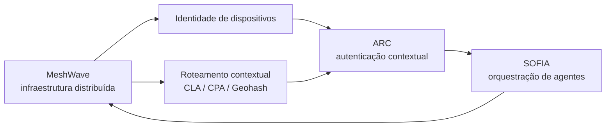

# Visão geral do ecossistema MeshWave

## Metadados

| Campo | Valor |
|---|---|
| ID curatorial | `DOM-01` |
| Status | `EM_CURADORIA` |
| Versão do documento | `0.1.0` |
| Última atualização | `2026-10-08` |
| Curador | `Agente BCE MeshWave` |
| Confiança geral | `média-baixa` |
| Fontes desta versão | `BCE/fontes/CLASSIFICACAO_LOTE_001.md` |

## 1. Resumo executivo

O MeshWave aparece nas fontes como um ecossistema de infraestrutura de comunicação distribuída, identidade contextual e inteligência/orquestração por agentes. A visão de longo prazo combina uma rede capaz de operar de forma resiliente com mecanismos de confiança, roteamento geoespacial e componentes de inteligência associados ao sistema SOFIA.

O material analisado ainda mistura três níveis que precisam ser mantidos separados: **visão estratégica**, **proposta de arquitetura** e **implementação verificável**. Neste primeiro estado da arte, há evidência textual suficiente para afirmar que esses conceitos foram discutidos e iterados, mas não para afirmar que todos os módulos ou integrações estejam implementados em produção.

## 2. Escopo e limites

Este documento consolida somente o primeiro lote de fontes prioritárias. Ele não substitui os documentos especializados de arquitetura, rede, identidade, ARC ou SOFIA. O objetivo é fornecer uma visão de orientação e registrar quais relações já são sustentadas pelo material e quais continuam como hipótese.

## 3. Definições atuais

### 3.1 MeshWave

**Definição de trabalho:** infraestrutura/ecossistema de comunicação e processamento distribuído cuja evolução proposta inclui operação inteligente, resiliência, identidade de dispositivos e roteamento contextual.

A definição é deliberadamente ampla porque as fontes ainda não fornecem um contrato único de arquitetura. A visão registrada menciona evolução de modelos embarcados básicos para capacidades preditivas, aprendizado federado e IA generativa para simulação de ameaças. Essas capacidades devem ser classificadas como roadmap ou visão até que haja código, testes e implantação que as confirmem.

### 3.2 SOFIA

**Definição de trabalho:** camada de inteligência e orquestração de agentes associada ao ecossistema MeshWave.

No primeiro lote, SOFIA aparece principalmente como componente de sinergia e como assunto de documentos históricos, mas suas APIs, ciclo de missão, persistência e limites operacionais não estão suficientemente especificados aqui. O documento dedicado de SOFIA deverá substituir esta definição preliminar por uma descrição baseada em fontes próprias.

### 3.3 ARC

**Definição de trabalho:** mecanismo de autenticação contextual/recessiva que combina evidências de sincronização, desafio contextual e inferência bayesiana para produzir confiança graduada.

A fonte mais forte do lote apresenta uma evolução de design em que dados incompletos são representados explicitamente como `Real` ou `Placeholder`. O ARC não deve interpretar um placeholder como evidência medida; a qualidade da evidência afeta o prior e a verossimilhança usada no cálculo de confiança.

### 3.4 Roteamento geoespacial

**Definição de trabalho:** hipótese de organização hierárquica de regiões, CLAs, CPAs, vértices, coordenadas compartilhadas e Geohash para apoiar localização e roteamento.

Esta definição vem de contexto visual e de transferência de tarefa. Ainda não existe, neste lote, uma especificação formal de níveis, algoritmo, cardinalidade, atualização de coordenadas ou política de falhas.

## 4. Estado da arte atual

### 4.1 O que está sustentado pelas fontes

As fontes sustentam que o projeto foi pensado de maneira evolutiva e modular, que a resiliência é um objetivo explícito e que houve preocupação em conectar infraestrutura, inteligência, identidade e confiança. Também sustentam uma decisão de design concreta no ARC: substituir nulos por um wrapper tipado, diferenciar dado real de placeholder e impedir que uma medição ausente seja usada como se fosse válida.

### 4.2 O que é proposta ou visão

A progressão para aprendizado federado e IA generativa, a integração ampla entre MeshWave, SOFIA, ARC, PGC e Q-CyPIA e a operação autônoma da rede aparecem como visão ou plano. Não há, no lote, evidência suficiente de uma implementação integrada que valide todas essas relações.

### 4.3 O que ainda não foi confirmado

Não foram confirmados neste lote: um diagrama textual completo da arquitetura; APIs estáveis; formato de mensagens entre MeshWave e SOFIA; definição normativa de CLA/CPA; método de geração de identificadores; testes do código ARC; segurança criptográfica do desafio por hash; implantação em nós reais; métricas operacionais; e compatibilidade entre versões.

## 5. Modelo de sinergia preliminar

O diagrama é uma síntese curatorial, não um diagrama oficial encontrado nas fontes. Ele expressa a relação mais plausível do lote: a infraestrutura fornece conectividade; a topologia apoia seleção de caminhos; a identidade fornece contexto; o ARC avalia confiança; e SOFIA coordena agentes e missões. Cada seta precisa ser confirmada nos documentos especializados.

## 6. Evolução arqueológica

| Momento/versão | Formulação observada | Mudança | Interpretação |
|---|---|---|---|
| `v0.1.0-alpha` | marcador de versão associado à visão e identidade | ponto inicial observado | não há conteúdo suficiente para reconstruir o estado completo |
| `v0.2.0-alpha` | novo marcador de versão junto a identificadores e visão ampliada | evolução declarada | indica iteração, mas não especifica alterações de código |
| fase de roteamento | regiões, CLAs, vértices e coordenadas passam a ser representados visualmente | preferência por referência visual mais clara | modelo conceitual de topologia; parâmetros ainda pendentes |
| fase ARC | valores nulos são substituídos por `ResilientValue.Real/Placeholder` | aperfeiçoamento por robustez e resiliência | decisão de engenharia explícita, com código Kotlin proposto |
| fase de curadoria | criação de índice, dossiê mestre e classificação por domínio | separação entre fonte bruta e conhecimento curado | origem da BCE e da atual sistemática de continuidade |

## 7. Decisões e escolhas observadas

### 7.1 Resiliência explícita de dados

A decisão mais concreta deste lote foi não usar `null` para representar falha de medição em `SyncResult`. A ausência é convertida em um placeholder tipado; o módulo bayesiano precisa reconhecer o tipo antes de usar o valor. A escolha melhora a clareza do contrato, obriga tratamento dos estados pelo compilador e evita que um valor padrão seja confundido com medição real.

### 7.2 Preferência por evolução iterativa

As fontes registram que novos insights levaram a reformulações de código, vistas como aperfeiçoamento e não como desvio do projeto. Essa arqueologia é importante: a versão posterior não deve apagar o motivo pelo qual a versão anterior foi substituída.

### 7.3 Separação entre visão e evidência

A BCE adota a decisão de manter o conteúdo bruto em `KNOWLEDGE/` e publicar interpretações em `BCE/`. Isso permite que ideias como IA generativa, Q-CyPIA ou uma integração MeshWave–SOFIA permaneçam registradas sem serem apresentadas como capacidade já validada.

## 8. Evidências

| ID | Caminho relativo | Tipo | Sustenta | Limitação |
|---|---|---|---|---|
| E001 | `KNOWLEDGE/info/20260422_171119_O que é o projeto Meshwave_ - Manus/` | texto/código | visão evolutiva, versões e identificadores | conteúdo repetitivo e sem especificação completa |
| E002 | `KNOWLEDGE/info/20260422_165052_Fonte para Arquitetura e Operação da Rede MeshWave - Manus/` | imagem/texto | existência de uma fonte arquitetural | texto extraído insuficiente; imagens ainda precisam de análise dedicada |
| E003 | `KNOWLEDGE/info/20260422_165701_Hierarquia de CLA Continental e Roteamento - Manus/` | imagem/contexto | hipótese de topologia CLA/CPA/Geohash | sem algoritmo formal no lote |
| E004 | `KNOWLEDGE/info/20260422_165745_ARC - Autenticação Recessiva Contextual com inferência Bayesiana - Manus/` | texto/código | design ResilientValue, SyncResult e inferência condicional | não prova compilação, testes ou produção |
| E005 | `KNOWLEDGE/info/20260422_173802_Identificador Único do Equipamento na Rede - Manus/` | histórico operacional | necessidade de separar tema de ruído operacional | não contém definição técnica suficiente |
| E006 | `KNOWLEDGE/johann/20260422_174331_Conhecimento sobre Meshwave, Sofia e módulos ARC-Bayes_ - Manus/` | texto/visão | intenção de dossiê integrado e classificação | plano editorial, não evidência de implementação |

## 9. Conflitos e incertezas

O principal conflito não é entre duas especificações, mas entre a amplitude da visão e a escassez de prova implementacional. A linguagem de algumas interações descreve o ecossistema como integrado e pronto, enquanto os artefatos do lote frequentemente são propostas, imagens de referência ou código parcial. A BCE deve manter essa distinção até a análise de repositórios, testes e versões subsequentes.

## 10. Lacunas e perguntas abertas

1. Qual é o modelo formal da arquitetura e quais componentes estão efetivamente implantados?
2. O que significam exatamente CLA, CPA, PGC e Q-CyPIA, e quais são suas interfaces?
3. Como um identificador de equipamento é gerado, persistido, renovado e revogado?
4. Como o desafio ARC impede replay, vazamento de segredo e falsificação contextual?
5. Quais dados alimentam os priors e as probabilidades bayesianas, e como são calibrados?
6. Como SOFIA recebe missões, chama APIs, persiste conhecimento e devolve resultados?
7. Quais versões de código correspondem a `v0.1.0-alpha` e `v0.2.0-alpha`?
8. A referência visual de CLA representa um algoritmo executável ou somente uma metáfora geográfica?

## 11. Relações

- `DOM-02` — arquitetura e implantação devem confirmar a topologia e os componentes.
- `DOM-03` — roteamento deve formalizar CLA/CPA/Geohash.
- `DOM-04` — identidade deve explicar ANDROID_ID, DID e identificador de equipamento.
- `DOM-05` — ARC deve aprofundar sincronização, desafio contextual e Bayes.
- `DOM-06` — SOFIA deve detalhar agentes, missões e orquestração.
- `BCE/CONTROLE_MESTRE.md` — controla o próximo lote.

## 12. Próximo passo de curadoria

Processar as fontes de identidade `info/20260422_173855_Identificador Único do Equipamento na Rede - Manus` e `info/20260422_174130_Definição do identificador único do equipamento na rede - Manus`, além da fonte `info/20260422_174348_Complementar Módulos Faltantes do Diagrama de Implantação - Manus`, confrontando definições com imagens, código e versões antes de atualizar este documento.

## 13. Histórico de versões

| Versão | Data | Alteração | Commit |
|---|---|---|---|
| `0.1.0` | 2026-10-08 | Primeiro estado da arte baseado no Lote 001 | a publicar |
