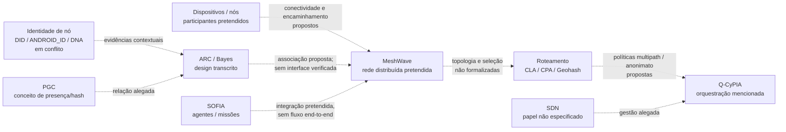

# Visão geral do ecossistema MeshWave

## Metadados

| Campo | Valor |
|---|---|
| ID curatorial | `DOM-01` |
| Status | `REVISÃO` — versão provisória; cobertura não abrangente |
| Versão do documento | `0.2.1` |
| Última atualização | `2026-10-08` |
| Curador | `Manus — curadoria BCE MeshWave` |
| Confiança geral | `baixa a média` para intenção conceitual; baixa para arquitetura vigente e estado do produto |
| Fontes desta versão | Classificações L001–L003, relatório F1.7, fontes primárias da seção 8 e especificação arquitetural E011 |

## 1. Resumo executivo

O material curado apresenta **MeshWave como uma iniciativa/ecossistema cuja visão é oferecer comunicação distribuída em malha**, relacionando dispositivos/nós, roteamento resiliente, identidade e confiança. Em formulações de sinergia, **SOFIA** aparece como inteligência/orquestração de agentes, enquanto **ARC**, **PGC** e **Q-CyPIA** são associados a autenticação contextual, prova/contexto de presença e seleção de rotas com anonimato. Essas relações descrevem **intenção, proposta ou síntese de fontes**; não constituem, por si, uma arquitetura implementada.

A evidência disponível nesta etapa é heterogênea: transcrições de conversas, planos, diagramas/capturas e fragmentos de código copiados para conversas. No conjunto amostrado pela F1.7, **não foi confirmado código executável anexado nem resultado verificável de build, teste, execução, upload ou produção em 29/29 conjuntos examinados**. Esse resultado é limitado à amostra — 29 de 273 conjuntos (10,62%) — e não demonstra inexistência de código ou operação fora dela.

Assim, este documento define um **mapa de conceitos e relações candidatos para orientar a curadoria**, não uma descrição certificada do produto atual. O diagrama e as definições abaixo distinguem o que foi observado em registros do que continua proposto, ambíguo ou não verificado.

## 2. Escopo e limites

Este documento oferece uma visão de orientação do ecossistema e ligações entre domínios; não substitui os documentos especializados de arquitetura, rede, identidade, ARC, SOFIA, aplicações ou segurança. A síntese direta aprofundou três fontes primárias de visão/sinergia (`L001-01`, `L001-06` e `L002-04`) e confrontou as classificações Lote 001–003, os catálogos F1.4–F1.6 e o relatório F1.7. Os arquivos brutos permanecem preservados.

**Limites relevantes:**

- O texto primário é majoritariamente transcrição de conversas reproduzidas, com repetições e conteúdo gerado em interação; afirmações em uma transcrição são evidência de que a afirmação foi registrada, não confirmação independente do sistema.
- A amostra integrada F1.2–F1.6 cobre 29/273 conjuntos, selecionados por prioridade e não de forma estatisticamente representativa.
- Nenhum contrato completo de arquitetura, API, protocolo de mensagens, topologia implantada, métrica operacional ou conjunto reproduzível de testes foi confirmado nesta base amostrada.
- Links externos catalogados em F1.6 não foram lidos como páginas; respostas HTTP HEAD não validam seu conteúdo.
- Alegações de terceiros/possíveis homônimos em transcrições — inclusive criptomoeda, visualização musical e classe do OpenFOAM — permanecem **não verificadas e não são usadas para definir este projeto**.

## 3. Terminologia de trabalho

| Termo | Definição de trabalho nesta BCE | Estado e fonte |
|---|---|---|
| **MeshWave** | Nome do projeto/ecossistema ao qual as fontes associam comunicação em malha e componentes de identidade, roteamento e confiança. | A fonte `L001-01` contém essa visão, mas mistura conteúdo explicativo e contexto de busca; não há definição normativa única. |
| **Rede mesh** | Topologia em que nós podem encaminhar comunicação por outros nós, em vez de depender exclusivamente de uma infraestrutura central. | Conceito descrito em `L001-01`; não comprova que um protocolo ou rede MeshWave esteja operacional. |
| **SOFIA** | Sistema associado à execução/orquestração de agentes, tarefas ou missões, referido como camada de inteligência do ecossistema. | Intenção de integração em `L001-06` e `L002-04`; ciclo e interface com MeshWave não confirmados por esta visão. |
| **ARC** | Rótulo de autenticação contextual/recessiva com inferência bayesiana e tratamento explícito de evidência ausente. | Proposta de design em `L001-04`; não é uma norma nem comprova segurança, compilação ou operação. |
| **PGC** | Prova de Gênese Contextual, descrita numa visão como registro de hash relacionado ao estado de hardware e evidência de presença. | Conceito reportado em `L002-04`; formato, ameaça, privacidade e validação física não especificados. |
| **Q-CyPIA** | Orquestrador mencionado em associação a SDN e seleção de caminhos com critérios de anonimato/diversidade. | O nome e a relação aparecem em `L002-04`; expansão da sigla, interface e algoritmo não estabelecidos. |
| **SDN** | Plano/gestão de rede referido como responsável por administrar o orquestrador Q-CyPIA numa visão resumida. | Relação relatada, sem componentes ou contrato técnico detalhado em `L002-04`. |
| **CLA / CPA / Geohash** | Vocabulário de uma proposta de hierarquia regional/geoespacial para localização, cache e roteamento. | Aparece em fontes visuais e de planejamento (`L001-03`, `L002-02`); níveis, semântica, algoritmo e parâmetros não normativos. |
| **DNA do Equipamento** | Metáfora/proposta de identidade persistente e multifatorial para superar dependência de um único identificador de dispositivo. | Visão/roadmap na transcrição `L001-01`; não equivale a biometria ou esquema técnico validado. |

Os nomes ARC, PGC, Q-CyPIA, MeshBlockchain e outros termos variam entre fontes e podem refletir formulações exploratórias. Não presumir expansões, equivalência entre módulos ou padronização sem especificação identificável.

## 4. Estado da arte nas fontes revisadas

### 4.1 Capacidades e comportamento

**Registrado como visão:** a rede deveria permitir comunicação distribuída, adaptação a alterações nos nós e rotas, resiliência e operação inteligente. A mesma fonte apresenta uma progressão de capacidades embarcadas básicas para modelos preditivos, aprendizado federado e IA generativa para simulação de ameaças. Essa progressão é **roadmap/aspiração**, não capacidade observada.

**Registrado como proposta de integração:** uma formulação relaciona IA de roteamento, SDN e Q-CyPIA à seleção de caminhos múltiplos que atendam a requisitos de anonimato/diversidade. Outra formulação relaciona MeshWave (infraestrutura) e SOFIA (agentes/orquestração), além de ARC, PGC e Q-CyPIA. As fontes não apresentam contratos entre esses elementos, medições, ameaça de segurança formalizada ou teste de ponta a ponta.

**Não confirmado:** rede implantada entre dispositivos, roteamento dinâmico funcional, anonimato mensurado, presença física provada por PGC, aprendizagem federada, IA generativa integrada, operação autônoma ou interoperabilidade MeshWave–SOFIA.

**Aprofundamento arquitetural F2.2 (E011/DOM-02):** uma especificação documental de 2025 organiza a proposta em cinco camadas (Aplicação, Rede Mesh, Otimização/IA Distribuída, Integração, Segurança/Blockchain) e acrescenta um controlador SDN transversal. Essa decomposição expande o mapa conceitual desta visão, mas não comprova arquitetura vigente, implantação ou execução; ver `BCE/temas/arquitetura-geral-e-implantacao.md`.

### 4.2 Componentes e responsabilidades candidatas

| Elemento | Papel atribuído nas fontes | Estado de evidência nesta etapa |
|---|---|---|
| Rede MeshWave | Conectividade/distribuição entre nós e base para comunicação resiliente. | Visão conceitual; sem implantação reproduzível confirmada na amostra F1.7. |
| Roteamento / CLA / CPA / Geohash | Seleção e organização de caminhos/regiões, possivelmente com cache e dados contextuais. | Hipótese apoiada por descrição e referência visual; definição formal e algoritmo pendentes. |
| Identidade do equipamento | Vincular identidade, reputação e histórico a um nó. | Problema e propostas são relatados; fontes divergem sobre DID/ANDROID_ID e formatos. Sem esquema vigente validado. |
| ARC / Bayes | Avaliar confiança/contexto e lidar com medições incompletas. | Decisão de design registrada em código Kotlin transcrito: `Real` versus `Placeholder`; código não foi confirmado como compilado/integrado. |
| PGC | Registrar/hash de estado contextual ou de hardware como evidência de presença. | Alegação conceitual resumida; criptografia, anti-replay, falsificação, privacidade e implementação não validados. |
| Q-CyPIA / SDN | Orquestrar caminhos com critérios de anonimato/diversidade. | Relação de alto nível em transcrição; algoritmo, interface e modelo de ameaça ausentes. |
| SOFIA | Coordenar agentes, missões e processamento associado ao ecossistema. | Sistema e fluxos aparecem em fontes próprias, mas esta visão não confirma acoplamento operacional com a rede MeshWave. |
| MeshBlockchain e módulos de roadmap | Possíveis peças de visão ampliada, citadas em exemplos de sinergia/planejamento. | Não promover a componente atual: a citação é ilustrativa ou roadmap, sem artefato funcional confirmado. |

### 4.3 Interfaces, entradas e saídas

Não há, nas fontes revisadas para a visão geral, contratos de interface que definam: formato de pacote/nó; API entre SOFIA, MeshWave, ARC e Q-CyPIA; estados e dados de missão; representação normativa de identidade; esquema de cache ou atualização de localização; nem política de falha e recuperação. Portanto, o diagrama abaixo não deve ser interpretado como interface técnica.

### 4.4 Implementado, prototipado ou proposto

- **Implementado/verificado nesta amostra:** nenhum componente end-to-end foi demonstrado por código executável, build, teste ou implantação reproduzível nos 29 conjuntos integrados pelo catálogo F1.5/F1.7.
- **Código transcrito / proposta de engenharia:** o ARC inclui trechos Kotlin e uma escolha explícita de modelagem `ResilientValue.Real/Placeholder`; sem repositório/commit/build associados, permanece proposta ou registro de código, não implementação validada.
- **Conceitual / especificado de modo incompleto:** MeshWave como rede mesh, topologia CLA/CPA/Geohash, identidade multifatorial, PGC, Q-CyPIA/SDN, anonimato e integração com SOFIA.
- **Roadmap:** aprendizado federado, IA generativa, identidade autônoma/resiliente, MeshBlockchain e capacidades avançadas de rede citadas em visões ou planos.
- **Contraditório/ambíguo:** estados de versão `v0.1.0-alpha`/`v0.2.0-alpha`, dependência inicial em `ANDROID_ID` e posterior proposta de “DNA do Equipamento”; não há vínculo com releases ou commits que permita determinar o estado vigente.

## 5. Modelo conceitual provisório

**Leitura correta:** todas as setas são relações propostas/relatadas em fontes, não conexões observadas em runtime. O diagrama é uma síntese curatorial nova, não uma figura oficial ou arquitetura aprovada. A relação circular ARC→MeshWave e o vínculo SOFIA↔MeshWave são hipóteses para guiar os DOMs especializados.

## 6. Fluxos e casos de uso

Não há fluxo operacional completo confirmado. A narrativa de alto nível sugere a sequência abaixo como **caso de uso pretendido**, sujeita a validação:

1. nós/dispositivos participam de uma rede distribuída;
2. uma camada de roteamento propõe caminhos conforme disponibilidade, localização ou política;
3. a identidade/contexto do nó alimenta avaliação de confiança ARC/PGC;
4. políticas de SDN/Q-CyPIA poderiam restringir ou diversificar caminhos;
5. SOFIA poderia coordenar agentes/tarefas que usam a infraestrutura.

Nenhuma fonte nesta revisão demonstra que essa cadeia foi executada em dispositivos reais, que as partes trocam mensagens compatíveis, ou que anonimato e segurança foram medidos. Falhas, timeouts, sincronização, revogação e recuperação permanecem sem especificação de ecossistema.

## 7. Evolução arqueológica e decisões observadas

| Formulação/versão | Registro encontrado | Interpretação curatorial |
|---|---|---|
| Visão inicial da rede | `L001-01` descreve MeshWave como comunicação entre dispositivos móveis em malha e, em respostas posteriores, associa roteamento, Bayes e confiança contextual. | A transcrição mistura explicação genérica e ideias do projeto; registrar como visão relatada, não como definição técnica independente. |
| `v0.1.0-alpha` | A fonte associa identidade do nó a `ANDROID_ID` e relata fragilidade quando o identificador muda. | Problema percebido pelo autor da conversa; vínculo com release executável não comprovado. |
| `v0.2.0-alpha` | Propõe “DNA do Equipamento” e identidade persistente/multifatorial, com referência ao “Barco de Teseu”. | Evolução conceitual; algoritmo, dados, proteção contra correlação e compatibilidade não especificados. |
| Visão de sinergia | `L001-06` propõe um dossiê integrado e atribui papéis gerais a MeshWave, SOFIA, ARC, PGC e Q-CyPIA. | Plano editorial/arquitetural, não prova de módulos implantados. |
| Visão resumida de roteamento e segurança | `L002-04` associa Q-CyPIA/SDN a multipath/anonimato e descreve ARC-Bayes/PGC, recomendando validação em testbeds e correção de instabilidades assíncronas. | Visão de alto nível que explicita necessidade futura de validação; os componentes continuam sem contrato ou teste anexado nesta evidência. |

As datas e versões são tratadas como rótulos registrados, não como sequência comprovada de releases. `L002-04` referencia `GLOBALMESHWAVE-Consolidado11Maio2025.md`, mas o documento citado não foi localizado sob `KNOWLEDGE/` nesta cópia; a formulação permanece evidência indireta/transcrita.

### Decisões de engenharia candidatas

A fonte ARC do Lote 001 registra uma escolha de design para evitar que ausência de medição seja confundida com zero/valor real: encapsular valores como `Real` ou `Placeholder` e tratar placeholder sem verossimilhança de medição, ajustando a confiança conforme estado de sincronização. É uma decisão de design presente no registro, não decisão normativa do ecossistema nem validação de segurança. Ver `DOM-05` para análise própria.

## 8. Evidências e fontes

| ID | Caminho relativo | Tipo | O que sustenta | Limitações |
|---|---|---|---|---|
| E001 / L001-01 | `KNOWLEDGE/info/20260422_171119_O que é o projeto Meshwave_ - Manus/` (`content.txt`, `code_blocks.txt`, `FULL.png`) | Transcrição/captura/fragmentos | Visão de rede mesh, roadmap e tensão de identidade `ANDROID_ID` → “DNA do Equipamento”. | Conteúdo repetitivo e parcialmente explicativo/gerado; blocos são rótulos, não código executável; associação de versão não confirmada. |
| E002 / L001-02 | `KNOWLEDGE/info/20260422_165052_Fonte para Arquitetura e Operação da Rede MeshWave - Manus/` | Captura e imagem de roadmap | Alegação de protótipo Python e plano de Fase 1/Fase 2 na captura; figura de evolução por segmentos/fases. | Analisado em DOM-02; não há código/resultado do protótipo nem prova de implementação. |
| E003 / L001-03 | `KNOWLEDGE/info/20260422_165701_Hierarquia de CLA Continental e Roteamento - Manus/` | Contexto/imagem | Referência visual de grade/polígonos e aprovação conversacional como representação CLA/regional. | Analisado em DOM-02; sem legenda, algoritmo, cardinalidade, CRS ou parâmetros normativos. |
| E004 / L001-04 | `KNOWLEDGE/info/20260422_165745_ARC - Autenticação Recessiva Contextual com inferência Bayesiana - Manus/` | Texto/código transcrito | Proposta `ResilientValue`, sincronização e inferência condicionada à qualidade da evidência. | Código não comprovado em repositório/build/teste; segurança formal não avaliada. |
| E005 / L001-06 | `KNOWLEDGE/johann/20260422_174331_Conhecimento sobre Meshwave, Sofia e módulos ARC-Bayes_ - Manus/` | Transcrição/captura/comandos editoriais | Intenção de dossiê integrado, papéis conceituais e exemplo de sinergia. | Predominam curadoria, instruções de Git e plano editorial; exemplos não são arquitetura implementada. |
| E006 / L002-02 | `KNOWLEDGE/info/20260422_174130_Definição do identificador único do equipamento na rede - Manus/` | Plano textual/visual | Geohash, CPA/CLA, cache e organização como elementos considerados para identidade/localização. | Sem contrato de dados ou interoperabilidade; classificado como planejamento conceitual. |
| E007 / L002-04 | `KNOWLEDGE/johann/20260422_175016_SOFIA and MeshWave Ecosystem Overview - Manus/` (`content.txt`, `code_blocks.txt`, `FULL.png`) | Resumo/transcrição/captura | Associação relatada entre IA de roteamento, SDN, Q-CyPIA, multipath/anonimato e ARC-Bayes/PGC. | Texto muito repetido/truncado; fragmento de código repete descrição; nenhum teste/API; referência consolidada não recuperada. |
| E008 | `BCE/fontes/CLASSIFICACAO_LOTE_001.md`, `BCE/fontes/CLASSIFICACAO_LOTE_002.md`, `BCE/fontes/CLASSIFICACAO_LOTE_003.md` | Sínteses curatoriais | Classificações semânticas, conflitos e limites de confiança dos lotes. | Cobertura integrada parcial; consultar originais para cada afirmação. |
| E009 | `BCE/fontes/CATALOGO_CODIGO_E_IMPLEMENTACAO_LOTES_001_003.md`; `BCE/fontes/CATALOGO_LINKS_LOTES_001_003.md`; `BCE/artefatos/INDICE_IMAGENS_E_DIAGRAMAS.md` | Catálogos derivados | Evidência de código/imagens/links na amostra e método de verificação. | Escopos diferentes: F1.4 cobre 19 fontes; F1.5/F1.6 29 diretórios. Links remotos não lidos. |
| E010 | `BCE/fontes/RELATORIO_LACUNAS_E_QUALIDADE_F1_7.md` | Síntese de qualidade/cobertura | Denominadores, prioridades e impossibilidade de generalizar a amostra. | Síntese dos artefatos anteriores; não é validação externa. |
| E011 | `01_arquitetura_geral_meshwave.md` | Especificação arquitetural em Markdown | Modelo conceitual de cinco camadas e controlador SDN; ver DOM-02 §4. | Documento propositivo; versão declarada não ligada a release/código. Campo de contato existente no original foi omitido das sínteses BCE. |

Os `links.txt` das fontes estão representados pelo catálogo F1.6, que distingue ocorrências, destinos e limitações sem reproduzir parâmetros opacos. Nenhuma página externa foi usada nesta revisão como confirmação independente.

## 9. Conflitos e incertezas

| ID | Questão | Fontes | Impacto | Ação |
|---|---|---|---|---|
| C01 | “MeshWave” é nome ambíguo e a transcrição inclui sentidos/afirmações externas não verificados. | E001 | Risco de misturar homônimos ou conteúdo de busca ao projeto. | Usar somente evidência com vínculo explícito ao corpus do projeto; validar externamente em etapa própria. |
| C02 | A narrativa de ecossistema integrado excede a evidência de interfaces e funcionamento. | E001, E005, E007; F1.7 | Pode converter ambição em estado atual. | Manter todas as relações como propostas até localizar artefatos e testes reproduzíveis. |
| C03 | Identidade muda de `ANDROID_ID` para “DNA do Equipamento”; variantes DID/GeoID também divergem. | E001, E006; F1.7/Q04 | Risco de incompatibilidade, persistência fraca ou decisão prematura. | DOM-04 deve localizar decisão vigente, esquema, ameaça e testes. |
| C04 | Q-CyPIA/SDN, PGC e requisitos de anonimato não têm definição formal. | E007; Lote 002 | Não é possível avaliar interoperabilidade, segurança ou desempenho. | Solicitar/identificar especificações e testbeds rastreáveis; não inferir do nome. |
| C05 | Versões `v0.1.0-alpha` e `v0.2.0-alpha` não estão ligadas a commits/releases verificáveis. | E001 | A evolução arqueológica pode ser confundida com histórico de software. | Procurar tags, commits, APKs e changelogs identificáveis em DOM-12. |
| C06 | O documento referenciado como `GLOBALMESHWAVE-Consolidado11Maio2025.md` não foi localizado na busca desta cópia. | E007 | A síntese de 2025 permanece indireta e pode estar incompleta. | Localizar a fonte e registrar proveniência antes de usar seus detalhes. |
| C07 | Um fragmento/captura de código ARC não prova compilação ou proteção contra ataque. | E004; F1.5/F1.7 | Risco de classificar desenho como recurso seguro implementado. | Verificar repositório/commit, testes, parâmetros estatísticos e threat model em DOM-05. |
| C08 | A especificação E011 acrescenta uma decomposição de cinco camadas e controlador SDN ao mapa conceitual, mas não demonstra vigência nem relação operacional com SOFIA/ARC/Q-CyPIA. | E011; DOM-02 | A visão de ecossistema pode ser interpretada como arquitetura implantada ou compatível sem interfaces. | Manter a relação como proposta até validar versão, interfaces, componentes e evidência operacional em DOM-02/DOM-15. |

## 10. Lacunas e perguntas abertas

1. Qual repositório, branch, commit ou versão identifica o produto MeshWave efetivamente existente?
2. Qual é a arquitetura física/lógica atual, e quais elementos são componentes reais versus roadmap? (DOM-02)
3. Qual mecanismo de comunicação entre nós é implementado; como descoberta, enlace, roteamento e falha funcionam? (DOM-03)
4. Qual identidade é normativa; como são gerados, renovados, revogados e recuperados DID/GeoID/IDs de equipamento? (DOM-04)
5. Qual modelo de ameaça e quais testes sustentam ARC/PGC, a inferência Bayesiana e a alegação de anonimato? (DOM-05)
6. Que contrato liga SOFIA a agentes, missões e à infraestrutura MeshWave? (DOM-06/DOM-15)
7. Existe conteúdo integral e rastreável do consolidado de 11 maio 2025 citado em E007?
8. Quais afirmações conceituais se repetem nos 244 conjuntos ainda fora da cobertura semântica F1.2–F1.6?

## 11. Relações com outros documentos

- `DOM-02` — arquitetura/implantação: formalizar componentes e fronteiras.
- `DOM-03` — rede/roteamento: validar mesh, CLA/CPA/Geohash, descoberta e multipath.
- `DOM-04` — identidade/DIDs: resolver `ANDROID_ID`, DID/GeoID e “DNA do Equipamento”.
- `DOM-05` — ARC/Bayes: examinar modelo de confiança, `ResilientValue`, PGC e ameaça.
- `DOM-06` — SOFIA: definir agentes, missões e vínculo real com o ecossistema.
- `DOM-12` — desenvolvimento/versionamento: associar rótulos alfa a repositório e commits.
- `DOM-14` — segurança/privacidade: avaliar localização, identificação persistente, anonimato e dados contextuais.
- `BCE/fontes/RELATORIO_LACUNAS_E_QUALIDADE_F1_7.md` — cobertura e prioridades que limitam esta visão.

## 12. Histórico de versões

| Versão | Data | Alteração | Fontes/commit |
|---|---|---|---|
| `0.1.0` | 2026-10-08 | Estado da arte inicial, baseado principalmente no Lote 001. | `854f90d` |
| `0.2.0` | 2026-10-08 | Revisão de visão e sinergia contra F1.7, Lotes 001–003 e fontes primárias L001-01/L001-06/L002-04; adiciona Q-CyPIA/PGC, limitações de cobertura e modelo explícito provisório. | F2.1; commit a registrar no checkpoint. |
| `0.2.1` | 2026-10-08 | Referencia a especificação de cinco camadas descoberta em F2.2, liga DOM-01 a DOM-02 e passa a F2.3 sem promover arquitetura proposta a estado implementado. | F2.2; commits relacionados registrados em `BCE/sessoes/2026-10-08_f2-2.md` e no controle mestre. |

## 13. Próximo passo de curadoria

Executar **F2.3 — mesh networking, comunicação e roteamento**: confrontar fontes dedicadas a descoberta de vizinhos, enlaces, encaminhamento, roteamento, CLA/CPA/Geohash, cache e fallback com DOM-02 e DOM-01. Manter DOM-01 em `REVISÃO` até a ampliação de cobertura e validação das relações de arquitetura; manter a separação entre especificação conceitual, roadmap e implementação comprovada.
