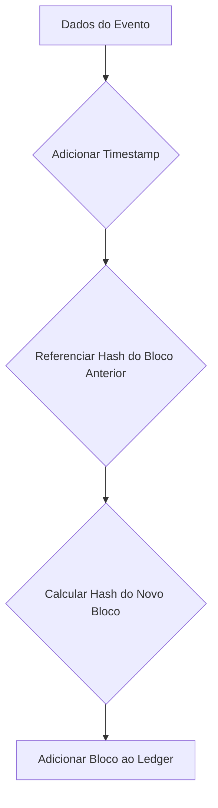

## Imagens e Ilustrações da Preparação Blockchain

Este diretório contém imagens e diagramas que visualizam os conceitos e as etapas da preparação para a integração da tecnologia blockchain no Projeto MeshWave.

### 1. Diagrama Conceitual de Geração de Chaves

Este diagrama ilustra o processo de geração de um par de chaves criptográficas (privada e pública) e a derivação de um endereço de blockchain, fundamental para a identidade e transações na rede.

```mermaid
graph TD
    A[Gerar Chave Privada (Segura)] --> B(Derivar Chave Pública)
    B --> C(Gerar Endereço Blockchain)
    C --> D[Par de Chaves + Endereço]
```

### 2. Fluxo Simplificado de Registro em Ledger

Este fluxograma demonstra o processo básico de como um evento ou dado é formatado e registrado em um ledger distribuído, enfatizando a ligação com o bloco anterior para garantir a imutabilidade.



---

**Autor:** Diogenes Duarte Sobral
**Contato:** celular +55 21 972341965, omaci2008@gmail.com


