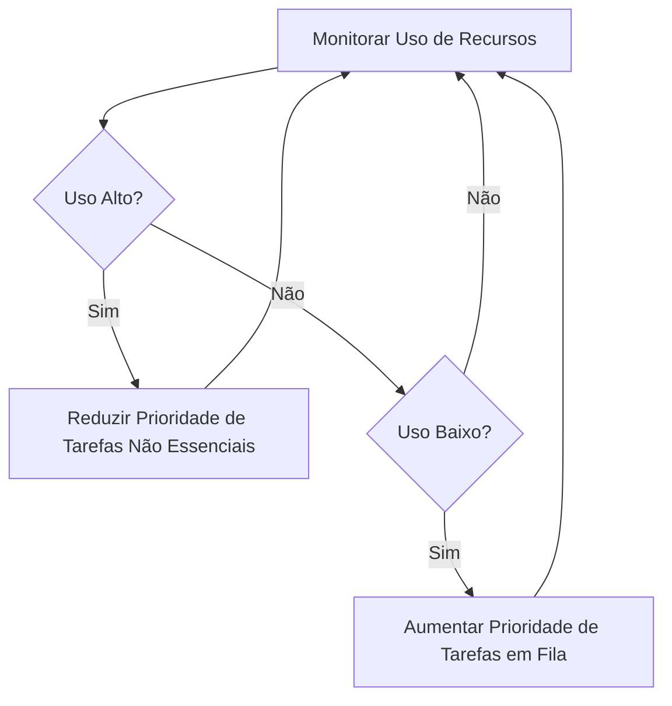

## Imagens e Ilustrações da Otimização de Dispositivo

Este diretório contém imagens e diagramas que visualizam os conceitos e as estratégias de otimização de dispositivo no Projeto MeshWave, ilustrando como o desempenho e a eficiência são maximizados.

### 1. Ciclo de Otimização de Recursos

Este diagrama ilustra o ciclo contínuo de monitoramento, análise e ajuste de recursos (CPU, memória) para manter o desempenho ideal do dispositivo na rede mesh.



### 2. Impacto da Otimização de Memória

Este gráfico conceitual demonstra a redução do consumo de memória ao longo do tempo com a aplicação de técnicas de otimização, como coleta de lixo e liberação de recursos não utilizados.

```mermaid
lineChart
    title "Consumo de Memória ao Longo do Tempo"
    x-axis "Tempo"
    y-axis "Uso de Memória (MB)"
    "Sem Otimização": 100, 120, 150, 180, 200, 220, 250
    "Com Otimização": 100, 90, 80, 70, 60, 55, 50
```

---

**Autor:** Diogenes Duarte Sobral
**Contato:** celular +55 21 972341965, omaci2008@gmail.com


