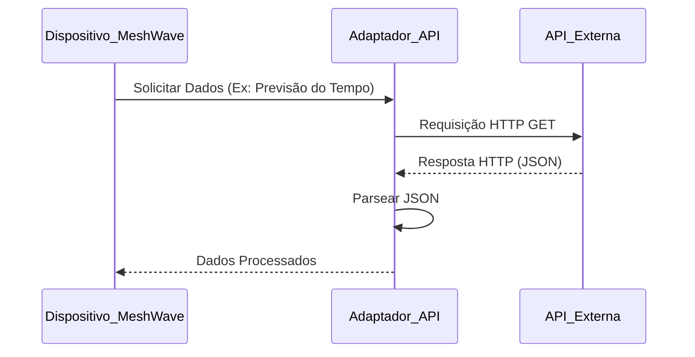

## Imagens e Ilustrações dos Adaptadores de Serviços

Este diretório contém imagens e diagramas que visualizam os conceitos e a arquitetura dos adaptadores de serviços no Projeto MeshWave, ilustrando como eles permitem a integração com plataformas e serviços externos.

### 1. Diagrama Conceitual de um Adaptador de Nuvem

Este diagrama ilustra como um dispositivo MeshWave, através de um adaptador de nuvem, pode enviar dados coletados na rede mesh para um serviço de armazenamento em nuvem, como o Amazon S3.

```mermaid
graph TD
    subgraph Rede MeshWave
        A[Dispositivo MeshWave]
    end

    subgraph Adaptador de Nuvem
        B[Módulo de Coleta de Dados]
        C[Módulo de Formatação]
        D[Módulo de Upload (API Nuvem)]
    end

    subgraph Serviço de Nuvem
        E[Armazenamento S3]
    end

    A --> B
    B --> C
    C --> D
    D --> E
```

### 2. Fluxo de Integração com API Externa

Este fluxograma detalha o processo de um dispositivo MeshWave consumindo dados de uma API RESTful externa, mostrando os passos de requisição, processamento e uso dos dados.



---

**Autor:** Diogenes Duarte Sobral
**Contato:** celular +55 21 972341965, omaci2008@gmail.com


