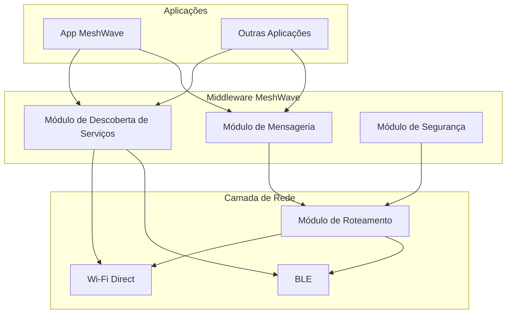
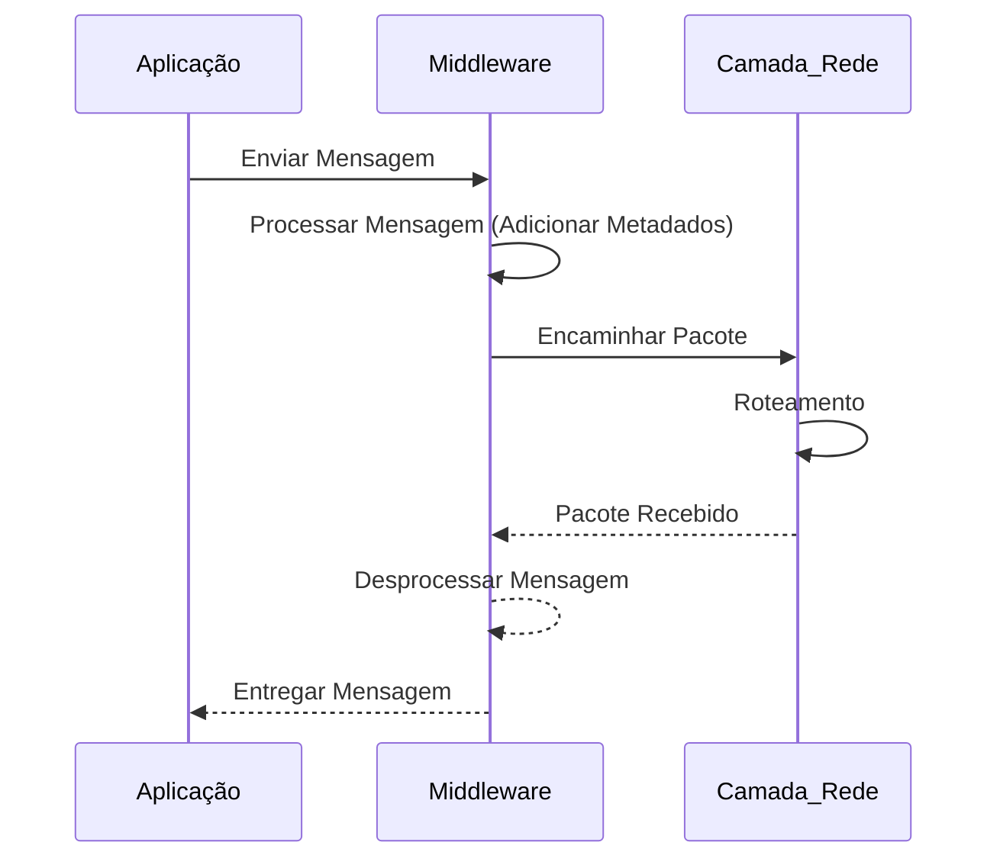

## Imagens e Ilustrações do Middleware

Este diretório contém imagens e diagramas que visualizam os conceitos e a arquitetura do middleware do Projeto MeshWave, ilustrando como ele facilita a comunicação e a interação entre os componentes do sistema.

### 1. Diagrama de Arquitetura do Middleware

Este diagrama ilustra a posição do middleware como uma camada intermediária entre as aplicações e a camada de rede, destacando seus principais componentes e suas interações.

### 2. Fluxo de Comunicação Através do Middleware

Este fluxograma detalha como uma mensagem é processada e encaminhada através das diferentes camadas do middleware, desde a aplicação de origem até a camada de rede.

---

**Autor:** Diogenes Duarte Sobral
**Contato:** celular +55 21 972341965, omaci2008@gmail.com

