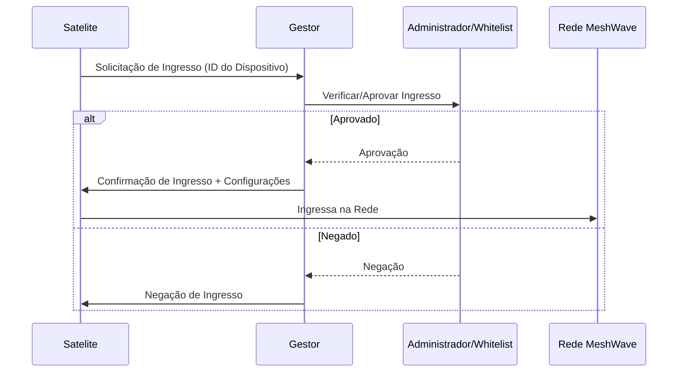

## Imagens e Ilustrações da Ativação em Duas Etapas

Este diretório contém imagens e diagramas que visualizam os conceitos e o fluxo do processo de ativação em duas etapas na rede MeshWave, com foco na segurança e controle de acesso.

### 1. Fluxo de Ativação em Duas Etapas

Este diagrama ilustra a interação entre o dispositivo satélite, o dispositivo gestor e o administrador (ou whitelist) durante o processo de ingresso seguro na rede MeshWave.



### 2. Diagrama de Componentes de Segurança na Ativação

Este diagrama conceitual mostra os principais componentes de segurança envolvidos no processo de ativação em duas etapas, como criptografia e autenticação.

```mermaid
graph TD
    subgraph Dispositivo Satélite
        A[Módulo de Solicitação]
        B[Interface de Confirmação]
    end

    subgraph Dispositivo Gestor
        C[Módulo de Validação]
        D[Módulo de Aprovação (Whitelist/Manual)]
    end

    A -- Envia Solicitação (Criptografada) --> C
    C -- Consulta --> D
    D -- Retorna Aprovação/Negação --> C
    C -- Envia Confirmação/Negação (Criptografada) --> A
    B -- Interage com Usuário --> A
```

---

**Autor:** Diogenes Duarte Sobral
**Contato:** celular +55 21 972341965, omaci2008@gmail.com


