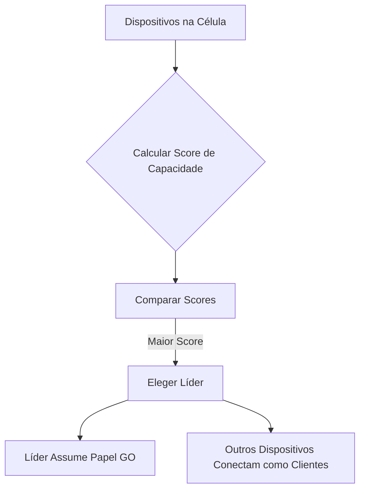

## Imagens e Ilustrações do Autogerenciamento

Este diretório contém imagens e diagramas que visualizam os conceitos e processos de autogerenciamento na rede MeshWave, incluindo a formação de células e a eleição de líderes.

### 1. Formação de Células MeshWave

Este diagrama ilustra como os dispositivos MeshWave se agrupam em células, com um dispositivo atuando como líder (Group Owner) e os demais como membros.

```mermaid
graph TD
    subgraph Célula 1
        A[Líder (GO)]
        B[Membro 1]
        C[Membro 2]
        A --- B
        A --- C
    end

    subgraph Célula 2
        D[Líder (GO)]
        E[Membro 3]
        F[Membro 4]
        D --- E
        D --- F
    end

    A -- Conexão Inter-Célula --> D
```

### 2. Fluxo de Eleição de Líder de Célula

Este fluxograma detalha o processo de eleição de um líder de célula com base na capacidade dos dispositivos, garantindo que o nó mais adequado assuma o papel de gerenciamento.



---

**Autor:** Diogenes Duarte Sobral
**Contato:** celular +55 21 972341965, omaci2008@gmail.com


