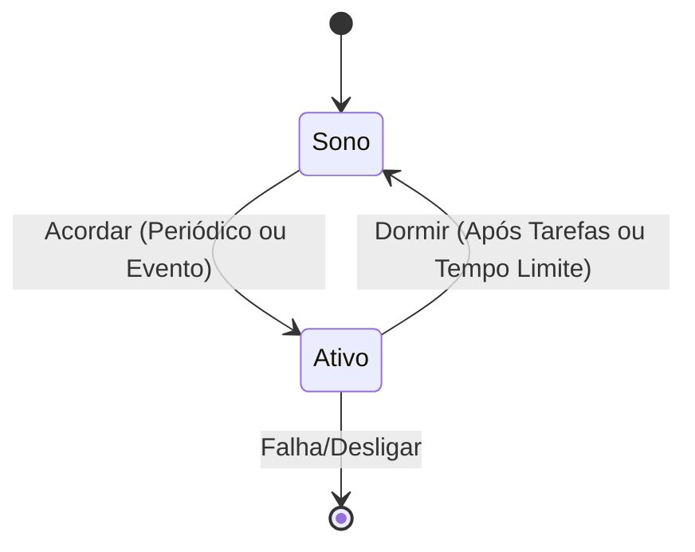

## Imagens e Ilustrações da Energia Adaptativa

Este diretório contém imagens e diagramas que visualizam os conceitos e estratégias de energia adaptativa no Projeto MeshWave, com foco na otimização do consumo de energia.

### 1. Diagrama de Modo Híbrido BLE/Wi-Fi Direct

Este diagrama ilustra como os dispositivos MeshWave podem alternar entre o modo BLE (para baixo consumo e descoberta) e o modo Wi-Fi Direct (para alta taxa de transferência de dados), otimizando o uso de energia.

```mermaid
graph TD
    A[Dispositivo MeshWave] --> B{Necessidade de Dados?}
    B -- Baixa --> C[Modo BLE (Descoberta, Pequenos Pacotes)]
    B -- Alta --> D[Modo Wi-Fi Direct (Transferência de Dados)]
    C --> E[Baixo Consumo de Energia]
    D --> F[Alto Throughput]
    E --> A
    F --> A
```

### 2. Ciclo de Vida de Energia com Duty Cycling

Este diagrama de estados representa o comportamento de um dispositivo MeshWave que implementa o duty cycling para economizar energia, alternando entre estados ativo e de sono.



---

**Autor:** Diogenes Duarte Sobral
**Contato:** celular +55 21 972341965, omaci2008@gmail.com


