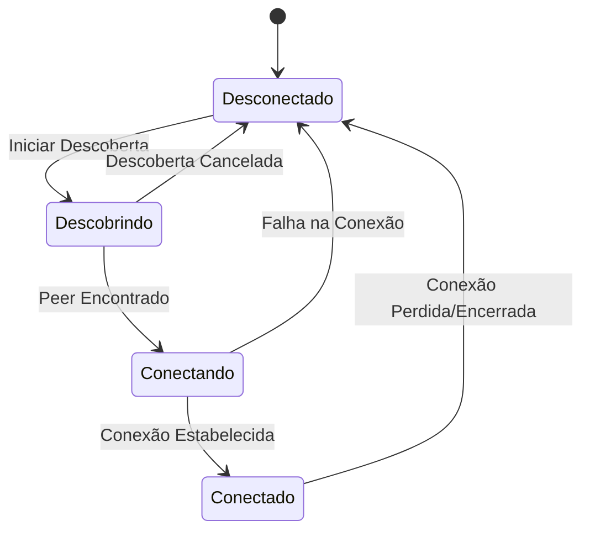

## Imagens e Ilustrações do Gerenciamento de Conexões

Este diretório contém imagens e diagramas que visualizam os processos e conceitos relacionados ao gerenciamento de conexões na rede MeshWave, focando no estabelecimento e manutenção de links.

### 1. Fluxo de Estabelecimento de Conexão Wi-Fi Direct

Este diagrama ilustra os passos detalhados para o estabelecimento de uma conexão Wi-Fi Direct, desde a descoberta até a formação do grupo e a disponibilidade para comunicação.

```mermaid
sequenceDiagram
    participant DeviceA
    participant DeviceB
    participant WifiP2pManager

    DeviceA->>WifiP2pManager: discoverPeers()
    WifiP2pManager-->>DeviceA: onPeersAvailable(DeviceB)
    DeviceA->>WifiP2pManager: connect(WifiP2pConfig(DeviceB))
    WifiP2pManager-->>DeviceB: Connection Request
    DeviceB->>WifiP2pManager: Accept/Reject Connection
    alt Connection Accepted
        WifiP2pManager-->>DeviceA: onSuccess()
        WifiP2pManager-->>DeviceB: onSuccess()
        WifiP2pManager->>DeviceA: onConnectionInfoAvailable(info)
        WifiP2pManager->>DeviceB: onConnectionInfoAvailable(info)
        DeviceA<->>DeviceB: Data Exchange (TCP/UDP Sockets)
    else Connection Rejected
        WifiP2pManager-->>DeviceA: onFailure()
    end
```

### 2. Diagrama de Estados de Conexão

Este diagrama de estados representa os diferentes estados que uma conexão P2P pode assumir e as transições entre eles.



---

**Autor:** Diogenes Duarte Sobral
**Contato:** celular +55 21 972341965, omaci2008@gmail.com


