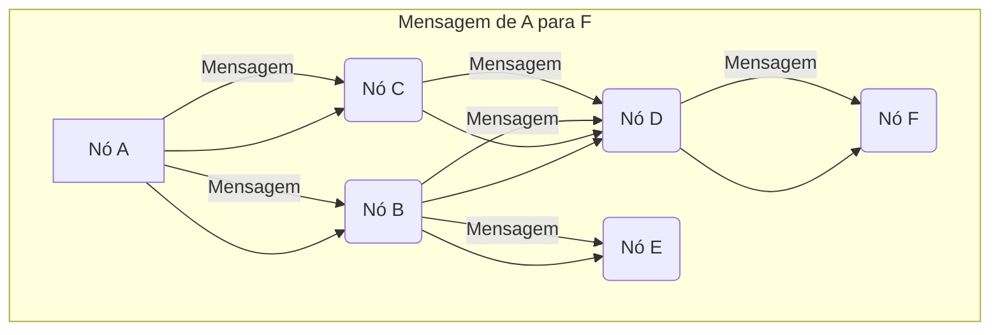
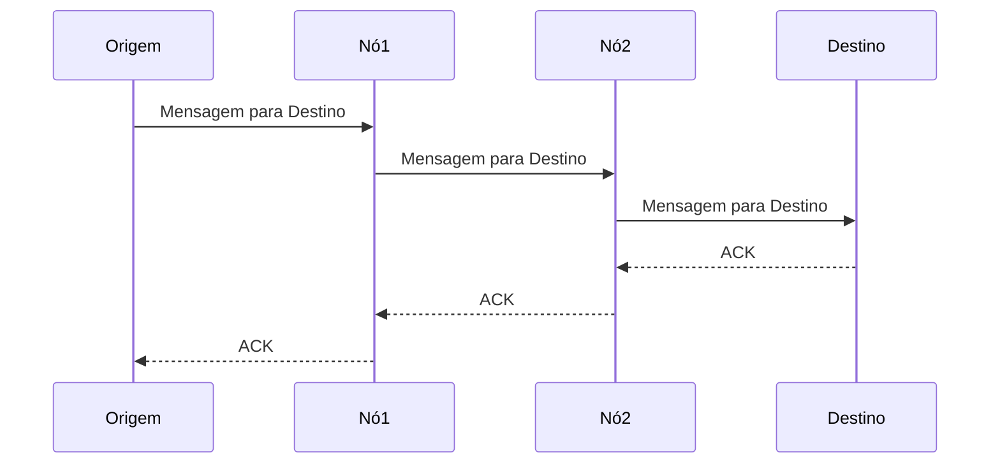

## Imagens e Ilustrações do Roteamento Básico

Este diretório contém imagens e diagramas que visualizam os conceitos e fluxos do roteamento básico na rede MeshWave.

### 1. Diagrama de Roteamento por Inundação (Flooding)

Este diagrama ilustra como uma mensagem se propaga através da rede quando o roteamento por inundação é utilizado. Cada nó retransmite a mensagem para todos os seus vizinhos, exceto o remetente.

### 2. Exemplo de Roteamento Hop-by-Hop

Este diagrama mostra um caminho de roteamento simples onde cada nó decide o próximo salto com base em informações locais, sem a necessidade de uma visão global da rede.

---

**Autor:** Diogenes Duarte Sobral
**Contato:** celular +55 21 972341965, omaci2008@gmail.com

