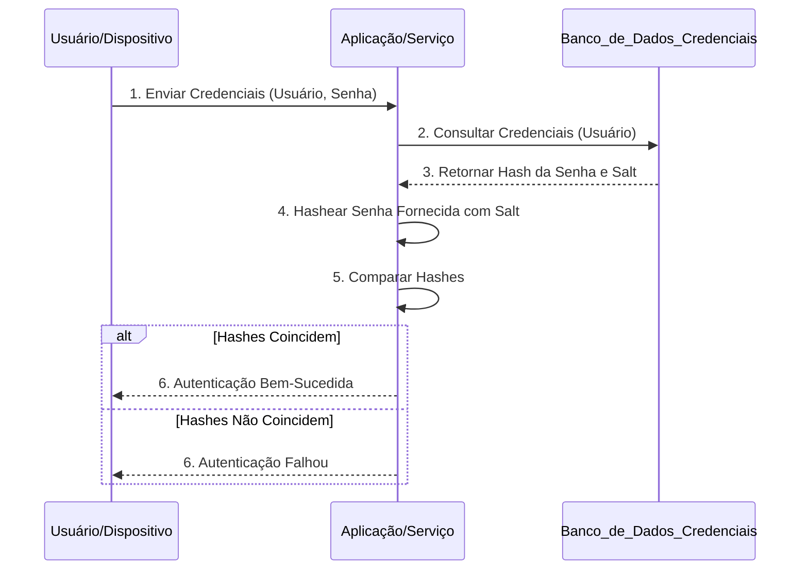
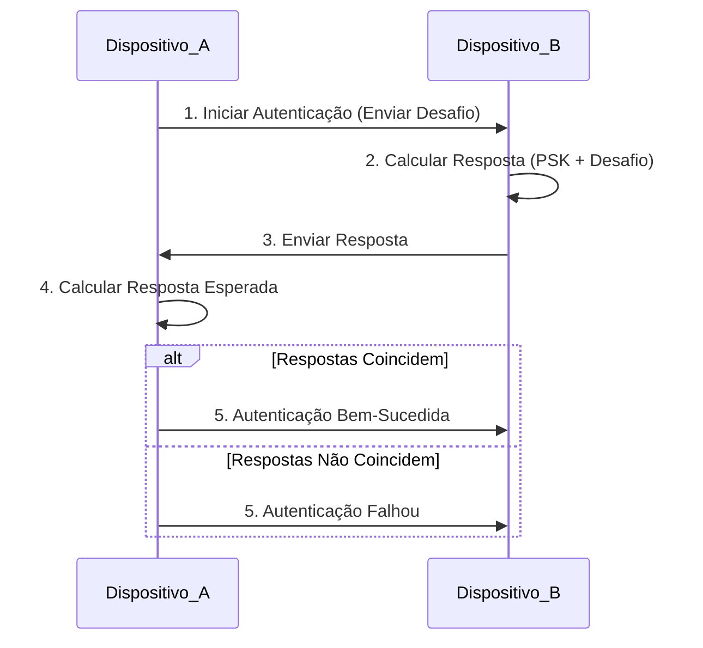

## Imagens e Ilustrações da Autenticação Básica

Este diretório contém imagens e diagramas que visualizam os conceitos e o fluxo da autenticação básica no Projeto MeshWave, ilustrando como a identidade de usuários e dispositivos é verificada.

### 1. Fluxo de Autenticação de Usuário (Credenciais)

Este diagrama ilustra o processo de autenticação de um usuário ou dispositivo usando credenciais (nome de usuário e senha) e a verificação contra um banco de dados seguro.

### 2. Diagrama de Autenticação Baseada em PSK (Chave Pré-Compartilhada)

Este diagrama conceitual mostra como dois dispositivos podem autenticar um ao outro usando uma chave pré-compartilhada (PSK) e um mecanismo de desafio-resposta para provar que ambos conhecem a chave sem revelá-la.

---

**Autor:** Diogenes Duarte Sobral
**Contato:** celular +55 21 972341965, omaci2008@gmail.com

