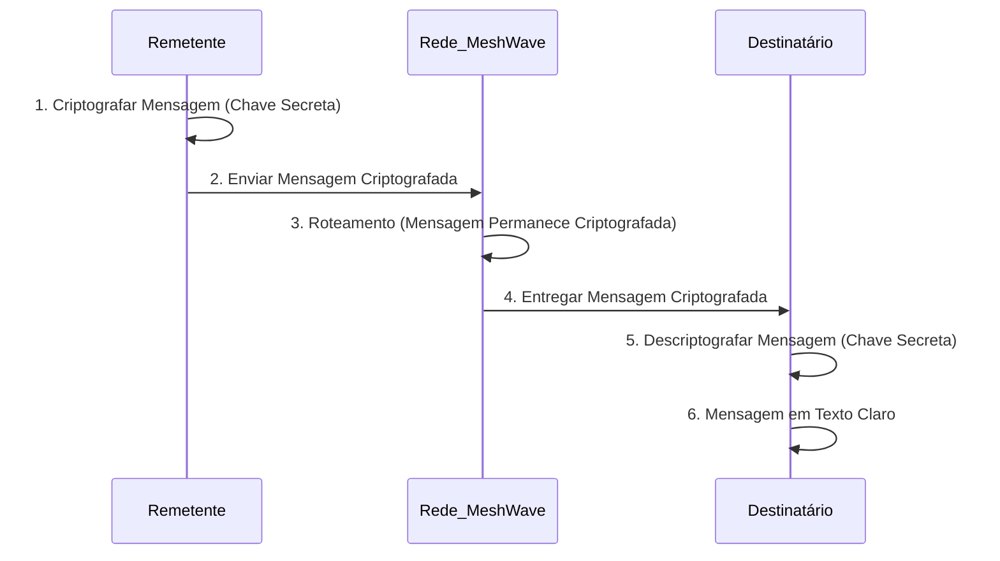

## Imagens e Ilustrações da Criptografia E2E

Este diretório contém imagens e diagramas que visualizam os conceitos e o fluxo da criptografia End-to-End (E2E) no Projeto MeshWave, ilustrando como as mensagens são protegidas do remetente ao destinatário.

### 1. Fluxo de Criptografia End-to-End

Este diagrama ilustra o processo de criptografia e descriptografia de uma mensagem, garantindo que apenas o remetente e o destinatário final possam acessar o conteúdo em texto claro, mesmo que a mensagem passe por nós intermediários na rede mesh.



### 2. Diagrama de Troca de Chaves Diffie-Hellman (Conceitual)

Este diagrama conceitual mostra como dois participantes podem derivar uma chave secreta compartilhada sem trocá-la diretamente, usando o protocolo Diffie-Hellman.

```mermaid
graph TD
    A[Alice] --> B{Gerar Chave Privada (a)}
    B --> C(Calcular Chave Pública (g^a mod p))
    C --> D[Enviar Chave Pública para Bob]

    E[Bob] --> F{Gerar Chave Privada (b)}
    F --> G(Calcular Chave Pública (g^b mod p))
    G --> H[Enviar Chave Pública para Alice]

    D --> I{Alice Recebe Chave Pública de Bob}
    I --> J(Alice Calcula Chave Secreta (g^b)^a mod p)

    H --> K{Bob Recebe Chave Pública de Alice}
    K --> L(Bob Calcula Chave Secreta (g^a)^b mod p)

    J -- Chave Secreta Compartilhada --> L
```

---

**Autor:** Diogenes Duarte Sobral
**Contato:** celular +55 21 972341965, omaci2008@gmail.com


