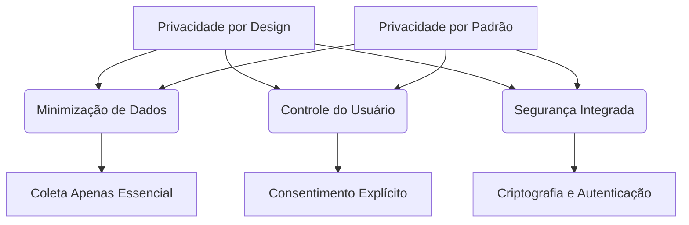

## Imagens e Ilustrações da Privacidade Fundamental

Este diretório contém imagens e diagramas que visualizam os conceitos e as técnicas de privacidade fundamental no Projeto MeshWave, ilustrando como os dados dos usuários são protegidos e sua identidade é preservada.

### 1. Princípios de Privacidade por Design e por Padrão

Este diagrama conceitual destaca os pilares da privacidade no desenvolvimento do MeshWave, enfatizando a minimização de dados, o controle do usuário e a segurança como elementos centrais.



### 2. Fluxo de Anonimização de Dados

Este fluxograma ilustra o processo de anonimização de dados de telemetria, mostrando como identificadores diretos são removidos ou pseudonimizados e informações são generalizadas para proteger a privacidade do usuário.

```mermaid
flowchart TD
    A[Dados Brutos (Identificáveis)] --> B{Remover/Pseudonimizar IDs}
    B --> C{Generalizar Localização}
    C --> D{Agregar Informações}
    D --> E[Dados Anonimizados (Não Identificáveis)]
```

---

**Autor:** Diogenes Duarte Sobral
**Contato:** celular +55 21 972341965, omaci2008@gmail.com


